<h1 align="center">
  <picture>
    <source media="(prefers-color-scheme: dark)" srcset="docs/assets/hero-dark.svg">
    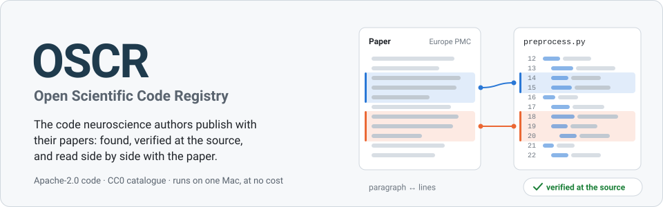
  </picture>
</h1>

<p align="center">
  <a href="https://github.com/yannbellec/Open-Scientific-Code-Registry-OSCR-/actions/workflows/ci.yml"></a>
  <a href="LICENSE"></a>
  <a href="pyproject.toml"></a>
  <a href="website/"></a>
  <a href="https://oscr.yannbellec-b.workers.dev"></a>
  <a href="https://huggingface.co/datasets/opsecsystems/oscr-catalog"></a>
  <a href="https://sandbox.zenodo.org/communities/oscr"></a>
  <a href="https://fair-software.eu"></a>
</p>

**OSCR finds the code that neuroscience authors published with their papers, verifies it
at the source, and keeps the text of their scripts.** For each open-access paper in Europe
PMC, a harvester reads the full text and the metadata, judges every link it finds (the
authors' own code, data, or a third-party tool), checks each candidate where it lives, and
records the result with its evidence. From the catalogue, one click opens the paper next to
the authors' script, with paired highlights showing which paragraph matches which lines.

<p align="center">
  <a href="https://oscr.yannbellec-b.workers.dev"><b>Website</b></a> ·
  <a href="https://huggingface.co/datasets/opsecsystems/oscr-catalog"><b>Open catalogue</b></a> (private until release) ·
  <a href="docs/GETTING_STARTED.md">Getting started</a> ·
  <a href="docs/ARCHITECTURE.md">Architecture</a> ·
  <a href="docs/STATE_OF_THE_ART.md">State of the art</a>
</p>

## Why

- **Papers say where their code is in many places**: an availability statement, a table of
  resources, a reference signed by the authors, a supplementary zip, a Zenodo record that
  points back to the paper. Search indexes miss much of it: on our sample, Europe PMC's
  search index under-reported code links by a factor of 2.4 compared with reading the XML.
- **Links rot, repositories get emptied**, and "available on request" is not code.
- So OSCR reads the full text, checks every candidate at the source, keeps the evidence of
  each verdict, and republishes nothing it is not allowed to.

## Key numbers

<picture>
  <source media="(prefers-color-scheme: dark)" srcset="docs/assets/figures/kpis-dark.svg">
  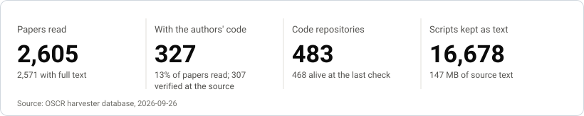
</picture>

| | Measured | Date |
|---|---|---|
| **Precision** | 10 of 11 "authors' code" verdicts correct on papers never seen while tuning (the one error, a malformed URL, is fixed) | 2026-09-25 |
| **Recall** | text alone finds the authors' exact repository for **72%** of the papers with readable full text (73 of 102), and at least one repository of the authors for 88% (97 of 110), on an independent benchmark: 150 papers from 11 neuroscience journals that a Zenodo software record declares itself linked to | 2026-09-25 |
| **Throughput** | **~715 to 1,500 papers per hour**, one process: ~715 at background priority (358 to 436 papers per 30-minute slice), ~1,500 at normal priority (2.4 s per paper, measured in the foreground on 300 papers) | 2026-09-25 and 26 |
| **Footprint** | ~1.4% of one CPU core on average, 40 to 60 MB of memory, no GPU, on a Mac Studio; it waits on the network most of the time, out of politeness to the services it queries | 2026-09-26 |
| **Cost** | $0: no paid service anywhere | |

What the harvester has found so far: about 24% of EEG/MEG papers from 2025 publish their
code (23 to 24 of 99), 7 of 18 electrophysiology papers from September 2026, and 0 of 60
neuroscience papers from June 2016. The backlog is 614,336 open-access neuroscience papers
with full text in Europe PMC, plus ~200 new ones a day.

## Figures

Drawn from the harvester's database by [`tools/make_figures.py`](tools/make_figures.py)
(standard library only; the numbers behind each chart are in
[`figures.json`](docs/assets/figures/figures.json)). Snapshot of 2026-09-26: the backfill
started with September 2026 and walks back month by month to 2000; the 2016 and 2025
columns are earlier test samples.

<picture>
  <source media="(prefers-color-scheme: dark)" srcset="docs/assets/figures/years-dark.svg">
  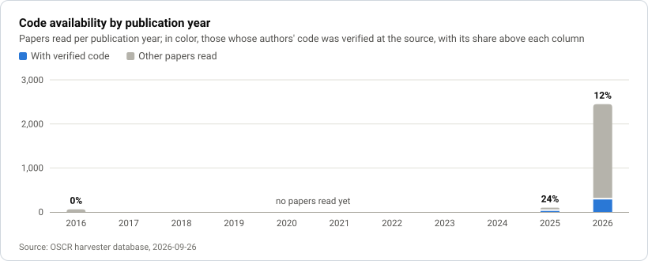
</picture>

<p>
  <picture>
    <source media="(prefers-color-scheme: dark)" srcset="docs/assets/figures/hosts-dark.svg">
    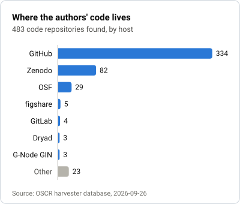
  </picture>
  <picture>
    <source media="(prefers-color-scheme: dark)" srcset="docs/assets/figures/languages-dark.svg">
    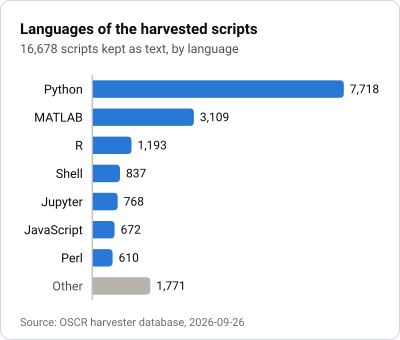
  </picture>
</p>
<p>
  <picture>
    <source media="(prefers-color-scheme: dark)" srcset="docs/assets/figures/licenses-dark.svg">
    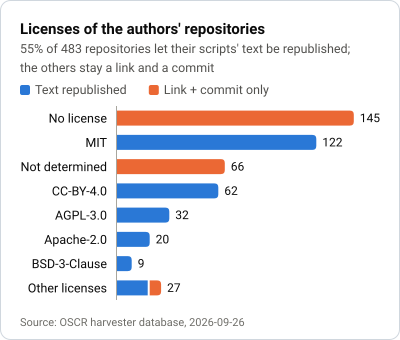
  </picture>
  <picture>
    <source media="(prefers-color-scheme: dark)" srcset="docs/assets/figures/ladder-dark.svg">
    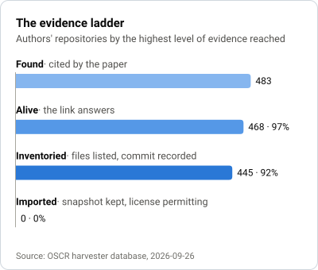
  </picture>
</p>

Regenerate them from the working database with `uv run python tools/make_figures.py`
(options: `--db`, `--out`, `--date`).

## How it works

<picture>
  <source media="(prefers-color-scheme: dark)" srcset="docs/assets/pipeline-dark.svg">
  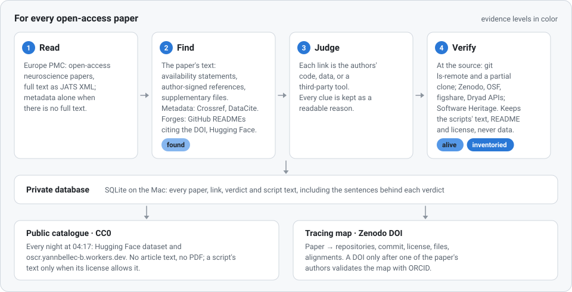
</picture>

1. **Read.** Europe PMC serves the full text of open-access papers as JATS XML. DataCite is
   always queried; Crossref when there is no full text.
2. **Find.** Three routes: the paper's text (availability statements, the resources table,
   references signed by the authors, supplementary files); its metadata (Crossref,
   DataCite); the forges (GitHub READMEs that cite the DOI, the Hugging Face page of an arXiv
   paper).
3. **Judge.** Each link is the authors' code, data, or a third-party tool, and every clue
   is kept as a readable reason, such as `code+1.5 ownership marker 'our code'` or
   `code+ the repository holds 12 scripts out of 40 files`.
4. **Verify at the source.** `git ls-remote`, then a shallow partial clone without file
   contents (`--filter=blob:none`) and a sparse checkout limited to scripts; the Zenodo,
   OSF, figshare and Dryad APIs; Software Heritage for the archive status. Verification can
   overrule the text: a "data" deposit holding 50 Python scripts holds code; a Zenodo
   "dataset" record without a single script does not.
5. **Keep the text.** Scripts, README and license, never data, go to the private database
   with their commit, language, line count and digest. Notebooks become code, cell by cell,
   without their outputs. Limits: 200 KB per file, 2,000 files or 30 MB per repository.

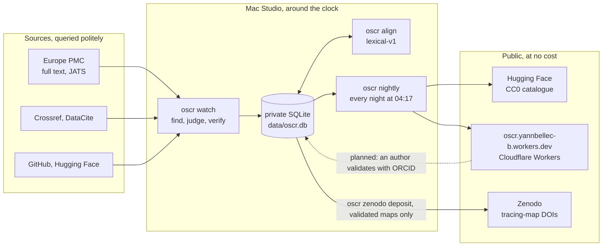

**The evidence ladder.** Every repository of the authors carries the highest level of
evidence reached, the way a template of a method catalogue is either run or only
documented:

| Level | Meaning |
|---|---|
| `found` | the paper cites the link |
| `alive` | the link answers |
| `inventoried` | files listed, scripts counted, commit recorded |
| `imported` | a snapshot is kept, only when the license allows it |

<details>
<summary><b>The status of a paper</b></summary>

| Status | Meaning |
|---|---|
| `code_verified` | at least one repository of the authors answers and holds code |
| `code_found` | a link to the authors' code, not verified yet (or unreachable at the last attempt) |
| `code_empty` | the repository answers but holds no recognized script |
| `code_dead` | every link to the authors' code is dead |
| `on_request` | the paper says the code is "available on request" |
| `data_only` | data links, no code |
| `no_fulltext` | no full text: only the metadata could speak |
| `none` | nothing |

</details>

## The Code ↔ Paper reader

<picture>
  <source media="(prefers-color-scheme: dark)" srcset="docs/assets/reader-dark.svg">
  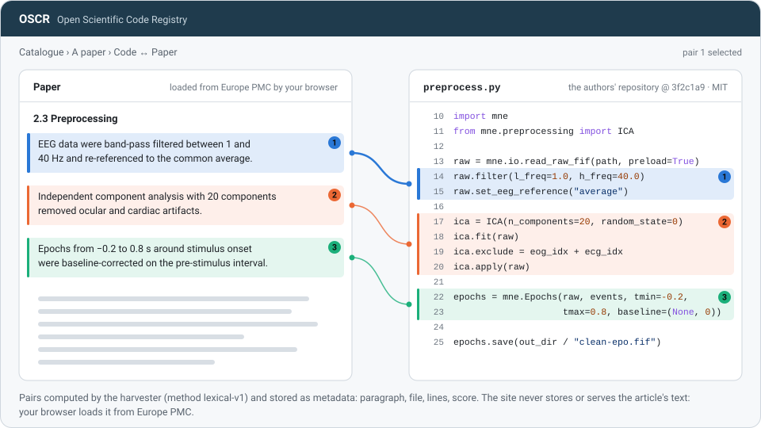
</picture>

- **The paper, on the left, comes straight from Europe PMC to your browser.** The website
  never stores or serves the text of an article: the page ships paragraph numbers, and your
  browser fetches the open-access XML and shows it as plain text.
- **The script, on the right,** is the authors' file at the verified commit, with numbered
  lines. A script whose license does not allow republication is never copied: the reader
  lists the file and links to it at the source, at the verified commit.
- **Paired highlights**: the same color and number mark a paragraph and the lines that
  match it. Clicking either side brings the other into view.
- **The pairs are computed by the harvester** (`oscr align`, method `lexical-v1`) and stored
  as metadata: the paragraph's number, its section title, the file, the line range, the
  symbol, a score and at most six short technical terms as evidence, never a span of the
  article. Paragraphs and code units (functions, notebook cells, script blocks) become bags
  of technical terms (word stems, two-word phrases, compound identifiers, numeric constants
  and ranges, tool names, figure numbers), and a pair is kept only when several rare terms
  agree, both sides rank each other near the top, and the score clears a threshold set by
  reading pairs by hand (25 papers, 2026-09-26). A wrong highlight costs the reader more
  than a missing one.
- **Measured** on the 25-paper alignment set: 159 pairs.
  - A fresh sample of 33 of them (15 papers), not used for tuning and checked by hand: 24
    correct, 9 plausible (setup or wrapper code next to the real computation), 0 wrong.
  - Over all 91 pairs judged by hand: 67 correct, 23 plausible, 1 wrong.
  - On the whole catalogue (2026-09-26): 1,872 pairs for 256 papers, about 0.3 s per paper
    on the Mac.

## Tracing maps and DOIs

A **tracing map** is a small JSON file that says, for one paper, where its code is
(repository, commit, license), what was found there (files and digests), how it was found,
and which paragraphs match which lines. It holds neither the paper's text nor the code.
Here is the map proposed for `doi:10.7554/elife.106554` (two of its seven files shown), with
the test validation used to exercise the chain on the Zenodo sandbox:

```json
{
  "format": "tracing-map/0.1",
  "paper": {
    "doi": "10.7554/elife.106554",
    "title": "Enhanced tactile coding in rat neocortex under darkness.",
    "journal": "eLife",
    "published": "2026-09-21",
    "authors": ["Yamashiro K", "Tanaka S", "Matsumoto N", "Ikegaya Y"]
  },
  "code": [
    {
      "repo": "github.com/ut-yakusaku/yamashiro-elife-2024",
      "url": "https://github.com/UT-yakusaku/Yamashiro-eLife-2024",
      "state": "alive",
      "license": "MIT",
      "commit": "35d0551cf4740cc20ddf8e66058a2126c5f564dc",
      "commit_date": "2026-09-18T18:47:15-05:00",
      "type": "",
      "software_heritage_archived": false,
      "level": "inventoried",
      "found_by": "text:availability",
      "section": "Data availability",
      "files": [
        {"path": "main.py", "language": "Python", "digest": "f189c687dec3ddaf5cc7aa3903831d8d94cb677be8353aa29e36487439ba94b0"},
        {"path": "trainer.py", "language": "Python", "digest": "98cc4ff699760da749737273a7dac599507d9bfb55ca8b7922a1ec077d9cd409"}
      ]
    }
  ],
  "alignments": [],
  "proposed": {"by": "oscr", "on": "2026-09-26"},
  "validated": {"by": "Carberry, Josiah", "orcid": "0000-0002-1825-0097", "on": "2026-09-26", "proof": "test"}
}
```

Josiah Carberry is ORCID's fictitious test researcher, and a `test` proof is ignored by the
real Zenodo. This map was proposed before the pairs were computed; each entry of
`alignments` has `paragraph`, `section`, `repo`, `path`, `start_line`, `end_line`, `symbol`,
`score`, `evidence` and `method`.

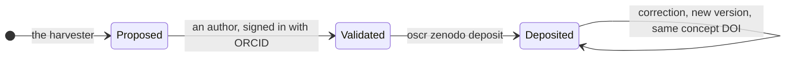

The rules:

- **A DOI only for a map validated by one of the paper's authors** (ORCID). Machine-generated
  maps are shown on the website without a DOI, never deposited.
- **The DOI is on the map, never on the code**: the authors' code is never redeposited.
- **Relations**: `IsSupplementTo` the paper's DOI; `References` the code repository: its
  DOI when it has one, otherwise its address, pinned to the validated commit on GitHub,
  GitLab and Codeberg.
- **Creators**: the validating author, with their ORCID, and the platform. License of the
  record: CC0-1.0. The maps are gathered in a Zenodo community (`oscr`, on the sandbox during
  development).
- **Status**: no real DOI has been issued yet. Author sign-in on the website comes first
  (see the roadmap); until then, deposits go to the Zenodo sandbox, whose DOIs (prefix
  `10.5072`) are not real.

## Architecture: the $0 stack

| Piece | Runs on | Does | Cost |
|---|---|---|---|
| **Harvester**: `oscr watch`, launchd agent `org.oscr.harvester` | a Mac Studio, around the clock, at low priority | reads papers, finds and verifies code, keeps the scripts' text in a private SQLite database (WAL) | $0 |
| **Dashboard**: `oscr dashboard`, agent `org.oscr.dashboard` | the same Mac, http://127.0.0.1:8790, local only | a live, read-only view of the private database | $0 |
| **Nightly publication**: `oscr nightly`, agent `org.oscr.nightly`, 04:17 | the same Mac | writes the public catalogue to `data/public/`, uploads it to Hugging Face, rebuilds and deploys the website | $0 |
| **Website**: [`website/`](website/), Astro, static | Cloudflare Workers (static assets), https://oscr.yannbellec-b.workers.dev | the catalogue, a page per paper, the Code ↔ Paper reader | $0 |
| **Open catalogue** | Hugging Face dataset `opsecsystems/oscr-catalog`, private until the owner decides | `articles.csv`, `repositories.csv`, `scripts.jsonl`, `alignments.jsonl`, `oscr_public.db` | $0 |
| **Tracing-map DOIs**: `oscr zenodo …` | Zenodo (CERN); the sandbox during development | a DOI for each author-validated map | $0 |
| **Code and CI** | GitHub | this repository, [GitHub Actions](.github/workflows/ci.yml) | $0 |

Everything is plain files and free tiers: SQLite in WAL mode lets the harvester write while
the dashboard and the nightly job read; the public copy of the database (`oscr_public.db`,
no excerpt of any paper) opens in Datasette. Details and the free-tier limits that matter:
[docs/ARCHITECTURE.md](docs/ARCHITECTURE.md). Every free host we compared, and the measured
throughput: [docs/HOSTING_AND_THROUGHPUT.md](docs/HOSTING_AND_THROUGHPUT.md).

## Quick start

You need Python 3.12 (3.11 works), [uv](https://docs.astral.sh/uv/) and git; Node.js 22.12
or later for the website.

```bash
git clone https://github.com/yannbellec/Open-Scientific-Code-Registry-OSCR-.git
cd Open-Scientific-Code-Registry-OSCR-
uv sync
uv run pytest -q

uv run oscr run                              # an incremental pass (7 days back the first time)
uv run oscr doi 10.7554/eLife.100605         # specific papers
uv run oscr scan --domain electrophysiology --since 2026-09-01
uv run oscr backfill --domain neuro --hours 2   # walk back into the backlog, month by month
uv run oscr align                            # paragraph ↔ lines pairs (lexical-v1)
uv run oscr stats                            # the figures
uv run oscr dashboard                        # http://127.0.0.1:8790
uv run oscr watch                            # continuously, like the Mac agent (Ctrl-C stops it)
uv run oscr nightly --dataset '' --cloudflare ''   # the public catalogue in data/public, nothing sent
```

**Domains**: `neuro` (broad, the default), `electrophysiology` (EEG, MEG, iEEG), or any
Europe PMC query.

**Tracing maps** (the Zenodo sandbox is the default instance):

```bash
uv run oscr zenodo card 10.7554/elife.106554        # the proposed map, as JSON
uv run oscr zenodo community --create               # the community (a sandbox token is required)
uv run oscr zenodo validate 10.7554/elife.106554 --orcid 0000-0002-1825-0097 --name "Carberry, Josiah"   # a TEST validation, sandbox only
uv run oscr zenodo deposit 10.7554/elife.106554 --dry-run   # the Zenodo record, nothing sent
uv run oscr zenodo deposit 10.7554/elife.106554     # refused until an author has validated
```

**On a Mac, in the background**:

```bash
tools/install_mac.sh              # installs and starts the three launchd agents; re-run to update
tools/install_mac.sh --uninstall  # removes them (the data stays)
```

| To | Run |
|---|---|
| follow the harvester | `tail -f ~/Library/Logs/oscr/harvester.log` |
| pause it | `launchctl bootout gui/$(id -u)/org.oscr.harvester` |
| resume it | `launchctl bootstrap gui/$(id -u) ~/Library/LaunchAgents/org.oscr.harvester.plist` |
| publish now | `launchctl kickstart gui/$(id -u)/org.oscr.nightly` |

**Settings** live in `~/.config/oscr/settings` (`KEY=value`): `OSCR_DOMAIN`,
`OSCR_PRIORITY` (`background` or `normal`), `OSCR_HF_DATASET`, `OSCR_CLOUDFLARE_PROJECT`,
`OSCR_ZENODO_INSTANCE` (`sandbox` or `zenodo`), `OSCR_ZENODO_COMMUNITY` and a few more,
all described in [docs/GETTING_STARTED.md](docs/GETTING_STARTED.md).

**Environment**, all optional:

| Variable | Use |
|---|---|
| `GITHUB_TOKEN` | the search for READMEs that cite a DOI (10 requests a minute without a token), authenticated clones |
| `OSCR_CONTACT` | a contact address for Crossref's polite pool; nothing is sent when it is unset |
| `HF_TOKEN` | Hugging Face uploads (otherwise the token of `hf auth login`, at its standard location) |
| `ZENODO_SANDBOX_TOKEN`, `ZENODO_TOKEN` | Zenodo deposits (otherwise the macOS keychain services `org.oscr.zenodo-sandbox` and `org.oscr.zenodo`) |

## Data and licensing

| What | License | Where |
|---|---|---|
| OSCR's code | Apache-2.0, see [LICENSE](LICENSE) and [NOTICE](NOTICE) | this repository |
| The catalogue: papers, links, verdicts, repositories, statuses, alignments | CC0-1.0 | the Hugging Face dataset, the website, `oscr_public.db` |
| Tracing maps | CC0-1.0 | their Zenodo records |
| The authors' scripts | **each keeps its own license**; the text is republished only when that license allows it | `scripts.jsonl`, the website |
| The papers | not ours: never republished, only linked by DOI | Europe PMC and the publishers |

## Rules

- **No article text or PDF is ever published**: a DOI link, nothing more. The sentences
  that justified each verdict stay in the private database.
- **Code without a license stays a link and a commit**, never a copy.
- **No mass email.** Authors come to OSCR, not the other way round: validating a map will be
  a form they choose to use.
- **No paid service.**
- **Politeness**: a minimum interval per service (0.75 s between two Europe PMC requests),
  an on-disk cache, no repeated request, and a pause when a service's quota runs out.
- **Tokens never enter the repository or the settings file**: they stay at their standard
  location, in the macOS keychain or in Cloudflare secrets.

## Roadmap

- [ ] **Author validation on the website**: an author signs in with ORCID (free public API),
      reviews their map, validates or corrects it. The site's Worker writes the
      validation to D1; the Mac picks it up and deposits the map on Zenodo. No real DOI before
      this exists, on purpose.
- [ ] **Search** on the website, designed in the platform plan below.
- [ ] **Better alignment**: beyond `lexical-v1`, GROBID for the text, tree-sitter for the
      code, a local model on the Mac.
- [ ] **The past years** from the PMC Open Access bucket on AWS, rather than thousands of
      Europe PMC requests.
- [ ] **Reverse indexes** of ModelDB and G-Node GIN, where code is linked to its paper by
      construction.
- [ ] **A wider recall benchmark**: NeuroLibre, ReScience C, CODECHECK, and closed-access
      papers, where only the metadata speaks.

The platform extension (accounts, search, community) is specified in
[docs/PLATFORM_PLAN.md](docs/PLATFORM_PLAN.md) and awaits the owner's validation.

## Documentation

| Document | Contents |
|---|---|
| [docs/GETTING_STARTED.md](docs/GETTING_STARTED.md) | install and connect everything, step by step; daily operations; troubleshooting |
| [docs/ARCHITECTURE.md](docs/ARCHITECTURE.md) | the pieces, the tracing map's life, the free-tier limits |
| [docs/HOSTING_AND_THROUGHPUT.md](docs/HOSTING_AND_THROUGHPUT.md) | measured throughput, API quotas, every free host compared |
| [docs/STATE_OF_THE_ART.md](docs/STATE_OF_THE_ART.md) | sources, tools and literature; what we measured and learned |

## Citation

If you use OSCR or its catalogue, please cite it with the metadata in
[CITATION.cff](CITATION.cff) (GitHub's "Cite this repository" button reads it);
[codemeta.json](codemeta.json) carries the same description.

```bibtex
@software{oscr,
  author  = {{The OSCR contributors}},
  title   = {{OSCR}: Open Scientific Code Registry},
  url     = {https://github.com/yannbellec/Open-Scientific-Code-Registry-OSCR-},
  license = {Apache-2.0},
  year    = {2026}
}
```

OSCR meets three of the five [fair-software.eu](https://fair-software.eu) recommendations: a
public repository, a license and a citation file; a community registry entry and a quality
checklist are still to come.

## Contributing

Bug reports, new sources of links, sharper heuristics, documentation and accessibility
fixes are welcome. Read [CONTRIBUTING.md](CONTRIBUTING.md) first: the rules above are not
negotiable. Please follow the [Code of Conduct](CODE_OF_CONDUCT.md), and report security
issues privately as described in [SECURITY.md](SECURITY.md).

## License

The code is under the [Apache License 2.0](LICENSE). The catalogue data and the tracing
maps are dedicated to the public domain under
[CC0-1.0](https://creativecommons.org/publicdomain/zero/1.0/). Every harvested script keeps
the license its authors gave it.
