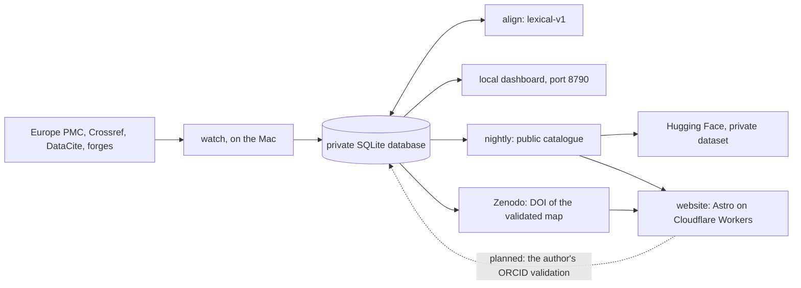
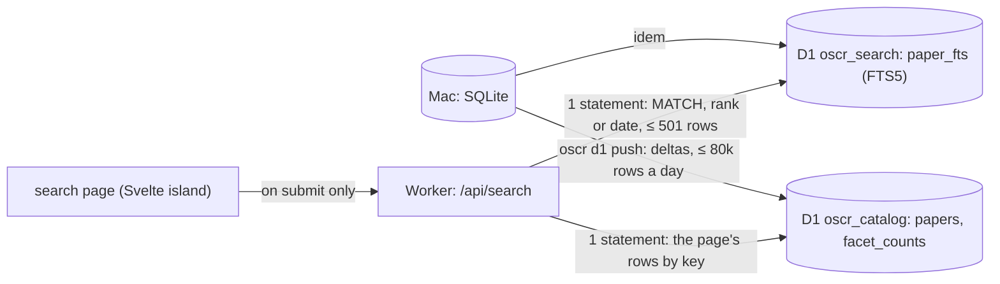

# Architecture, at $0

The rules that govern everything below are in [CLAUDE.md](../CLAUDE.md):
- Zenodo DOIs only for tracing maps validated by one of the paper's authors;
- no paid service.

## The pieces

| Piece | Where it runs | What it does | Cost |
|---|---|---|---|
| **The harvester** (`oscr watch`) | the Mac Studio, continuously | reads the papers, finds and verifies the code, keeps the scripts' text in the private database (SQLite, WAL) | $0 |
| **The alignment** (`oscr align`) | the Mac; the harvester also runs it once a day for the papers still without pairs | pairs the paper's paragraphs with lines of the authors' code (method `lexical-v1`) and stores the pairs in the `alignment` table | $0 |
| **The local dashboard** (`oscr dashboard`) | the Mac, http://127.0.0.1:8790 | the table of the private database, for the owner only, read-only | $0 |
| **The public catalogue** (`oscr nightly`) | the Mac, at 04:17 | `data/public/` in public mode, then the Hugging Face dataset, then the website | $0 |
| **The website** (`website/`, Astro) | Cloudflare Workers (static assets) | the public site, built from the public catalogue, with the Code ↔ Paper reader | $0 |
| **The search index** (`oscr d1 push`, Phase 3) | the Mac → Cloudflare D1 | the papers with a page, projected into two D1 databases (`oscr_catalog`, `oscr_search`), pushed as deltas within 80,000 rows written a day ([SEARCH.md](SEARCH.md)) | $0 |
| **The Worker's code** (`website/worker/`, Phase 3) | Cloudflare Workers, `/api/*` only | `/api/search`: FTS5 in D1, facets, sorts, CSV and JSON exports | $0 (100,000 requests a day) |
| **The map DOIs** (`oscr zenodo`) | Zenodo (CERN) | a map validated by an author receives a DOI in the community | $0 |

The database is in WAL mode: the harvester writes while the dashboard and the nightly job
read, and none of them blocks the others. What leaves the Mac (`oscr_public.db`) is put back
into a single file, with no excerpt of any paper.

## The enriched record (Phase 1)

Every paper read gets a record beyond its links. It is built on the Mac from what the Mac
already holds: `oscr/enrich.py`, run on every new paper and by `oscr enrich` for the papers
read before.

| source | what it gives | module |
|---|---|---|
| the cached full text (JATS, both of Europe PMC's flavours) | type, abstract, journal (ISSN, publisher), volume, issue, pages, dates, authors (order, ORCID, affiliations, ROR, corresponding), funding, keywords, subjects, references, RRIDs, availability statements | `oscr/biblio.py` |
| the Europe PMC `core` result (kept in `epmc_record` since Phase 1) | MeSH, grants, more ORCIDs, citation count, open-access flag, corrections and retractions | `oscr/biblio.py` |
| the Retraction Watch data (a weekly download, looked up locally by DOI) | retractions, corrections, expressions of concern | `oscr/sources/retractions.py` |
| the stored file lists and scripts | notebooks, README, CITATION.cff, environment files, tests, CI; the tools used (imports and calls) | `oscr/repofeatures.py` |
| rules over title, keywords, MeSH, journal, abstract | on topic or not, modality, organism, population, subfield, each with a confidence and its reasons | `oscr/classify.py` |

- **The schema changes by numbered migrations** (`oscr/migrations/NNNN_*.sql`), applied once,
  in order, each in one transaction, when the database opens. Schema 4 adds the tables of
  [PLATFORM_PLAN.md](PLATFORM_PLAN.md) §4.
- **Provenance**: `field_provenance` says where each value came from (jats, epmc,
  retraction-watch…) and when.
- **Versions**: `version` keeps each change of a record, with what changed; texts appear
  there only as digests.
- **Every verdict on a repository** is kept in `alive_check`, not only the last one.
- **Categories** (owner's decision D6): the rules first; the owner's own labels
  (`oscr labels data/annotation/sample.csv`) win over the rules. A local model will decide
  the ambiguous cases, only between 01:00 and 07:00, once compared with the owner's labels
  (`tools/compare_models.py`).
- **Off-topic papers** (D7) stay on the Mac: they are out of every public output (the
  catalogue, the scripts, the matches, the public database) and out of the statistics.
- **No article text leaves** (`catalog.public_db`). Abstracts, the raw Europe PMC records and
  the versions are removed from the public database, and availability statements are kept
  only under CC BY, CC0, CC BY-SA or CC BY-NC (D1).
- **Rates are computed on research articles** (`catalog.RESEARCH_TYPES`); reviews,
  conference abstracts, case reports and notices are counted apart.

## The Code ↔ Paper reader

A page of the website puts a paper and its authors' code side by side.

- **Left, the paper.** Its full text is fetched from Europe PMC (open access, CORS allowed)
  by the reader's browser, never by the site, and shown as plain text. The site never stores
  or serves the text of a paper.
- **Right, the code.** One view is prerendered at build time; the others are fetched on
  demand from the lot of their repository (`/scripts/NN.json`). A script whose license does
  not allow republication is not copied: the reader lists the file and links to it at the
  source, at the verified commit.
- **The pairs** come from `alignments/NN.json`, read at build time. A pair joins paragraph
  number *i* (the index of a `
` among all the `
` of the JATS `<body>`, in document
  order, which the browser computes the same way) and a line range of one file: the same
  color on both sides. Clicking one side brings the other into view. The build keeps only the
  known fields of a pair and drops any evidence term longer than 60 characters, so no
  sentence of a paper can reach the site.

The website's name is not written in its pages: it comes from `SITE_NAME` (default `OSCR`)
and `SITE_TAGLINE`, set in `website/src/config.ts` or at build time.

## The website's pages

Every page is static: Astro builds it from the public export (`data/public/`, written by
`oscr nightly` in public mode), and the Worker serves it as a static asset. Every `<title>`
ends with `SITE_NAME`; the only style is `science.css`.

| route | what it shows | from the export |
|---|---|---|
| `/` | the papers with their authors' code, by day of publication | `catalog.json` |
| `/paper/<slug>/` | a paper with code, code on request or data only (decision D2): its authors (those with an ORCID iD linked), journal, categories, tools, code and data | `catalog.json`, `entities/` |
| `/paper/<slug>/code/` | the Code ↔ Paper reader, for the papers with code | `catalog.json`, `alignments/`, `scripts/` |
| `/browse/` | the categories by facet, with their counts; the other ways in | `entities/categories.json` |
| `/browse/<facet>/<value>/` | the papers of a category, by day | `entities/categories.json` |
| `/authors/`, `/author/<orcid>/` | the authors with an ORCID iD: latest affiliations, institutions, tools, papers | `entities/authors.json` |
| `/journals/`, `/journal/<id>/` | ISSN, publisher, papers with code out of papers read | `entities/journals.json` |
| `/institutions/`, `/institution/<ror>/` | the authors' institutions, by ROR id | `entities/institutions.json` |
| `/tools/`, `/tool/<id>/` | the tools found in the authors' code: repositories, papers | `entities/tools.json` |
| `/datasets/`, `/dataset/<id>/` | the datasets cited, by repository | `entities/datasets.json` |
| `/lookup/` | the DOI lookup: any paper read, with or without a page | `lookup/NNN.json`, fetched by the browser |
| `/search/` | the search (Phase 3): a static page and a Svelte island that asks `/api/search` only when a search is submitted | D1, through the Worker |
| `/about/` | what the registry is, and what it never publishes | — |

- **Who counts.** `oscr/entities.py` counts only the papers with a page (D2): the authors'
  code (verified, found, empty, dead), code on request, data only. An off-topic paper appears
  nowhere, the lookup included (D7).
- **People** are merged by ORCID iD only; a name without one stays a name on its paper's
  page. No email address or telephone number leaves the export, and the build removes any
  string that still looks like an address.
- **The lookup** is static: the page fetches one shard, `/lookup/NNN.json` (the first 3 hex
  characters of the SHA-1 of the lowercased DOI), only when its form is submitted.
- **Bounded.** `STATIC_MAX` (`website/src/lib/entities.ts`): 2,000 pages per entity type,
  the entities with the most papers; beyond, pages will be rendered on demand by the Worker
  from D1 (Phase 3). `npm run check` (in CI with `--every-route`) checks every route and every
  internal link after the build, and prints the number of files.

## The tracing map

The map (`tracing-map.json`, see `oscr/zenodo.py`) says, for a paper:
- where its code is: repository, commit, license;
- what was found there: the path and digest of each file;
- how it was found;
- which paragraphs match which lines (`alignments`).

It contains neither the text of the paper nor the code.

Its life:
1. **Proposed** by the harvester. It is visible on the website, without a DOI.
2. **Validated** by an author, signed in with their ORCID. The map kept is the one the
   author saw, or corrected.
3. **Deposited** on Zenodo, in the community (`oscr zenodo deposit`). It receives a DOI.
   - Relations: `IsSupplementTo` the paper, `References` the code repository, at the
     validated commit.
   - Creators: the author (ORCID) and the platform.
4. **Corrected** later: a new version, under the same concept DOI.

## What remains to build, in order

1. ~~Deploy the website~~: done on 2026-09-26, https://oscr.yannbellec-b.workers.dev, rebuilt every night.
2. **Author validation.** ORCID offers sign-in for free (public API, `/authenticate`
   scope). The site's Worker receives the validation and writes it to D1. The Mac picks it
   up, then deposits the map on Zenodo.
3. ~~Search~~: built in Phase 3 (below, and [SEARCH.md](SEARCH.md)); the remote databases await the owner's approval.
4. ~~A first paper ↔ code alignment~~: `lexical-v1`, computed on the Mac. Next: GROBID for
   the text, tree-sitter for the code, a local model on the Mac.

## The free limits that matter

Checked on 2026-09-26 in Cloudflare's documentation; the full table, with sources, is in
[PLATFORM_PLAN.md](PLATFORM_PLAN.md) (§2 and Appendix A).

| Service | Limit | Consequence |
|---|---|---|
| Workers static assets | 20,000 files per version; 25 MiB per file; asset requests free and unlimited | one static page per paper holds up to ~15,000 papers with code. Beyond that: pages grouped, or rendered on demand |
| Workers | 100,000 requests per day for all dynamic routes, cached or not; 10 ms of CPU per request; 64 MiB per Worker | kept for actions: sign-in, validation, search, API |
| D1 | 500 MB per database, 10 databases; 5 M rows read and 100,000 written per day | the catalogue projection, the script index and the community, pushed as deltas |
| Hugging Face | public datasets free ("best-effort"); byte ranges with CORS | the open data, and the script blocks |
| Zenodo | 50 GB per record; 60 requests per minute without a token | a map weighs a few KB |

**The scripts' text.** Today, 32 lots in `public/scripts/`. Decided on 2026-09-26
([SCRIPT_STORAGE.md](SCRIPT_STORAGE.md)): deduplicated, zstd, Parquet blocks on a public
Hugging Face dataset, read by the reader in the browser with range requests (~78 KB per
script), with an index in D1. Measured: 155 MB of text become 25.6 MB; ~3.3 GB at the full
neuro stock, of which ~2.3 GB are public.

## Planned platform

The platform extension (a normalized D1 catalogue, accounts, search and a community) is
specified in [PLATFORM_PLAN.md](PLATFORM_PLAN.md). Each phase follows the rules of
[CLAUDE.md](../CLAUDE.md); Phase 2 (navigation, the pages above) and Phase 3 (the search,
below) are built on their branches and await the owner's review.

### Search engine

**Built (Phase 3), awaiting the owner's review; the remote databases await approval.** SQLite
FTS5 in D1, not Pagefind; the details, the API and the measurements are in
[SEARCH.md](SEARCH.md), the choice in [PLATFORM_PLAN.md](PLATFORM_PLAN.md) §7.

- **Two databases**, because a D1 database that holds FTS5 cannot be exported: `oscr_catalog`
  (what a result row shows, the precomputed counts of the unfiltered view) and `oscr_search`
  (the index).
- **The filters are index tokens**, not an index table: each facet value of a paper is a token
  of the index's `facets` column, so a filter is part of the MATCH, costs no row written per
  value, and D1 reads only the matching rows.
- **The key is the date**: YYYYMMDD × 100,000 + n. "Newest first" is the index's rowid order and
  a date range a rowid range, without an index.
- **Bounded costs**: a window of 500 results gives the page, the exact total and the facet
  counts up to 500 (past it, the counts are the first 500's, the total says "more than 500" and
  the pages stop there): a search reads at most ~540 rows (~600 at 50 results a page), an export
  ~1,500; the Worker's CPU stays under ~3 ms (measured in V8, docs/SEARCH.md §5).
- **Never an abstract in an answer**: abstracts are indexed only under an open license (D1's
  rule), in a contentless index; results carry title, journal, date, status and links.

**Why not Pagefind.** Pagefind writes one fragment file per indexed record, plus index
chunks, filter files and a start-up file that lists every record.
- A searchable catalogue of 50–90k papers needs ~50–90k files. The limit is 20,000 files per
  Pages deployment, which Pagefind reaches at ~15k records.
- Pagefind has no incremental index, so every rebuild re-uploads most chunks over a home
  uplink (~0.9 MB/s, and ~25 KB/s for a background task).
- Its maintainer calls ~180k pages "probably around the ceiling".
- Everything indexed can be downloaded by anyone.

**The cost to watch.** Every search is a Worker request, even when cached, out of 100,000 a
day for the whole site, plus D1 rows read (5 M a day). If that budget gets tight, the fallback
costs no request: a static inverted index published as Parquet blocks on Hugging Face and read
by byte ranges, like the scripts (the owner's plan B, decision D3).
