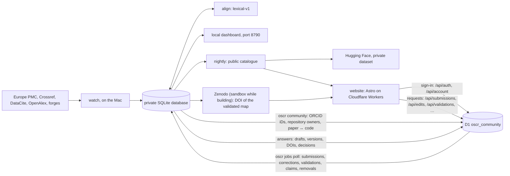
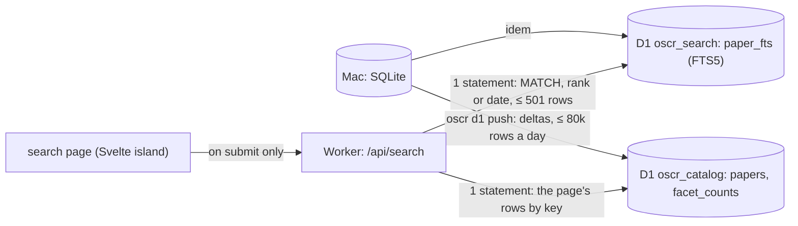

# Architecture, at $0

The rules that govern everything below are in [CLAUDE.md](../CLAUDE.md):
- Zenodo DOIs only for tracing maps validated by one of the paper's authors;
- no paid service.

## The pieces

| Piece | Where it runs | What it does | Cost |
|---|---|---|---|
| **The harvester** (`oscr watch`) | the Mac Studio, continuously | reads the papers, finds and verifies the code, keeps the scripts' text in the private database (SQLite, WAL) | $0 |
| **The alignment** (`oscr align`) | the Mac; the harvester also runs it once a day for the papers still without pairs | pairs the paper's paragraphs with lines of the authors' code (method `lexical-v1`) and stores the pairs in the `alignment` table | $0 |
| **The local dashboard** (`oscr dashboard`) | the Mac, http://127.0.0.1:8790 | the table of the private database, for the owner only, read-only | $0 |
| **The public catalogue** (`oscr nightly`) | the Mac, at 04:17 | `data/public/` in public mode, then the Hugging Face dataset, then the website | $0 |
| **The website** (`website/`, Astro) | Cloudflare Workers (static assets) | the public site, built from the public catalogue, with the Code ↔ Paper reader | $0 |
| **The search index** (`oscr d1 push`, Phase 3) | the Mac → Cloudflare D1 | the papers with a page, projected into two D1 databases (`oscr_catalog`, `oscr_search`), pushed as deltas within 80,000 rows written a day ([SEARCH.md](SEARCH.md)) | $0 |
| **The Worker's code** (`website/worker/`, Phase 3) | Cloudflare Workers: `/api/*`, and the requests no static file answers | `/api/search`: FTS5 in D1, facets, sorts, CSV and JSON exports; the pages of the papers past the 6,500 most recent, from their records (no D1), and the 404 page | $0 (100,000 requests a day) |
| **The map DOIs** (`oscr zenodo`) | Zenodo (CERN) | a map validated by an author receives a DOI in the community | $0 |
| **The accounts** (`website/worker/account/`, Phase 5) | the Worker's code, `/api/auth/*` and `/api/account/*`, with the D1 database `oscr_community` | sign-in with ORCID, GitHub or Google; sessions; the verified authors and maintainers ([ACCOUNTS.md](ACCOUNTS.md)) | $0 |
| **The accounts' facts** (`oscr community`) | the Mac | the ORCID iDs of the papers with a page, the owners of their repositories and which paper each is the code of, pushed to `oscr_community` as deltas (locally, or to Cloudflare: nightly with `OSCR_COMMUNITY_PUSH=remote`) | $0 |
| **The contributions** (`website/worker/contributions/`, Phase 6) | the Worker's code, `/api/contributions`, `/api/submissions`, `/api/claims`, `/api/edits`, `/api/validations`, `/api/reports`, with `oscr_community` | submit a paper and its code, claim a paper, correct a record, validate a map, request a removal: checked at once, recorded with a job for the Mac ([CONTRIBUTIONS.md](CONTRIBUTIONS.md)) | $0 |
| **The job runner** (`oscr jobs poll`, Phase 6) | the Mac, every ten minutes (proposed: `tools/org.oscr.jobs.plist`, not installed) | reads the new jobs in `oscr_community`, harvests a submitted paper into a draft, applies corrections as new versions, deposits validated maps on the Zenodo sandbox, lists claims and removal requests for the owner (`oscr claims`, `oscr reports`, `oscr submissions`) | $0 |

The database is in WAL mode: the harvester writes while the dashboard and the nightly job
read, and none of them blocks the others. What leaves the Mac (`oscr_public.db`) is put back
into a single file, with no excerpt of any paper.

## The enriched record (Phase 1)

Every paper read gets a record beyond its links. It is built on the Mac from what the Mac
already holds: `oscr/enrich.py`, run on every new paper and by `oscr enrich` for the papers
read before.

| source | what it gives | module |
|---|---|---|
| the cached full text (JATS, both of Europe PMC's flavours) | type, abstract, journal (ISSN, publisher), volume, issue, pages, dates, authors (order, ORCID, affiliations, ROR, corresponding), funding, keywords, subjects, references, RRIDs, availability statements | `oscr/biblio.py` |
| the Europe PMC `core` result (kept in `epmc_record` since Phase 1) | MeSH, grants, more ORCIDs, citation count, open-access flag, corrections and retractions | `oscr/biblio.py` |
| the Retraction Watch data (a weekly download, looked up locally by DOI) | retractions, corrections, expressions of concern | `oscr/sources/retractions.py` |
| OpenAlex (one free lookup by DOI per paper, the owner's key; kept in `openalex_record`) | the work's id, institutions by ROR id with country and type, open-access status and link, a preprint, the primary topic (subfield, field, domain), referenced and related works; and, only where the JATS and Europe PMC said nothing, ORCID iDs, corresponding authors, funders, citation and reference counts, volume, issue, pages, publisher | `oscr/sources/openalex.py` |
| the stored file lists and scripts | notebooks, README, CITATION.cff, environment files, tests, CI; the tools used (imports and calls) | `oscr/repofeatures.py` |
| rules over title, keywords, MeSH, journal, abstract | on topic or not, modality, organism, population, subfield, each with a confidence and its reasons | `oscr/classify.py` |

- **The schema changes by numbered migrations** (`oscr/migrations/NNNN_*.sql`), applied once,
  in order, each in one transaction, when the database opens. Schema 4 adds the tables of
  [PLATFORM_PLAN.md](PLATFORM_PLAN.md) §4.
- **Provenance**: `field_provenance` says where each value came from (jats, epmc,
  retraction-watch, openalex…), with the record it came from (a PMCID, an OpenAlex id), and
  when. The sources merge in that order of authority: the JATS, then Europe PMC, then OpenAlex,
  which never replaces a value another source gave (a person's correction, the owner's label
  included).
- **OpenAlex** (schema 7, `oscr/migrations/0007_openalex.sql`): the key comes from the macOS
  keychain (`org.oscr.openalex`, or `OPENALEX_API_KEY`) and travels only in the
  `Authorization` header to api.openalex.org — never in a URL, the cache, a log or an error.
  Only single lookups are made (free; $1 of credit a day covers the paid calls OSCR does not
  make); each day's calls and spending are kept from OpenAlex's own headers (`openalex.Budget`),
  and a second 429 stops OpenAlex until midnight UTC. New papers are looked up during their
  scan, before their enrichment (`harvest.scan_article`); those OpenAlex does not know yet (it
  lags a few days) are asked again a week later by the watch's daily round
  (`enrich.openalex_pass`); `oscr enrich --openalex [--all]` does the papers read before,
  resumably. The raw records stay on the Mac; the institutions, topics, open-access status,
  preprints and counts reach the pages, the entities and the search (`catalog.public_db`
  keeps nothing of off-topic papers).
- **Versions**: `version` keeps each change of a record, with what changed; texts appear
  there only as digests.
- **Every verdict on a repository** is kept in `alive_check`, not only the last one.
- **Categories** (owner's decision D6): the rules first; the owner's own labels
  (`oscr labels data/annotation/sample.csv`) win over the rules. A local model will decide
  the ambiguous cases, only between 01:00 and 07:00, once compared with the owner's labels
  (`tools/compare_models.py`).
- **Off-topic papers** (D7) stay on the Mac: they are out of every public output (the
  catalogue, the scripts, the matches, the public database) and out of the statistics.
- **No article text leaves** (`catalog.public_db`). Abstracts, the raw Europe PMC and OpenAlex
  records and the versions are removed from the public database, and availability statements are kept
  only under CC BY, CC0, CC BY-SA or CC BY-NC (D1). The paper's page shows the abstract and the
  statements under the same licenses only (Phase 4, below).
- **Rates are computed on research articles** (`catalog.RESEARCH_TYPES`); reviews,
  conference abstracts, case reports and notices are counted apart.

## The Code ↔ Paper reader

A page of the website puts a paper and its authors' code side by side.

- **Left, the paper.** Its full text is fetched from Europe PMC (open access, CORS allowed)
  by the reader's browser, never by the site, and shown as plain text. The site never stores
  or serves the text of a paper.
- **Right, the code.** One view is prerendered at build time; the others are fetched on
  demand from the lot of their repository (`/scripts/NN.json`). A script whose license does
  not allow republication is not copied: the reader lists the file and links to it at the
  source, at the verified commit.
- **The pairs** come from `alignments/NN.json`, read at build time. A pair joins paragraph
  number *i* (the index of a `
` among all the `
` of the JATS `<body>`, in document
  order, which the browser computes the same way) and a line range of one file: the same
  color on both sides. Clicking one side brings the other into view. The build keeps only the
  known fields of a pair and drops any evidence term longer than 60 characters, so no
  sentence of a paper can reach the site.

The website's name is not written in its pages: it comes from `SITE_NAME` (default `OSCR`)
and `SITE_TAGLINE`, set in `website/src/config.ts` or at build time.

## The website's pages

Astro builds the site from the public export (`data/public/`, written by `oscr nightly` in
public mode), and the Worker serves it as static assets. Every `<title>` ends with `SITE_NAME`;
the only style is `science.css`. A Worker serves at most 20,000 static files per version, so
the number of files must not grow with the catalogue: how each kind of page is rendered is in
"How pages are rendered, and the file budget" below.

| route | what it shows | from the export | rendered |
|---|---|---|---|
| `/` | the papers with their authors' code, by day of publication | `catalog.json` | static |
| `/paper/<slug>/` | a paper with code, code on request or data only (decision D2), in sections: Overview, Code, Map, Data, Versions, Cite, Similar (and Discussion, Reproductions, Activity, which open with sign-in); see "The paper's page" below | `catalog.json`, `entities/`, `papers/` | static for the 6,500 most recent (`STATIC_PAPERS`); the others by the Worker, a reduced page |
| `/paper/<slug>/code/` | the Code ↔ Paper reader, for the papers with code | `catalog.json`, `alignments/`, `scripts/` | static with its paper; past them, the Worker sends it to `/paper/<slug>/#code` |
| `/browse/` | the categories by facet, with their counts; the other ways in | `entities/categories.json` | static |
| `/browse/<facet>/<value>/` | the papers of a category, by day | `entities/categories.json` | static (the vocabulary's ~60 values; 300 at most) |
| `/authors/`, `/author/<orcid>/` | the authors with an ORCID iD: latest affiliations, institutions, tools, papers | `entities/authors.json` | the list static; each author in the browser, from `/records/author/NN.json` |
| `/journals/`, `/journal/<id>/` | ISSN, publisher, papers with code out of papers read | `entities/journals.json` | idem, `/records/journal/` |
| `/institutions/`, `/institution/<ror>/` | the authors' institutions, by ROR id | `entities/institutions.json` | idem, `/records/institution/` |
| `/tools/`, `/tool/<id>/` | the tools found in the authors' code: repositories, papers | `entities/tools.json` | idem, `/records/tool/` |
| `/datasets/`, `/dataset/<id>/` | the datasets cited, by repository | `entities/datasets.json` | idem, `/records/dataset/` |
| `/lookup/` | the DOI lookup: any paper read, with or without a page | `lookup/NN.json` | static page; the browser fetches one of 256 shards |
| `/search/` | the search (Phase 3): a static page and a Svelte island that asks `/api/search` only when a search is submitted | D1, through the Worker | static + Worker |
| `/account/` | sign-in, the linked identities, the roles, "your papers", the maintainer claim form (Phase 5) | nothing: the page asks `/api/account/me` | static + Worker |
| `/about/` | what the registry is, and what it never publishes | — | static |

- **Who counts.** `oscr/entities.py` counts only the papers with a page (D2): the authors'
  code (verified, found, empty, dead), code on request, data only. An off-topic paper appears
  nowhere, the lookup included (D7).
- **People** are merged by ORCID iD only; a name without one stays a name on its paper's
  page. No email address or telephone number leaves the export, and the build removes any
  string that still looks like an address.
- **The lookup** is static: the page fetches one shard, `/lookup/NN.json` (the first 2 hex
  characters of the SHA-1 of the lowercased DOI: 256 files at most), only when its form is
  submitted. A shard maps each DOI to `[status, day read]`, and the page's name when there is one.
- **Checked.** `npm run check` (in CI with `--every-route`) checks, after the build, every route,
  every internal link (the links held by the records included, and the entities behind the
  rewrites), that each record is in the shard its key names, and the file budget; it prints the
  number of files folder by folder.

## How pages are rendered, and the file budget

Decided on 2026-09-28 (the measurements and the alternatives: [PLATFORM_PLAN.md](PLATFORM_PLAN.md)
§6). The constants are in `website/src/lib/shards.ts`, shared by the build, the browser, the Worker
and the check; the pages rendered on demand share one markup, `website/src/lib/render.ts` (the
catalogue's listing of the static pages is its too).

| kind | files | how a reader gets it | cost of a view |
|---|---|---|---|
| a paper among the `STATIC_PAPERS` (6,500) most recent, and its reader | 1, and 1 for the reader | a static file | nothing |
| an older paper | none: its record in one of 256 `/records/paper/NN.json` | no file answers, so the Worker runs (`not_found_handling = "none"`): it reads the record and the shell `/paper/404.html` through its `ASSETS` binding and returns the page, status 200 (`worker/pages.ts`) | 1 Worker request, 0 D1 row, < 1 ms of CPU |
| an author, journal, institution, tool or dataset | none: one shell per type (`/author/`, …) and 64 `/records/<type>/NN.json` per type | `public/_redirects` rewrites `/author/<orcid>/` to the shell (status 200, the address kept), whose script fetches the shard and renders the entity (`src/scripts/entity.ts`) | 1 static fetch of one shard, no Worker request |
| the DOI lookup | 256 `/lookup/NN.json` | the page's script fetches one shard | 1 static fetch |
| an address no file answers | — | the Worker serves `404.html` with the status 404 | 1 Worker request |

- **The budget holds whatever the catalogue's size**: at most 2 × 6,500 files of papers, and
  `FIXED_FILES_MAX` (2,000) for everything else — the 576 shards, 256 lookup shards, 128 lots of
  scripts, the category pages (300 at most) and the fixed pages and bundles. The two add up to the
  check's margin, 15,000, under the 20,000 limit.
- **What an older paper's page leaves out**, and says so at its top: the Code ↔ Paper reader, the
  tracing map, the versions, the citation formats, the similar papers and the Contribute section
  (claim, correct, validate), whose data are in the build's lots. It shows the record: title,
  integrity notices, authors (their pages), journal, date, type, status, DOI, license,
  institutions, categories, each repository of the code with its license and state, the tools,
  the datasets, and the links to the paper and to Europe PMC.
- **An entity's page lists its 500 most recent papers** (`ENTITY_ROWS_MAX`); past that (a tool
  such as NumPy), it says how many more there are and links to the search.
- **The owner's switch** (wrangler.toml): with `not_found_handling = "404-page"`, no page costs a
  Worker request — the assets serve `/paper/404.html` for a missing `/paper/…`, and its script
  renders the older paper in the browser — but with the status 404, which search engines do not
  index, and every other missing address gets the site's 404 page.

## The paper's page (Phase 4)

One page per paper, in sections reached through a bar of in-page links (`#overview`,
`#code`, `#map`, `#data`, `#versions`, `#cite`, `#similar`, `#discussion`, `#reproductions`,
`#activity`): no route of their own, no JavaScript needed, so the number of files does not
change (5,999 files for a 3,032-paper export, before and after). The Code ↔ Paper reader stays
at `/paper/<slug>/code/`.

`oscr/paperpage.py` writes what the sections need into `papers/NN.json` (lots keyed by paper
id, like `alignments/`), for the papers with a page only; the site reads them when it is built
(`website/src/lib/paper.ts`, `src/components/paper/`).

| section | shows | from |
|---|---|---|
| Overview | authors in order (their pages, their ORCID records), affiliations (the institution's text; no email, no phone), journal, volume, issue, pages, dates, type, language, license, identifiers, categories, keywords, MeSH, journal subjects, funding, citation count, references, RRIDs, integrity notices (a retraction, a correction or an expression of concern is said first, under the title); the abstract **only under D1's licenses** | `article`, `paper_author`, `paper_subject`, `grant_award`, `funder`, `paper_rrid`, `integrity_notice` |
| Code | each repository: state, license, commit and its date, languages, size, Software Heritage, where it was found, what it holds (README, license file, CITATION.cff, environment files, tests, CI, notebooks), the tools found in it, the history of its availability checks (the last 20: date, state, HTTP status; a check's error text stays on the Mac); the way into the reader; the code statement | `repository`, `repo_feature`, `repo_tool`, `alive_check`, `statement` |
| Map | proposed or validated (ORCID only), what the map holds, its DOI and its JSON on Zenodo once deposited (never the sandbox) | `validation`, `card_doi`, `file`, `alignment` |
| Data | the datasets cited (their pages), the other data links and where each was found, the data statement | `link`, `paper_dataset`, `dataset`, `statement` |
| Versions | the record's history, newest first: date, and what changed in its public facts, its code and data links included (Phase 6); a correction says by whom by role only ("a verified author") | `version` |
| Cite | the paper in an APA-like text, BibTeX, RIS and CSL-JSON, built at export; the map's too once it has a DOI; a copy button (`src/scripts/cite.ts`) | `article`, `journal`, `paper_author` |
| Similar | up to 10 papers with a page, ranked by the tools, categories, datasets, cited references (`paper_reference` DOIs) and authors (ORCID iD) they share, each weighed by its rarity, with the reasons in words ("shares FieldTrip, EEG, 3 references") | computed at export |
| Contribute (Phase 6) | how to sign in; for a signed-in reader, by their roles: claim the paper, correct its links, validate its map (with its digest), the badge's snippets; a removal request for anyone signed in (the sidebar links to it). Its script asks the Worker once, only when the browser holds a session | `map.digest`, the code's README (`repository.files`); the Worker's `/api/contributions/paper` |

**What never leaves**, tested on synthetic databases (`tests/test_paperpage.py`) and checked
again by `website/scripts/data.mjs`:
- **a paper's texts under a closed license** (decision D1, `catalog.statement_is_publishable`,
  applied to the abstract as to the statements): the page then says, from facts only, what the
  statements point to (datasets, repositories) and whether they say "on request", and links to
  the paper. Under CC BY, CC0, CC BY-SA or CC BY-NC, the text is shown with its license;
- **an email address** or a telephone number (`entities.scrub`, then a last check per lot);
- **anything of an off-topic paper** (D7), which is nobody's similar paper either;
- **from the versions, only `paperpage.VERSION_FIELDS`**: the digests of the abstract and of the
  statements, the classification's raw values (`categories`, `on_topic`) and any field added
  later stay on the Mac; a version that changed only those is not listed;
- Retraction Watch's reasons (the notice itself is linked), the Zenodo sandbox's tests.

The map's creators include the platform: the export writes it `{platform}` and the site puts
`SITE_NAME` there, escaped for each format.

## The tracing map

The map (`tracing-map.json`, see `oscr/zenodo.py`) says, for a paper:
- where its code is: repository, commit, license;
- what was found there: the path and digest of each file;
- how it was found;
- which paragraphs match which lines (`alignments`).

It contains neither the text of the paper nor the code.

Its life:
1. **Proposed** by the harvester. It is visible on the website, without a DOI.
2. **Validated** by an author, signed in with their ORCID (Phase 6: the paper's Contribute
   section). The page carries the map's digest (`zenodo.map_digest`) and the validation brings it
   back: the map kept is the one the author saw — if it changed since, the Mac asks the author to
   look again. While the site signs in with ORCID's sandbox, a validation is a test (`proof =
   'test'`), which only Zenodo's sandbox takes.
3. **Deposited** on Zenodo, in the community, by the Mac's job runner (`oscr jobs poll`; by hand:
   `oscr zenodo deposit`), on the sandbox while the platform is built. It receives a DOI, which
   goes back to the author's account page.
   - Relations: `IsSupplementTo` the paper, `References` the code repository, at the
     validated commit.
   - Creators: the author (ORCID) and the platform.
4. **Corrected** later: a new version, under the same concept DOI.

## Contributions (Phase 6)

What signed-in readers ask of the registry, and the Mac's answers ([CONTRIBUTIONS.md](CONTRIBUTIONS.md)):

- **The Worker checks and records; the Mac does the work.** A request is checked at once in the
  Worker (the session, its CSRF token and the site's Origin; the reader's role; for a link, that
  it points to a place the registry knows and answers; for a DOI, that it is registered), then
  written to `oscr_community` with a row in `jobs`. The Mac polls `jobs` and writes each outcome
  into the request's row: the Worker never harvests, verifies a license or talks to Zenodo, and
  the Mac never listens on the network.
- **A correction is a version.** Corrections of a record's links (by a verified author of the
  paper, or a maintainer of its code for their own repository) are kept on the Mac
  (`link_edit`), applied after every later scan, and each makes a new `version` with its
  provenance (the person's ORCID iD or GitHub login, on the Mac only). The Versions section says
  "a correction by a verified author".
- **The owner decides what the machine cannot**: manual author claims, claims GitHub cannot
  settle, removal requests, and submissions published by someone who is not among the paper's
  authors (`oscr claims`, `oscr reports`, `oscr submissions`; moderation in the site is Phase 7).
  An accepted removal takes the record out of every public output (`article.withdrawn`, like an
  off-topic paper).
- **Cheap by construction.** A request writes 3 rows (its row, its index entry, the job), an
  answer 1; per-account daily limits are counted from the rows; a signed-out reader's page view
  costs no Worker request (the pages ask only when the `__Host-oscr_signed_in` hint cookie is
  there).

## What remains to build, in order

1. ~~Deploy the website~~: done on 2026-09-26, https://oscr.yannbellec-b.workers.dev, rebuilt every night.
2. ~~Author validation~~: built. Sign-in (Phase 5, [ACCOUNTS.md](ACCOUNTS.md)): ORCID
   (`openid` scope, free for non-commercial use), GitHub and Google, and an ORCID iD found
   among a paper's authors makes a verified author of it. Phase 6 ([CONTRIBUTIONS.md](CONTRIBUTIONS.md)):
   the verified author validates the map in the site's Worker, which writes it to D1; the Mac
   picks it up and deposits the map on Zenodo (the sandbox while the platform is built).
3. ~~Search~~: built in Phase 3 (below, and [SEARCH.md](SEARCH.md)); the remote databases await the owner's approval.
4. ~~A first paper ↔ code alignment~~: `lexical-v1`, computed on the Mac. Next: GROBID for
   the text, tree-sitter for the code, a local model on the Mac.

## The free limits that matter

Checked on 2026-09-26 in Cloudflare's documentation; the full table, with sources, is in
[PLATFORM_PLAN.md](PLATFORM_PLAN.md) (§2 and Appendix A).

| Service | Limit | Consequence |
|---|---|---|
| Workers static assets | 20,000 files per version; 25 MiB per file; asset requests free and unlimited; `_redirects`: 2,000 static and 100 dynamic rules | the site stays under 15,000 files whatever the catalogue ("How pages are rendered, and the file budget"): 6,500 papers static, the others rendered by the Worker; entities in shards behind one shell per type |
| Workers | 100,000 requests per day for all dynamic routes, cached or not; 10 ms of CPU per request; 64 MiB per Worker | kept for actions (sign-in, contributions, search, API) and for the pages of the papers past the 6,500 most recent (one request a view, < 1 ms); a static page asks nothing |
| D1 | 500 MB per database, 10 databases; 5 M rows read and 100,000 written per day | the catalogue projection, the script index and the community, pushed as deltas |
| Hugging Face | public datasets free ("best-effort"); byte ranges with CORS | the open data, and the script blocks |
| Zenodo | 50 GB per record; 60 requests per minute without a token | a map weighs a few KB |

**The scripts' text.** Today, 32 lots in `public/scripts/`. Decided on 2026-09-26
([SCRIPT_STORAGE.md](SCRIPT_STORAGE.md)): deduplicated, zstd, Parquet blocks on a public
Hugging Face dataset, read by the reader in the browser with range requests (~78 KB per
script), with an index in D1. Measured: 155 MB of text become 25.6 MB; ~3.3 GB at the full
neuro stock, of which ~2.3 GB are public.

## Planned platform

The platform extension (a normalized D1 catalogue, accounts, search and a community) is
specified in [PLATFORM_PLAN.md](PLATFORM_PLAN.md). Each phase follows the rules of
[CLAUDE.md](../CLAUDE.md); Phase 2 (navigation, the pages above) and Phase 3 (the search,
below) are built on their branches and await the owner's review.

### Search engine

**Built (Phase 3), awaiting the owner's review; the remote databases await approval.** SQLite
FTS5 in D1, not Pagefind; the details, the API and the measurements are in
[SEARCH.md](SEARCH.md), the choice in [PLATFORM_PLAN.md](PLATFORM_PLAN.md) §7.

- **Two databases**, because a D1 database that holds FTS5 cannot be exported: `oscr_catalog`
  (what a result row shows, the precomputed counts of the unfiltered view) and `oscr_search`
  (the index).
- **The filters are index tokens**, not an index table: each facet value of a paper is a token
  of the index's `facets` column, so a filter is part of the MATCH, costs no row written per
  value, and D1 reads only the matching rows.
- **The key is the date**: YYYYMMDD × 100,000 + n. "Newest first" is the index's rowid order and
  a date range a rowid range, without an index.
- **Bounded costs**: a window of 500 results gives the page, the exact total and the facet
  counts up to 500 (past it, the counts are the first 500's, the total says "more than 500" and
  the pages stop there): a search reads at most ~540 rows (~600 at 50 results a page), an export
  ~1,500; the Worker's CPU stays under ~3 ms (measured in V8, docs/SEARCH.md §5).
- **Never an abstract in an answer**: abstracts are indexed only under an open license (D1's
  rule), in a contentless index; results carry title, journal, date, status and links.

**Why not Pagefind.** Pagefind writes one fragment file per indexed record, plus index
chunks, filter files and a start-up file that lists every record.
- A searchable catalogue of 50–90k papers needs ~50–90k files. The limit is 20,000 files per
  Pages deployment, which Pagefind reaches at ~15k records.
- Pagefind has no incremental index, so every rebuild re-uploads most chunks over a home
  uplink (~0.9 MB/s, and ~25 KB/s for a background task).
- Its maintainer calls ~180k pages "probably around the ceiling".
- Everything indexed can be downloaded by anyone.

**The cost to watch.** Every search is a Worker request, even when cached, out of 100,000 a
day for the whole site, plus D1 rows read (5 M a day). If that budget gets tight, the fallback
costs no request: a static inverted index published as Parquet blocks on Hugging Face and read
by byte ranges, like the scripts (the owner's plan B, decision D3).
