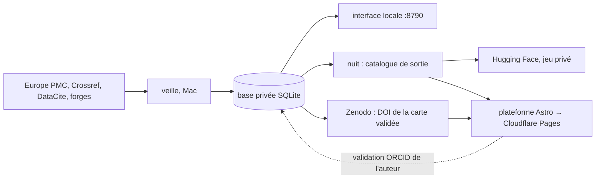

# L'architecture du projet, à 0 €

Les règles qui s'imposent à tout ce qui suit sont dans [CLAUDE.md](../CLAUDE.md) :
- des DOI Zenodo seulement pour les cartes validées par un auteur ;
- aucun service payant.

## Les pièces

| pièce | où elle tourne | ce qu'elle fait | coût |
|---|---|---|---|
| **Le ramasseur** (`scrapper veiller`) | le Mac Studio, en continu | lit les articles, trouve et vérifie le code, garde le texte des scripts dans la base privée (SQLite, WAL) | 0 € |
| **L'interface locale** (`scrapper serveur`) | le Mac, http://127.0.0.1:8790 | le tableau de la base privée, pour toi seul | 0 € |
| **Le catalogue de sortie** (`scrapper nuit`) | le Mac, à 4 h 17 | `donnees/publication/` en mode public, puis le jeu Hugging Face | 0 € |
| **La plateforme** (`plateforme/`, Astro) | Cloudflare Pages | le site public, construit depuis le catalogue de sortie | 0 € |
| **Les DOI des cartes** (`scrapper zenodo`) | Zenodo (CERN) | une carte validée par un auteur reçoit un DOI dans la communauté | 0 € |

## La carte de traçage

La carte (`carte.json`, voir `scrapper/invenio.py`) dit, pour un article :
- où est son code : dépôt, commit, licence ;
- ce qu'on y a trouvé : chemin et empreinte des fichiers ;
- comment on l'a trouvé.

Elle ne contient ni le texte de l'article ni le code.

Sa vie :
1. **Proposée** par le ramasseur. Elle est visible sur la plateforme, sans DOI.
2. **Validée** par un auteur, connecté avec son ORCID. La carte gardée est celle qu'il a vue ou corrigée.
3. **Déposée** sur Zenodo, dans la communauté (`scrapper zenodo deposer`). Elle reçoit un DOI.
   - Relations : `IsSupplementTo` vers l'article, `References` vers le dépôt du code, au commit validé.
   - Créateurs : l'auteur (ORCID) et la plateforme.
4. **Corrigée** plus tard : une nouvelle version, sous le même DOI de concept.

La version 0.1 de la carte ne relie que l'article à ses dépôts. L'alignement passage de
l'article ↔ fichier ou fonction (GROBID pour le texte, tree-sitter pour le code, un
modèle local sur le Mac) viendra remplir son champ `alignements`.

## Ce qui reste à construire, dans l'ordre

1. ~~Déployer le site~~ : fait le 26/09/2026, https://code-natif.pages.dev, remis à jour chaque nuit.
2. **La validation par l'auteur.** ORCID permet la connexion gratuite (API publique,
   portée `/authenticate`). Une Pages Function reçoit la validation et l'écrit dans
   D1. Le Mac la relève, puis dépose la carte sur Zenodo.
3. **La recherche** : D1 et son index plein texte (FTS5), interrogés par une Pages Function.
4. **L'alignement code ↔ article**, calculé sur le Mac.

## Les limites gratuites qui comptent

Chiffres de 2025, tirés de la documentation de Cloudflare, **à revérifier** avant de s'y fier.

| service | limite | conséquence |
|---|---|---|
| Pages | 20 000 fichiers par déploiement ; 25 Mio par fichier ; 500 constructions par mois | une page statique par article tient jusqu'à ~15 000 articles avec code. Au-delà : pages rendues à la demande (Functions + D1), ou regroupées |
| Pages Functions (Workers) | 100 000 requêtes par jour ; 10 ms de CPU par requête | réservées aux actions : connexion, validation, recherche |
| D1 | 5 Go ; 5 M lignes lues et 100 000 écrites par jour | le catalogue et les validations, pas le texte des scripts |
| Zenodo | 50 Go par fiche ; 60 requêtes/min sans jeton | une carte fait quelques Ko |

**Le texte des scripts.** Aujourd'hui, 32 lots dans `public/scripts/`. À grande échelle, un lot
dépassera 25 Mio : il faudra plus de lots, ou lire les scripts sur le jeu Hugging Face une fois
celui-ci public.
