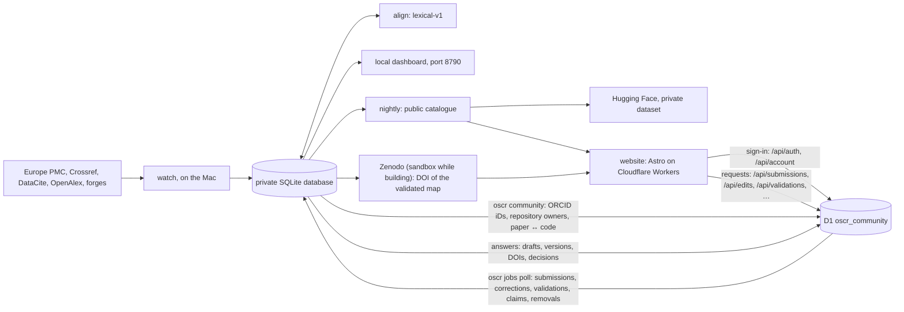
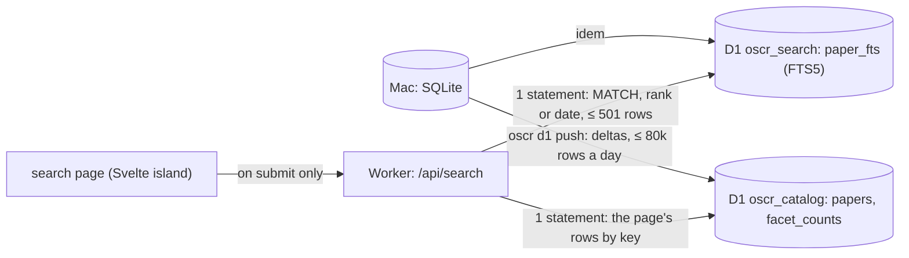
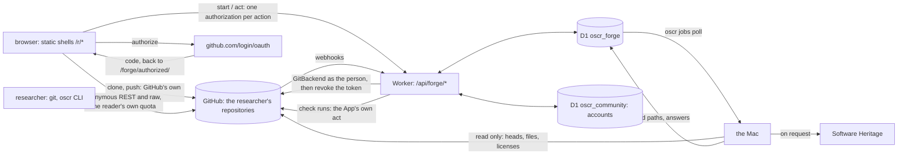

# Architecture, at $0

The rules that govern everything below are in [CLAUDE.md](../CLAUDE.md):
- Zenodo DOIs only for tracing maps validated by one of the paper's authors;
- no paid service.

## The pieces

| Piece | Where it runs | What it does | Cost |
|---|---|---|---|
| **The harvester** (`oscr watch`) | the Mac Studio, continuously | reads the papers, finds and verifies the code, keeps the scripts' text in the private database (SQLite, WAL) | $0 |
| **The alignment** (`oscr align`) | the Mac; the harvester also runs it once a day for the papers still without pairs | pairs the paper's paragraphs with lines of the authors' code (method `lexical-v1`) and stores the pairs in the `alignment` table | $0 |
| **The local dashboard** (`oscr dashboard`) | the Mac, http://127.0.0.1:8790 | the table of the private database, for the owner only, read-only | $0 |
| **The public catalogue** (`oscr nightly`) | the Mac, at 04:17 | `data/public/` in public mode, then the Hugging Face dataset, then the website | $0 |
| **The website** (`website/`, Astro) | Cloudflare Workers (static assets) | the public site, built from the public catalogue, with the Code ↔ Paper reader | $0 |
| **The search index** (`oscr d1 push`, Phase 3) | the Mac → Cloudflare D1 | the papers with a page, projected into two D1 databases (`oscr_catalog`, `oscr_search`), pushed as deltas within 80,000 rows written a day ([SEARCH.md](SEARCH.md)) | $0 |
| **The Worker's code** (`website/worker/`, Phase 3) | Cloudflare Workers: `/api/*`, and the requests no static file answers | `/api/search`: FTS5 in D1, facets, sorts, CSV and JSON exports; the pages of the papers past the 5,700 most recent, from their records (no D1), and the 404 page | $0 (100,000 requests a day) |
| **The map DOIs** (`oscr zenodo`) | Zenodo (CERN) | a map validated by an author receives a DOI in the community | $0 |
| **The accounts** (`website/worker/account/`, Phase 5) | the Worker's code, `/api/auth/*` and `/api/account/*`, with the D1 database `oscr_community` | sign-in with ORCID, GitHub or Google; sessions; the verified authors and maintainers ([ACCOUNTS.md](ACCOUNTS.md)) | $0 |
| **The accounts' facts** (`oscr community`) | the Mac | the ORCID iDs of the papers with a page, the owners of their repositories and which paper each is the code of, pushed to `oscr_community` as deltas (locally, or to Cloudflare: nightly with `OSCR_COMMUNITY_PUSH=remote`) | $0 |
| **The contributions** (`website/worker/contributions/`, Phase 6) | the Worker's code, `/api/contributions`, `/api/submissions`, `/api/claims`, `/api/edits`, `/api/validations`, `/api/reports`, with `oscr_community` | submit a paper and its code, claim a paper, correct a record, validate a map, request a removal: checked at once, recorded with a job for the Mac ([CONTRIBUTIONS.md](CONTRIBUTIONS.md)) | $0 |
| **The job runner** (`oscr jobs poll`, Phase 6) | the Mac, every ten minutes (proposed: `tools/org.oscr.jobs.plist`, not installed) | reads the new jobs in `oscr_community`, harvests a submitted paper into a draft, applies corrections as new versions, deposits validated maps on the Zenodo sandbox, lists claims and removal requests for the owner (`oscr claims`, `oscr reports`, `oscr submissions`) | $0 |

The database is in WAL mode: the harvester writes while the dashboard and the nightly job
read, and none of them blocks the others. What leaves the Mac (`oscr_public.db`) is put back
into a single file, with no excerpt of any paper.

## The enriched record (Phase 1)

Every paper read gets a record beyond its links. It is built on the Mac from what the Mac
already holds: `oscr/enrich.py`, run on every new paper and by `oscr enrich` for the papers
read before.

| source | what it gives | module |
|---|---|---|
| the cached full text (JATS, both of Europe PMC's flavours) | type, abstract, journal (ISSN, publisher), volume, issue, pages, dates, authors (order, ORCID, affiliations, ROR, corresponding), funding, keywords, subjects, references, RRIDs, availability statements | `oscr/biblio.py` |
| the Europe PMC `core` result (kept in `epmc_record` since Phase 1) | MeSH, grants, more ORCIDs, citation count, open-access flag, corrections and retractions | `oscr/biblio.py` |
| the Retraction Watch data (a weekly download, looked up locally by DOI) | retractions, corrections, expressions of concern | `oscr/sources/retractions.py` |
| OpenAlex (one free lookup by DOI per paper, the owner's key; kept in `openalex_record`) | the work's id, institutions by ROR id with country and type, open-access status and link, a preprint, the primary topic (subfield, field, domain), referenced and related works; and, only where the JATS and Europe PMC said nothing, ORCID iDs, corresponding authors, funders, citation and reference counts, volume, issue, pages, publisher | `oscr/sources/openalex.py` |
| the stored file lists and scripts | notebooks, README, CITATION.cff, environment files, tests, CI; the tools used (imports and calls) | `oscr/repofeatures.py` |
| rules over title, keywords, MeSH, journal, abstract | on topic or not, modality, organism, population, subfield, each with a confidence and its reasons | `oscr/classify.py` |

- **The schema changes by numbered migrations** (`oscr/migrations/NNNN_*.sql`), applied once,
  in order, each in one transaction, when the database opens. Schema 4 adds the tables of
  [PLATFORM_PLAN.md](PLATFORM_PLAN.md) §4.
- **Provenance**: `field_provenance` says where each value came from (jats, epmc,
  retraction-watch, openalex…), with the record it came from (a PMCID, an OpenAlex id), and
  when. The sources merge in that order of authority: the JATS, then Europe PMC, then OpenAlex,
  which never replaces a value another source gave (a person's correction, the owner's label
  included).
- **OpenAlex** (schema 7, `oscr/migrations/0007_openalex.sql`): the key comes from the macOS
  keychain (`org.oscr.openalex`, or `OPENALEX_API_KEY`) and travels only in the
  `Authorization` header to api.openalex.org — never in a URL, the cache, a log or an error.
  Only single lookups are made (free; $1 of credit a day covers the paid calls OSCR does not
  make); each day's calls and spending are kept from OpenAlex's own headers (`openalex.Budget`),
  and a second 429 stops OpenAlex until midnight UTC. New papers are looked up during their
  scan, before their enrichment (`harvest.scan_article`); those OpenAlex does not know yet (it
  lags a few days) are asked again a week later by the watch's daily round
  (`enrich.openalex_pass`); `oscr enrich --openalex [--all]` does the papers read before,
  resumably. The raw records stay on the Mac; the institutions, topics, open-access status,
  preprints and counts reach the pages, the entities and the search (`catalog.public_db`
  keeps nothing of off-topic papers).
- **Versions**: `version` keeps each change of a record, with what changed; texts appear
  there only as digests.
- **Every verdict on a repository** is kept in `alive_check`, not only the last one.
- **Categories** (owner's decision D6): the rules first; the owner's own labels
  (`oscr labels data/annotation/sample.csv`) win over the rules. A local model will decide
  the ambiguous cases, only between 01:00 and 07:00, once compared with the owner's labels
  (`tools/compare_models.py`).
- **Off-topic papers** (D7) stay on the Mac: they are out of every public output (the
  catalogue, the scripts, the matches, the public database) and out of the statistics.
- **No article text leaves** (`catalog.public_db`). Abstracts, the raw Europe PMC and OpenAlex
  records and the versions are removed from the public database, and availability statements are kept
  only under CC BY, CC0, CC BY-SA or CC BY-NC (D1). The paper's page shows the abstract and the
  statements under the same licenses only (Phase 4, below).
- **Rates are computed on research articles** (`catalog.RESEARCH_TYPES`); reviews,
  conference abstracts, case reports and notices are counted apart.

## The Code ↔ Paper reader

A page of the website puts a paper and its authors' code side by side.

- **Left, the paper.** Its full text is fetched from Europe PMC (open access, CORS allowed)
  by the reader's browser, never by the site, and shown as plain text. The site never stores
  or serves the text of a paper. Europe PMC's XML takes one to six seconds, sometimes more:
  each try has 20 seconds, the pane says that it is loading (and when it is slow), and a try
  that gets no answer, a network error or a server's error is made once more
  (`website/src/lib/retry.ts`). When Europe PMC still does not give it, a paper in PubMed
  Central is read from NCBI's copy (E-utilities, CORS allowed), whose paragraphs may be
  numbered otherwise: each pair is placed by its section and its evidence terms
  (`website/src/lib/anchor.ts`; 355 of 364 pairs where they belong on a sample of 40 papers,
  against 325 by number alone), and the pane says so. A failure keeps links to doi.org and
  Europe PMC and a button that tries again. The pane can be hidden, a choice kept in the
  browser.
- **Right, the code.** One view is prerendered at build time; the others are fetched on
  demand from the lot of their repository (`/scripts/NN.json`). A script whose license does
  not allow republication is not copied: the reader lists the file and links to it at the
  source, at the verified commit.
- **The pairs** come from `alignments/NN.json`, read at build time. A pair joins paragraph
  number *i* (the index of a `
` among all the `
` of the JATS `<body>`, in document
  order, which the browser computes the same way) and a line range of one file: the same
  color on both sides, a light tint with a thin mark in the gutter, and a strong shade for the
  pair being read; the rest of the code keeps its white ground. A range that covers the whole
  file (90 % of its lines at least) is a weak match: only its first line is tinted, and the
  legend says so. The page opens on the first match of the file it shows, both panes at it.
  Clicking one side brings the other into view. The build keeps only the known fields of a
  pair and drops any evidence term longer than 60 characters, so no sentence of a paper can
  reach the site.

The website's name is not written in its pages: it comes from `SITE_NAME` (default `OSCR`)
and `SITE_TAGLINE`, set in `website/src/config.ts` or at build time.

## The website's pages

Astro builds the site from the public export (`data/public/`, written by `oscr nightly` in
public mode), and the Worker serves it as static assets. Every `<title>` ends with `SITE_NAME`;
the only style is `science.css`. A Worker serves at most 20,000 static files per version, so
the number of files must not grow with the catalogue: how each kind of page is rendered is in
"How pages are rendered, and the file budget" below.

| route | what it shows | from the export | rendered |
|---|---|---|---|
| `/` | the papers with their authors' code, by day of publication | `catalog.json` | static |
| `/paper/<slug>/` | a paper with code, code on request or data only (decision D2), in sections: Overview, Code, Map, Data, Versions, Cite, Similar (and Discussion, Reproductions, Activity, which open with sign-in); see "The paper's page" below | `catalog.json`, `entities/`, `papers/` | static for the 5,700 most recent (`STATIC_PAPERS`, 6,000 before D16-3); the others by the Worker, a reduced page |
| `/paper/<slug>/code/` | the Code ↔ Paper reader, for the papers with code | `catalog.json`, `alignments/`, `scripts/` | static with its paper; past them, the Worker sends it to `/paper/<slug>/#code` |
| `/browse/` | the categories by facet, with their counts; the other ways in | `entities/categories.json` | static |
| `/browse/<facet>/<value>/` | the papers of a category, by day | `entities/categories.json` | static (the vocabulary's ~60 values; 200 at most) |
| `/authors/`, `/authors/<letter>/`, `/author/<orcid>/` | the authors with an ORCID iD, by family name: latest affiliations, institutions, tools, papers | `entities/authors.json` | the lists static; each author in the browser, from `/records/author/NN.json` |
| `/journals/`, `/journal/<id>/` | ISSN, publisher, papers with code out of papers read | `entities/journals.json` | idem, `/records/journal/` |
| `/institutions/`, `/institution/<ror>/` | the authors' institutions, by ROR id | `entities/institutions.json` | idem, `/records/institution/` |
| `/tools/`, `/tool/<id>/` | the tools found in the authors' code: repositories, papers | `entities/tools.json` | idem, `/records/tool/` |
| `/datasets/`, `/dataset/<id>/` | the datasets cited, by repository | `entities/datasets.json` | idem, `/records/dataset/` |
| `/lookup/` | the DOI lookup: any paper read, with or without a page | `lookup/NN.json` | static page; the browser fetches one of 256 shards |
| `/search/` | the search (Phase 3): a static page and a Svelte island that asks `/api/search` only when a search is submitted | D1, through the Worker | static + Worker |
| `/account/` | sign-in, the linked identities, the roles, "your papers", the maintainer claim form (Phase 5) | nothing: the page asks `/api/account/me` | static + Worker |
| `/about/` | what the registry is, and what it never publishes | — | static |

- **Who counts.** `oscr/entities.py` counts only the papers with a page (D2): the authors'
  code (verified, found, empty, dead), code on request, data only. An off-topic paper appears
  nowhere, the lookup included (D7).
- **People** are merged by ORCID iD only; a name without one stays a name on its paper's
  page. No email address or telephone number leaves the export, and the build removes any
  string that still looks like an address.
- **The lookup** is static: the page fetches one shard, `/lookup/NN.json` (the first 2 hex
  characters of the SHA-1 of the lowercased DOI: 256 files at most), only when its form is
  submitted. A shard maps each DOI to `[status, day read]`, and the page's name when there is one.
- **Checked.** `npm run check` (in CI with `--every-route`) checks, after the build, every route,
  every internal link (the links held by the records included, and the entities behind the
  rewrites), that each record is in the shard its key names, and the file budget; it prints the
  number of files folder by folder.

## How pages are rendered, and the file budget

Decided on 2026-09-28 (the measurements and the alternatives: [PLATFORM_PLAN.md](PLATFORM_PLAN.md)
§6). The constants are in `website/src/lib/shards.ts`, shared by the build, the browser, the Worker
and the check; the pages rendered on demand share one markup, `website/src/lib/render.ts` (the
catalogue's listing of the static pages is its too).

| kind | files | how a reader gets it | Worker requests a view |
|---|---|---|---|
| a paper among the `STATIC_PAPERS` (5,700) most recent, and its reader | 1, and 1 for the reader | a static file | 0 |
| an older paper | none: its record in one of 256 `/records/paper/NN.json` | no file answers, so the Worker runs (`not_found_handling = "none"`): it reads the record and the shell `/paper/404.html` through its `ASSETS` binding and returns the page, status 200 (`worker/pages.ts`); `/paper/<slug>/code/` is sent to `#code` | 1 (2 through `/code/`), 0 D1 row, 0.3 ms of CPU measured |
| an author, journal, institution, tool or dataset | none: one shell per type (`/author/`, …) and a fixed number of `/records/<type>/NN.json` per type (`SHARDS`: 1,024 for the authors, 512 institutions, 256 tools, 128 journals, 128 datasets) | `public/_redirects` rewrites `/author/<orcid>/` to the shell (status 200, the address kept), whose script fetches the shard and renders the entity (`src/scripts/entity.ts`) | 0 (1 for a key whose shard does not exist: its 404) |
| the lists of the entities (`/authors/` and a page a letter, `/journals/`, `/institutions/`, `/tools/`, `/datasets/`) | 1 each, 27 for the authors' letters | static, a link to every entity, no cap | 0 |
| the DOI lookup | 256 `/lookup/NN.json` | the page's script fetches one shard | 0 |
| an address no file answers | — | the Worker serves `404.html` with the status 404 | 1 |

- **The budget holds whatever the catalogue's size**: at most 2 × 5,700 files of papers, and
  `FIXED_FILES_MAX` (3,600; 3,000 before the GitHub side, D16-3) for everything else — the 2,304
  record shards, 256 lookup shards, 128 lots of scripts, the category pages (`MAX_CATEGORIES`, 200),
  the fixed pages and bundles, and the GitHub side's nightly shards (`GITHUB_SIDE_SHARDS`, 321), pages
  and bundles. The two add up to the check's margin, 15,000, under the 20,000 limit. `npm run check`
  prints the files folder by folder and fails past either; `npm run check:growth` (in CI) builds the
  fixture, then the fixture grown with 40,000 authors, 15,000 institutions, 12,000 papers and 150,000
  DOIs: 67 files, then 2,628, only the shards differing (381, then 2,942, with the GitHub side).
- **What an older paper's page leaves out**, and says so at its top: the Code ↔ Paper reader, the
  tracing map and its validation, the versions, the citation formats, the similar papers and the
  README badge, whose data are in the build's lots. It shows the record: title, integrity notices,
  authors (their pages), journal, date, type, status, DOI, license, institutions, categories, each
  repository of the code with its license and state, the tools, the datasets and data links, the
  links to the paper and to Europe PMC, and the Contribute section of the static pages — claim,
  correction of its links, removal request — run by the same script (`paper-actions.ts`).
- **An entity's page lists its 200 most recent papers** (`ENTITY_ROWS_MAX`) and at most 300 links
  of each kind (`LINKS_MAX`: a tool's repositories, an institution's authors); past that (a tool
  such as NumPy), it says how many more there are and links to the search.
- **Without JavaScript**, an entity's shell says that it needs it and links to the list, which is
  static; an older paper's page is whole HTML from the Worker.
- **The owner's switch** (wrangler.toml): with `not_found_handling = "404-page"`, no page costs a
  Worker request — the assets serve `/paper/404.html` for a missing `/paper/…`, and its script
  renders the older paper in the browser — but with the status 404, which search engines do not
  index, and every other missing address gets the site's 404 page.

## The paper's page (Phase 4)

One page per paper, in sections reached through a bar of in-page links (`#overview`,
`#code`, `#map`, `#data`, `#versions`, `#cite`, `#similar`, `#discussion`, `#reproductions`,
`#activity`): no route of their own, no JavaScript needed, so the number of files does not
change (5,999 files for a 3,032-paper export, before and after). The Code ↔ Paper reader stays
at `/paper/<slug>/code/`.

`oscr/paperpage.py` writes what the sections need into `papers/NN.json` (lots keyed by paper
id, like `alignments/`), for the papers with a page only; the site reads them when it is built
(`website/src/lib/paper.ts`, `src/components/paper/`).

| section | shows | from |
|---|---|---|
| Overview | authors in order (their pages, their ORCID records), affiliations (the institution's text; no email, no phone), journal, volume, issue, pages, dates, type, language, license, identifiers, categories, keywords, MeSH, journal subjects, funding, citation count, references, RRIDs, integrity notices (a retraction, a correction or an expression of concern is said first, under the title); the abstract **only under D1's licenses** | `article`, `paper_author`, `paper_subject`, `grant_award`, `funder`, `paper_rrid`, `integrity_notice` |
| Code | each repository: state, license, commit and its date, languages, size, Software Heritage, where it was found, what it holds (README, license file, CITATION.cff, environment files, tests, CI, notebooks), the tools found in it, the history of its availability checks (the last 20: date, state, HTTP status; a check's error text stays on the Mac); the way into the reader; the code statement | `repository`, `repo_feature`, `repo_tool`, `alive_check`, `statement` |
| Map | proposed or validated (ORCID only), what the map holds, its DOI and its JSON on Zenodo once deposited (never the sandbox) | `validation`, `card_doi`, `file`, `alignment` |
| Data | the datasets cited (their pages), the other data links and where each was found, the data statement | `link`, `paper_dataset`, `dataset`, `statement` |
| Versions | the record's history, newest first: date, and what changed in its public facts, its code and data links included (Phase 6); a correction says by whom by role only ("a verified author") | `version` |
| Cite | the paper in an APA-like text, BibTeX, RIS and CSL-JSON, built at export; the map's too once it has a DOI; a copy button (`src/scripts/cite.ts`) | `article`, `journal`, `paper_author` |
| Similar | up to 10 papers with a page, ranked by the tools, categories, datasets, cited references (`paper_reference` DOIs) and authors (ORCID iD) they share, each weighed by its rarity, with the reasons in words ("shares FieldTrip, EEG, 3 references") | computed at export |
| Contribute (Phase 6) | how to sign in; for a signed-in reader, by their roles: claim the paper, correct its links, validate its map (with its digest), the badge's snippets; a removal request for anyone signed in (the sidebar links to it). Its script asks the Worker once, only when the browser holds a session | `map.digest`, the code's README (`repository.files`); the Worker's `/api/contributions/paper` |

**What never leaves**, tested on synthetic databases (`tests/test_paperpage.py`) and checked
again by `website/scripts/data.mjs`:
- **a paper's texts under a closed license** (decision D1, `catalog.statement_is_publishable`,
  applied to the abstract as to the statements): the page then says, from facts only, what the
  statements point to (datasets, repositories) and whether they say "on request", and links to
  the paper. Under CC BY, CC0, CC BY-SA or CC BY-NC, the text is shown with its license;
- **an email address** or a telephone number (`entities.scrub`, then a last check per lot);
- **anything of an off-topic paper** (D7), which is nobody's similar paper either;
- **from the versions, only `paperpage.VERSION_FIELDS`**: the digests of the abstract and of the
  statements, the classification's raw values (`categories`, `on_topic`) and any field added
  later stay on the Mac; a version that changed only those is not listed;
- Retraction Watch's reasons (the notice itself is linked), the Zenodo sandbox's tests.

The map's creators include the platform: the export writes it `{platform}` and the site puts
`SITE_NAME` there, escaped for each format.

## The tracing map

The map (`tracing-map.json`, see `oscr/zenodo.py`) says, for a paper:
- where its code is: repository, commit, license;
- what was found there: the path and digest of each file;
- how it was found;
- which paragraphs match which lines (`alignments`).

It contains neither the text of the paper nor the code.

Its life:
1. **Proposed** by the harvester. It is visible on the website, without a DOI.
2. **Validated** by an author, signed in with their ORCID (Phase 6: the paper's Contribute
   section). The page carries the map's digest (`zenodo.map_digest`) and the validation brings it
   back: the map kept is the one the author saw — if it changed since, the Mac asks the author to
   look again. While the site signs in with ORCID's sandbox, a validation is a test (`proof =
   'test'`), which only Zenodo's sandbox takes.
3. **Deposited** on Zenodo, in the community, by the Mac's job runner (`oscr jobs poll`; by hand:
   `oscr zenodo deposit`), on the sandbox while the platform is built. It receives a DOI, which
   goes back to the author's account page.
   - Relations: `IsSupplementTo` the paper, `References` the code repository, at the
     validated commit.
   - Creators: the author (ORCID) and the platform.
4. **Corrected** later: a new version, under the same concept DOI.

## Contributions (Phase 6)

What signed-in readers ask of the registry, and the Mac's answers ([CONTRIBUTIONS.md](CONTRIBUTIONS.md)):

- **The Worker checks and records; the Mac does the work.** A request is checked at once in the
  Worker (the session, its CSRF token and the site's Origin; the reader's role; for a link, that
  it points to a place the registry knows and answers; for a DOI, that it is registered), then
  written to `oscr_community` with a row in `jobs`. The Mac polls `jobs` and writes each outcome
  into the request's row: the Worker never harvests, verifies a license or talks to Zenodo, and
  the Mac never listens on the network.
- **A correction is a version.** Corrections of a record's links (by a verified author of the
  paper, or a maintainer of its code for their own repository) are kept on the Mac
  (`link_edit`), applied after every later scan, and each makes a new `version` with its
  provenance (the person's ORCID iD or GitHub login, on the Mac only). The Versions section says
  "a correction by a verified author".
- **The owner decides what the machine cannot**: manual author claims, claims GitHub cannot
  settle, removal requests, and submissions published by someone who is not among the paper's
  authors (`oscr claims`, `oscr reports`, `oscr submissions`; moderation in the site is Phase 7).
  An accepted removal takes the record out of every public output (`article.withdrawn`, like an
  off-topic paper).
- **Cheap by construction.** A request writes 3 rows (its row, its index entry, the job), an
  answer 1; per-account daily limits are counted from the rows; a signed-out reader's page view
  costs no Worker request (the pages ask only when the `__Host-oscr_signed_in` hint cookie is
  there).

## What remains to build, in order

1. ~~Deploy the website~~: done on 2026-09-26, https://oscr.yannbellec-b.workers.dev, rebuilt every night.
2. ~~Author validation~~: built. Sign-in (Phase 5, [ACCOUNTS.md](ACCOUNTS.md)): ORCID
   (`openid` scope, free for non-commercial use), GitHub and Google, and an ORCID iD found
   among a paper's authors makes a verified author of it. Phase 6 ([CONTRIBUTIONS.md](CONTRIBUTIONS.md)):
   the verified author validates the map in the site's Worker, which writes it to D1; the Mac
   picks it up and deposits the map on Zenodo (the sandbox while the platform is built).
3. ~~Search~~: built in Phase 3 (below, and [SEARCH.md](SEARCH.md)); the remote databases await the owner's approval.
4. ~~A first paper ↔ code alignment~~: `lexical-v1`, computed on the Mac. Next: GROBID for
   the text, tree-sitter for the code, a local model on the Mac.

## The free limits that matter

Checked on 2026-09-26 in Cloudflare's documentation; the full table, with sources, is in
[PLATFORM_PLAN.md](PLATFORM_PLAN.md) (§2 and Appendix A).

| Service | Limit | Consequence |
|---|---|---|
| Workers static assets | 20,000 files per version; 25 MiB per file; asset requests free and unlimited; `_redirects`: 2,000 static and 100 dynamic rules | the site stays under 15,000 files whatever the catalogue ("How pages are rendered, and the file budget"): 5,700 papers static (D16-3), the others rendered by the Worker; entities in shards behind one shell per type. The largest lot of scripts is 22.9 MB (2026-09-28): close to the 25 MiB |
| Workers | 100,000 requests per day for all dynamic routes, cached or not; 10 ms of CPU per request; 64 MiB per Worker | kept for actions (sign-in, contributions, search, API), for the pages of the papers past the 5,700 most recent (one request a view, 0.3 ms of CPU) and for the 404s; a static page asks nothing |
| D1 | 500 MB per database, 10 databases; 5 M rows read and 100,000 written per day | the catalogue projection, the script index and the community, pushed as deltas |
| Hugging Face | public datasets free ("best-effort"); byte ranges with CORS | the open data, and the script blocks |
| Zenodo | 50 GB per record; 60 requests per minute without a token | a map weighs a few KB |

**The scripts' text.** Today, 32 lots in `public/scripts/`. Decided on 2026-09-26
([SCRIPT_STORAGE.md](SCRIPT_STORAGE.md)): deduplicated, zstd, Parquet blocks on a public
Hugging Face dataset, read by the reader in the browser with range requests (~78 KB per
script), with an index in D1. Measured: 155 MB of text become 25.6 MB; ~3.3 GB at the full
neuro stock, of which ~2.3 GB are public.

## Planned platform

The platform extension (a normalized D1 catalogue, accounts, search and a community) is
specified in [PLATFORM_PLAN.md](PLATFORM_PLAN.md). Each phase follows the rules of
[CLAUDE.md](../CLAUDE.md); Phase 2 (navigation, the pages above) and Phase 3 (the search,
below) are built on their branches and await the owner's review.

### Search engine

**Built (Phase 3), awaiting the owner's review; the remote databases await approval.** SQLite
FTS5 in D1, not Pagefind; the details, the API and the measurements are in
[SEARCH.md](SEARCH.md), the choice in [PLATFORM_PLAN.md](PLATFORM_PLAN.md) §7.

- **Two databases**, because a D1 database that holds FTS5 cannot be exported: `oscr_catalog`
  (what a result row shows, the precomputed counts of the unfiltered view) and `oscr_search`
  (the index).
- **The filters are index tokens**, not an index table: each facet value of a paper is a token
  of the index's `facets` column, so a filter is part of the MATCH, costs no row written per
  value, and D1 reads only the matching rows.
- **The key is the date**: YYYYMMDD × 100,000 + n. "Newest first" is the index's rowid order and
  a date range a rowid range, without an index.
- **Bounded costs**: a window of 500 results gives the page, the exact total and the facet
  counts up to 500 (past it, the counts are the first 500's, the total says "more than 500" and
  the pages stop there): a search reads at most ~540 rows (~600 at 50 results a page), an export
  ~1,500; the Worker's CPU stays under ~3 ms (measured in V8, docs/SEARCH.md §5).
- **Never an abstract in an answer**: abstracts are indexed only under an open license (D1's
  rule), in a contentless index; results carry title, journal, date, status and links.

**Why not Pagefind.** Pagefind writes one fragment file per indexed record, plus index
chunks, filter files and a start-up file that lists every record.
- A searchable catalogue of 50–90k papers needs ~50–90k files. The limit is 20,000 files per
  Pages deployment, which Pagefind reaches at ~15k records.
- Pagefind has no incremental index, so every rebuild re-uploads most chunks over a home
  uplink (~0.9 MB/s, and ~25 KB/s for a background task).
- Its maintainer calls ~180k pages "probably around the ceiling".
- Everything indexed can be downloaded by anyone.

**The cost to watch.** Every search is a Worker request, even when cached, out of 100,000 a
day for the whole site, plus D1 rows read (5 M a day). If that budget gets tight, the fallback
costs no request: a static inverted index published as Parquet blocks on Hugging Face and read
by byte ranges, like the scripts (the owner's plan B, decision D3).

## Git hosting (night run, phase 00)

Decided on the night of 2026-09-28/29. The options compared, the reasons and what would change
each choice are in [DECISIONS.md](DECISIONS.md), entries D00-1 to D00-16. Nothing of it is built
yet: phase 01 builds it on this design.

**No option lets OSCR hold Git repositories itself with certain compliance and at zero cost**
(D00-1):
- Hugging Face, a GitHub organization and the other hosted forges: their terms do not clearly
  allow one customer to serve other people's repositories.
- Every permanent free cloud VM asks for a payment card.
- A Git server on Cloudflare's free plan can neither index a real push within 10 ms of CPU nor
  hold ~100 GB.

**What OSCR does instead:**
- **Repositories live in the researcher's own GitHub account** (D00-2). OSCR's GitHub App
  creates them and acts on them with the researcher's consent: one authorization per action, as
  that person (D00-4).
- **The mirror mode is the same machinery**, applied to a repository the researcher already has.
- **OSCR keeps only its own layer**: links to papers and DOIs, tracing maps pinned to commits,
  reviews, the scientific issue types. It lives in a new D1 database and on the Mac.
- **`GitBackend` hides the forge**, so another storage can replace GitHub later without
  rewriting the rest (D00-13).

### The pieces

| Piece | Where it runs | What it does | Cost |
|---|---|---|---|
| **The repositories** | the researchers' own GitHub accounts | git over HTTPS and SSH; commits and merges made by GitHub's API as the person; pull requests, issues, releases; continuous integration for the repository's own tests only (D00-11) | $0 for OSCR: each researcher's own free quotas |
| **OSCR's GitHub App** | registered by the owner, installed by researchers | creates a repository when asked; acts as the person through a per-action authorization; sends webhooks; posts OSCR's check runs | $0 |
| **The repository pages** | static shells (`/r/*`, one `_redirects` rule, no file per repository) and the reader's browser | read public repositories straight from `api.github.com` and `raw.githubusercontent.com`, on the reader's own quota (D00-5); mask email addresses as `catalog.mask_emails` does; take OSCR's layer from a small static index | $0: no Worker request when signed out |
| **The forge service** (phase 01) | the Worker's code, `/api/forge/*` | per-action authorization (`start`, then `act`); webhooks; OSCR's live layer for signed-in readers; never a git proxy, never a stored user token | 2 requests per action, 1 per webhook |
| **`oscr_forge`** (new D1 database, binding `FORGE`) | Cloudflare D1 | repositories known by their forge id (public only), links to papers, installations, the paths tracing maps point to, the action log, jobs for the Mac; no Git object, token or email address | inside the Worker's D1 share (D00-12) |
| **`GitBackend`** | `website/worker/forge/` (Worker and browser); `oscr/forge.py` (the Mac, read-only) | the forge-neutral interface; the GitHub adapter; an in-memory double and a contract suite for tests | $0 |
| **The Mac** | as today | verifies linked repositories and their licenses; keeps the licensed script copies; computes tracing maps at pinned commits; polls public mirrors; asks Software Heritage to archive when a person requests it (D00-15). Never writes to a forge, never runs users' code | $0 |
| **The researcher's machine** | `git` and the `oscr` command-line tool (phase 14: `cli/`, [CLI.md](CLI.md)) | imports, keeping commit ids (D00-8); uploads above OSCR's caps; local blame; the registry's checks, citations and tracing maps on a local clone. Both of the tool's tokens (GitHub's, the registry's) stay in the researcher's keychain | $0 |

### Git over HTTPS, and tokens

- **Clones go straight to github.com.** Clone, fetch, pull and push use
  `https://github.com/<owner>/<name>.git` (or SSH) with GitHub's own credentials.
  - OSCR runs no git proxy and issues no git token (D00-3).
  - A proxy would pass GitHub's service on to others (GitHub's AUP §6), and Cloudflare's terms
    do not clearly allow a proxy in front of content hosted elsewhere.
- **The scoped tokens are GitHub App user tokens.** Each is limited to the App's permissions, the
  person's own rights and the repositories where the App is installed, and expires after 8 hours.
  - The command-line tool gets one through GitHub's device flow, so the token never reaches OSCR.
  - It acts as git's credential helper for github.com only.
- **A clone alias on OSCR's domain** is designed and switched off. It would be a `302` from
  `…/info/refs` to github.com, which git follows by default. The owner decides whether to turn it
  on.
- **OSCR's own tokens** (phases 09 and 14) will reach OSCR's API only, never git.

### Writing, and where commits and merges are made

- **Every write is one authorization per action** (D00-4):
  1. The page confirms the action with the person.
  2. `POST /api/forge/start` signs a 10-minute cookie. It holds the state, the PKCE verifier, the
     action and the SHA-256 of its payload. Nothing is written to D1.
  3. GitHub sends the browser back to a static page, which posts the code and the payload to
     `POST /api/forge/act`.
  4. The Worker exchanges the code and checks that the GitHub account is the one linked to the
     signed-in OSCR account.
  5. It acts through `GitBackend` as the person and checks that GitHub's answer matches the
     action.
  6. It revokes the token. The token is never stored.
- **The App's installation token** is minted in memory for the App's own acts only: OSCR's check
  run on a pull request, and reading an installed repository after its webhook.
- **Commits are made by GitHub** (D00-7):
  - a web edit is one `createCommitOnBranch` call: one request, compare-and-swap on the branch
    head, signed by GitHub, authored by the person;
  - moves, executable bits and commits with two parents use the Git data API.
- **Merges are made by GitHub.** Branch and pull-request merges go through GitHub's merge
  endpoints. A merge conflict is resolved in the browser and committed with two parents.
- **Nothing Git is built in the Worker or on the Mac.** Payloads through the Worker are capped at
  1 MiB to start, because of the 10 ms of CPU; the cap is raised once measured in V8.

### Large files, limits, the mirror mode, imports, deletion

- **Large files** (D00-9) go, in this order:
  1. to release assets (under 2 GiB each, with no limit on bandwidth);
  2. to a Zenodo record made by the researcher;
  3. to a Hugging Face dataset in the researcher's own account.

  Git LFS is for small binaries only: each GitHub Free owner gets 10 GiB of LFS storage and
  10 GiB of LFS download a month.
- **The limits** are shown at creation and in the editor: 100 MiB per file, 2 GB per push, a
  repository ideally under 1 GB. Through the Worker: web commits up to 1 MiB, release assets up
  to 25 MiB, streamed without parsing. Beyond that, GitHub's own pages or the command-line tool.
- **The mirror mode** (D00-2):
  - A researcher installs the App on an existing repository. OSCR then receives its webhooks and
    can write back with the researcher's authorization.
  - A public repository without the App is read only; the Mac polls it.
  - OSCR copies no Git data, except the licensed scripts it already keeps.
- **Imports** (D00-8) run on the researcher's machine: `git clone --mirror` then
  `git push --mirror`, or GitHub's own importer page. A Zenodo archive becomes one commit that
  cites its DOI. Never in the Worker or on the Mac.
- **Deletion** (D00-10):
  - OSCR archives the repository on GitHub and hides it at once, for a 30-day grace period during
    which it can be restored.
  - The deletion on GitHub is then the researcher's own act, through a fresh authorization, never
    OSCR's token or a timer.
  - Tracing maps that point to the repository are shown before anything is done.
- **Scope** (D00-14): public repositories only at first. The App asks for no account permission,
  so no email address. `GitBackend`'s types have no field for an email address.

### What each operation costs

The budgets (D00-12):
- 40,000 of the 100,000 Worker requests a day are planned for the GitHub side;
- the forge service's D1 writes are capped in code at 5,000 a day, inside the Worker's 10,000,
  until the owner confirms C3;
- no R2, no KV, no Durable Objects, no Cron Triggers.

| operation | Worker requests | D1 rows written | GitHub quota used, and whose |
|---|---|---|---|
| a repository page, a file, a commit list, a diff, signed out | 0 | 0 | the reader's own anonymous 60 an hour (raw files are not counted in them) |
| OSCR's layer for a signed-in reader | 1 | 0 (~10 read) | – |
| create a repository | 2 | ~5 | the person's own |
| a web commit, a branch, a pull request, a review, a merge, an issue | 2 | 1 (the action log) | the person's own |
| a scientific issue (OSCR's own) | 1 | 3 | – |
| a release; an asset up to 25 MiB | 2 | 1–2 | the person's own |
| a webhook (a push, a pull request with OSCR's check, a rename) | 1 | 0–2 | the installation's own, for the check run |
| the Mac polling a public mirror | 0 | 1 per changed head (the facts push's share) | `git ls-remote`, or the Mac's token (a `304` answer is free) |
| clone, fetch, push | 0 | 0 | the researcher's own |

A day at 3,000 repositories is estimated at about 7,000 Worker requests and 2,300 D1 rows
written.

### `GitBackend`

- **The interface** (`website/worker/forge/`). It groups repositories, git (refs, trees, files,
  commits, compare, blame, search, and making commits and merges), pull requests and reviews,
  issues, releases, checks, webhooks, the App's authorization, and links to the forge's own
  pages. It covers phases 01 to 07.
  - Errors are typed: one class, twelve codes. Limits and capabilities are given per kind of
    credential: anonymous, user, installation.
  - Its read side also runs in the browser.
  - An installation session may write nothing but check runs.
- **The GitHub adapter** uses REST, plus GraphQL where REST falls short: blame, review threads,
  auto-merge, reverting a pull request, pinning and transferring issues. It adds no dependency,
  and reaches the network only through an injected `fetch`.
- **An in-memory double** implements the whole interface, with git's real object ids, and a
  contract suite runs on every backend.
- **`oscr/forge.py`** is the Mac's read-only counterpart: a repository by its forge id, the head
  of a branch through conditional requests, whether a commit exists, the files at a commit.
- **Other forges can be added later.** A Forgejo, GitLab or Cloudflare backend would add an
  adapter that passes the same contract. That becomes possible if the owner ever unlocks
  OSCR-hosted storage (D00-1).

### The owner's steps [owner]

1. **Register the GitHub App.** It is separate from the sign-in OAuth App, which keeps no scope.
   - Name from `SITE_NAME`.
   - Callback URL `…/forge/authorized/`, with user authorization requested during installation.
     GitHub then allows no separate setup URL: the same page also receives the return from an
     installation.
   - Webhook `…/api/forge/webhook`, with a secret.
   - Repository permissions: Metadata (read); Repository creation, Administration, Contents, Pull
     requests, Issues and Checks (write). No account permission.
   - Installable by any account. Expiring user tokens. Device flow on, for the command-line tool.
2. **Give its values to `tools/setup_cloudflare.sh`**, which gains these questions in phase 01:
   `GITHUB_APP_ID`, `GITHUB_APP_CLIENT_ID`, `GITHUB_APP_CLIENT_SECRET`, `GITHUB_APP_PRIVATE_KEY`
   (GitHub's file as it is) and `GITHUB_APP_WEBHOOK_SECRET`, plus the variable
   `GITHUB_APP_SLUG`. The same script creates the D1 database `oscr_forge`. (Phase 01 stores the
   slug, and the owner's numeric GitHub id `FORGE_OWNER_GITHUB_ID`, as secrets too, so that a
   deployment never wipes them: D01-2.)
3. **Decide**:
   - C3: 20,000 D1 rows a day for the GitHub side;
   - whether a user token may stay, encrypted, in the session cookie for its 8 hours;
   - whether to switch on the clone alias;
   - whether OSCR may ask Software Heritage to archive the commits of validated maps by default.

### Git hosting (phase 01): the forge service, the pages, the Mac

Built on the night of 2026-09-29, on the design above; the contract (routes, action kinds and
their payloads, rows, caps, pages, jobs) is [FORGE.md](FORGE.md), the decisions D01-1 onwards in
[DECISIONS.md](DECISIONS.md).

- **The Worker** answers `/api/forge/*` (`website/worker/forge/service/`): `POST start` and
  `POST act`, one authorized action in two requests (D00-4); `POST webhook`, GitHub's deliveries;
  `GET repo` and `GET mine`, OSCR's layer for a signed-in reader. Every route needs the binding
  `FORGE` (D1 `oscr_forge`), and the signed-in ones the accounts; without them, 503
  `not_configured`.
- **Who may write**: `FORGE_OPEN` unset (the default) closes the write routes to everyone but the
  owner, the GitHub account `FORGE_OWNER_GITHUB_ID` names (D01-1). Phase 16's content rules open
  them.
- **An action** is a spec in a registry (`actions.ts`): it validates its payload, performs as the
  person through `GitBackend`, checks GitHub's answer, and returns its D1 rows as statements,
  written in one batch with the action row (`store.ts`).
- **The caps** are counted from the rows, with no counter row: 100 actions, 10 creations and 20
  links per account in 24 hours; 5,000 rows a UTC day for the whole service. The keys of `actions`
  and `deliveries` start with the UTC day, so each count is a key range (D01-11, D01-12).
- **The pages** are static: `/new/`, `/new/link/`, `/new/import/`, `/repositories/`,
  `/forge/authorized/`, the guides under `/hosting/`, and ONE shell for every repository page,
  `/r/<owner>/<name>/[settings/|branches/]` (`public/_redirects`: `/r/* /r/ 200`). Signed out, a
  repository page asks the Worker nothing: GitHub's anonymous API on the reader's quota, and OSCR's
  layer from at most 64 static shards (`/forge/layer/NN.json`).
- **The Mac** (`oscr forge …`, `oscr/forgejobs.py`, `oscr/forgelayer.py`) polls the jobs
  (`link`, `push`, `archive`, `delete_due`, `reconcile`) and the public mirrors' heads, pushes the
  traced paths, and writes the static layer before the nightly deployment
  (`OSCR_FORGE_PUSH=remote`). It reaches `oscr_forge` as it reaches `oscr_community`
  (`community.open_d1(target, database="oscr_forge")`).
- **The owner's setup** is the same script: `tools/setup_cloudflare.sh` creates, binds and
  migrates `oscr_forge`, and stores the App's values as Cloudflare secrets, the private key read
  from GitHub's `.pem` file; it never sets `FORGE_OPEN`.
- **The action kinds**, one file each family: `act-create.ts` (create, generate), `act-link.ts`
  (link, papers: the mirror mode), `act-settings.ts` (rename, edit, topics, features, template,
  default branch, archive, unarchive, transfer), `act-refs.ts` (branches), `act-delete.ts`
  (deletion with its grace period, restore, the final deletion, Software Heritage),
  `act-autolinks.ts` (custom autolinks, added to `GitBackend`'s `RepoOps` with the double, the
  adapter, the fake GitHub and the contract). Each first asks GitHub for the repository by its id
  and checks GitHub's answer against what was authorized (D01-27); the pages declare every action
  with the Worker's own `validate` and `describe`, so the sentence a person confirms is the one
  the Worker repeats (D01-28).
- **The papers** a repository is attached to are `linked` for a verified author of the paper or
  a maintainer of the repository (`oscr_community.roles`), `proposed` otherwise (`papers.ts`,
  D01-22); the Mac adds a repository to a paper's record only through Phase 6's path, and checks
  the same roles again.
- **The webhooks** write at most 2 rows each, as conditional statements that a redelivery leaves
  unchanged (D01-24), and only for an installation the registry knows that covers the repository.
- **The local end-to-end run** (`website/tests/forge-service/e2e.sh`): a throwaway local D1, the
  sign-in mocks, the fake GitHub served over HTTP (`tests/forge/fake-github-server.ts`), the site
  built to read it, `wrangler dev` with development values only; `e2e.ts` drives sign-in, creation,
  linking, settings, branches, autolinks, webhooks and `FORGE_OPEN`'s refusal over real HTTP. The
  screenshots of the pages: `docs/night-screenshots/phase-01/`.

### Code navigation (phase 02): the registry's own code viewer

Built on the night of 2026-09-29; the details are [CODE_NAVIGATION.md](CODE_NAVIGATION.md), the
decisions D02-1 to D02-19 in [DECISIONS.md](DECISIONS.md). GitHub is the competitor: every view is
the registry's own, and GitHub is only a last resort, said as such (D02-2).

- **The views** are GitHub's address shapes inside the one static shell `/r/*` (D02-1): `tree`,
  `blob`, `commits`, `commit`, `compare`, `docs`, `find`, `search`. The shell's script
  (`src/scripts/repo-shell.ts`) imports one module per concern, each registering into
  `repo-code.ts`'s hooks (`codeViews`, `renderers`, `treeExtras`, `lineMarkers`, `blobNotes`,
  `lineMenuExtras`, `binaryViews`, `languageOverrides`) and `repo-history.ts`'s `commitExtras`:
  `repo-code.ts` (directories and files), `repo-history.ts` (history, diffs, comparisons),
  `repo-markdown.ts` (Markdown files and READMEs), `repo-traced.ts` (tracing maps), `repo-rich.ts`
  (notebooks, tables, SVG, PDF, maps and models in words), `repo-docs.ts` (the Docs view),
  `repo-about.ts` (languages, community files, the citation), `repo-find.ts` (the finder and the
  search). Their pure parts are in `src/lib/` (`code-nav`, `highlight`, `history`, `markdown`,
  `mathml`, `traced`, `notebook`, `table`, `rich`, `docs`, `attributes`, `about`, `citation`,
  `finder`), each tested in Node (`tests/forge-pages/`).
- **Reading** (D02-3): the reader's browser, GitHub's anonymous API on the reader's quota, the
  files from `raw.githubusercontent.com` (not counted), GitHub's immutable answers kept for the tab
  (`gitcache.ts`). Signed out, the Worker is asked nothing; D1 is not touched.
- **Safety**: every view is a view tree of allowed elements and attributes (`repo-view.ts` `h`,
  `TAGS`, `ATTRS`, `safeHref`, `safeSrc`), turned into DOM nodes by `dom.ts` (MathML in its
  namespace), never an HTML string; highlight.js's output is parsed strictly; Markdown goes through
  GitHub's tag filter; notebooks are never run (D02-12); images load from object URLs or `data:`,
  never from another site (D02-6); email addresses are masked in text and in attributes read as
  text (D02-17). The `/r/*` CSP: `script-src 'self'`, `style-src 'self'`, `img-src 'self' data:
  blob:`, `connect-src 'self'` and GitHub's API and raw files, `object-src 'none'`,
  `frame-ancestors 'none'`.
- **Tracing maps** (D02-10): 64 static shards `/forge/traced/NN.json` built from the catalogue at
  build time (a fixed number of files), no paper text; the code view marks the lines, "explain
  these lines" names the paragraphs, a commit's page lists the map links it changed. Permalinks are
  read the same way by the site and the Mac (`tests/fixtures/permalinks.json`, D02-11).
- **Files added to the site**: the 64 tracing-map shards; the page scripts' chunks (one per
  highlight.js language, loaded when needed). No file per repository.
- **The meeting points with the `code-first` branch** (the paper reader rebuilt on the same model):
  `.hljs-*`, `ol.lines.code`, `nav.file-tree`, `.pair-1` … `.pair-6` and the reader's `#pair-N`
  anchor (CODE_NAVIGATION.md, "Where it meets the code-first branch").
- **The screenshots**: `docs/night-screenshots/phase-02/` (desktop 1280×860, phone 390×844, against
  the fake GitHub).

### Editing in the browser (phase 03): the registry's own editor

Built on the night of 2026-09-29; the details are [WEB_EDITING.md](WEB_EDITING.md), the decisions
D03-1 to D03-19 in [DECISIONS.md](DECISIONS.md). The editing happens in the registry; GitHub makes
the commit, as the person.

- **The views** are GitHub's editing shapes inside the `/r/*` shell (D03-2): `edit`, `new`,
  `upload`, `delete`, registered into `repo-code.ts`'s `codeViews` by `repo-edit.ts` and
  `repo-upload.ts`; `repo-templates.ts` plugs into the editor's own hooks (`nameHelpers`,
  `editorAids`). Their pure parts: `src/lib/editor.ts`, `commit-view.ts`, `secrets.ts`, `upload.ts`,
  `templates.ts`, tested in Node.
- **The editor** (`code-editor.ts`, D03-3): a transparent textarea over the viewer's own
  `ol.lines.code` in one grid cell (`science.css` `.editor-surface`), no library that injects styles;
  indentation from `.editorconfig` or the file; find and replace, go to line, wrapping, the browser's
  undo; the draft in `localStorage` until committed (D03-5).
- **The commit** (D03-1): one authorized action of kind `commit` (`act-commit.ts`), the target's
  repository, branch and head bound at start; `createCommitOnBranch` with `expectedHeadOid` (a moved
  branch is 409, nothing recorded), the Git data API for moves and executable bits (GitBackend
  decides), a new branch at the head seen (the pull request is phase 04's: `pullRequest` in the
  answer), a fork when GitHub says the person may not write and the page allowed it (D03-8). The
  Worker writes the trailers (co-authors' and the signer's GitHub no-reply addresses, D03-9); the
  action row only (1 D1 row; `migrations/d1-forge/0002_commit.sql` adds the kind).
- **The research link** (D03-10): the commit dialog lists the tracing-map links the change touches
  (`repo-traced.ts` `mapLinksIn`, `commit-view.ts` `touchedLinks`), a new branch then chosen by
  default.
- **Safety**: the payload is checked twice with the Worker's own rules (the page imports
  `validateCommit` and `describeCommit`: D01-28), paths refused where a repository may not hold them;
  the answer's links are `/r/` paths only (`VIEWER_PATH`, D03-18); uploads capped by the Worker's 1
  MiB and 100 files, LFS patterns obeyed, nothing uploaded ever run or served (D03-12); secrets warned
  about before the commit (D03-11); email addresses hidden in the editor's visible layer (D03-4).
  `FORGE_OPEN` unset: only the owner may commit (the end-to-end run checks another account's refusal).
- **Files added to the site**: none (the page scripts' chunks grow).
- **The screenshots**: `docs/night-screenshots/phase-03/` (desktop 1280×860, phone 390×844, against
  the fake GitHub and `wrangler dev`, signed in).

### Forks and pull requests (phase 04): reviewed and merged in the registry

Built on the night of 2026-09-29; the details are [PULL_REQUESTS.md](PULL_REQUESTS.md), the
decisions D04-1 to D04-19 in [DECISIONS.md](DECISIONS.md). Pull requests stay GitHub's objects;
they are read, reviewed and merged in the registry, and GitHub makes every fork, review, commit and
merge, as the person.

- **The views** are GitHub's shapes in the `/r/*` shell (D04-2): `pulls` (the list),
  `pull/<n>[/commits|checks|files|conflicts]`, `pull/new/<branch>`, the comparison's
  `?expand=1`, `fork`, `forks`. `repo-pulls.ts` registers the list, the creation form (a
  `compareExtras` hook of `repo-history.ts`) and the dispatcher of `pull/<n>`, whose tabs the other
  scripts register (`pullTabs`: `repo-pull.ts`, `repo-pull-files.ts`, `repo-conflicts.ts`);
  `repo-forks.ts` the fork pages and a fork's standing on its home. Their pure parts —
  `src/lib/pulls.ts`, `codeowners.ts`, `pull-view.ts`, `pull-page.ts`, `conflicts.ts` — are tested
  in Node.
- **The actions** (D04-1): ten kinds in `act-pulls.ts` and `act-forks.ts`, each one act as the
  person, 1 D1 row (`migrations/d1-forge/0003_pulls.sql`); a merge at the head the page showed
  (D04-4); bulk close and reopen in one authorization (D04-14). A suggestion applied and a conflict
  resolved are phase 03's `commit` — a resolution with `mergeParent`, two parents (D04-5); without
  write on the repository GitHub decides, for a maintainer's edit of a fork's branch (D04-6).
- **Files changed** reuses phase 02's diffs through hooks (`DiffContext.hooks`: the number cells
  name their side and line; each drawn file is decorated with its conversations and comment forms);
  the pending review and "Viewed" stay in the reader's browser (D04-8).
- **The research layer** (D04-10, D04-12, D04-13): the tracing-map links a pull request touches, per
  file (paper, paragraph, lines), in the creation form, the sidebar and Files changed
  (`repo-traced.ts` `changeTouches` from the merge base); the paper's verified authors suggested as
  reviewers and labelled as such (`GET /api/forge/repo` `reviewers`, to the people who manage the
  code; `migrations/d1-community/0004_roles_by_paper.sql`); the research pull request template.
- **GitBackend** gains `repos.forks` and `repos.syncFork` (adapter, double, fake, contract).
- **Safety**: every action declared with the Worker's own rules and sentence (`declarePull`,
  D01-28); texts shown masked, and no hidden address ever written back (D04-16); the callback keeps
  `/r/` links only, `?expand=1` the one query allowed (D04-17); comments rendered by the registry's
  own renderer into view trees, never HTML, never run. `FORGE_OPEN` unset: only the owner may act
  (the end-to-end run checks another account's fork and comment refused).
- **Files added to the site**: none (the page scripts' chunks grow).
- **The screenshots**: `docs/night-screenshots/phase-04/` (desktop 1280×860, phone 390×844, against
  the fake GitHub and `wrangler dev`, signed in).

### Issues (phase 05): triaged and closed in the registry

Built on the night of 2026-09-29; the details are [ISSUES.md](ISSUES.md), the decisions D05-1 to
D05-19 in [DECISIONS.md](DECISIONS.md). Two kinds of issues (D00-6): GitHub's ordinary issues stay
GitHub's objects, read on the reader's quota and written as the person; research issues — a code
error, a code–paper mismatch, a reproduction failure — are the registry's own, in `oscr_forge`.

- **The views** are GitHub's shapes in the `/r/*` shell (D05-3): `issues` (the list, the chooser,
  the form, an issue), `labels`, `milestones`, `milestone/<n>` (`repo-issues.ts`, `repo-issue.ts`),
  and the Issues tab; the research issues have ONE shell of their own, `/research/*`
  (`src/pages/research/index.astro`, `research.ts`; one `_redirects` rule, a CSP to this site only).
  Their pure parts — `src/lib/issues.ts`, `issue-forms.ts`, `issue-view.ts`, `issue-page.ts` — are
  tested in Node.
- **The actions** (D05-1): eleven kinds in `act-issues.ts`, each one act as the person, 1 D1 row
  (`migrations/d1-forge/0004_issues.sql`); `research_copy` (`act-research.ts`, D05-14); `pull_merge`
  closes the research issues a pull request's text names (D05-13). GitBackend gains the issue type
  (D05-6).
- **Research issues** (D05-2, D05-11, D05-16): `research_issues` and `research_comments`
  (`migrations/d1-forge/0005_research.sql`), the routes `GET /api/forge/research` and `POST
  /api/forge/research/{open,comment,edit}` (`research.ts`, over the pure `research-core.ts`), 3, 3 or
  2 rows a write, logged in `actions` so the caps count them; the reproduction report in the
  reproduction failure's own row; the triagers are the paper's verified authors, the code's
  maintainers and managers, the moderators (D05-12).
- **The research layer**: the paper's page lists its research issues in Discussion and
  Reproductions (`Later.astro`, `paper-research.ts`); the code view's line menu and the Code ↔ Paper
  reader open the research forms prefilled with the paragraph, the file, the lines and the commit
  (`issue-links.ts`, `code.astro`, D05-7); similar issues and suggestions set by rule while writing,
  lexical and in words (D05-9, D05-10).
- **The Mac**: `oscr/forgelayer.py` adds each repository's research issues to its layer shard and
  writes 64 shards `/forge/research/NN.json` for signed-out readers (D05-17).
- **Safety**: every GitHub action declared with the Worker's own rules and sentence (D01-28); the
  research writes need the session, its CSRF token, the site's Origin and `FORGE_OPEN`; texts masked
  before they are stored and when shown, a text holding an address never edited in the registry
  (D05-15); the callback's links `/r/` and `/research/<n>` only; labels as words with a colour mark
  from a fixed palette (D05-18). `FORGE_OPEN` unset: only the owner may act (the end-to-end run checks
  another account's issue and research issue refused).
- **Files added to the site**: 1 page (`/research/index.html`), and, when the export has them, at
  most 64 research shards: a fixed number whatever the number of issues.
- **The screenshots**: `docs/night-screenshots/phase-05/` (desktop 1280×860, phone 390×844, against
  the fake GitHub and `wrangler dev`, signed out and signed in).

### Releases, packages and environments (phase 07): read, compared and made in the registry

Built on the night of 2026-09-29; the details are [RELEASES.md](RELEASES.md), the decisions D07-1 to
D07-20 in [DECISIONS.md](DECISIONS.md). Releases, tags and their files stay GitHub's objects, read on
the reader's quota and written as the person (D00-6); the registry's own is the tie of a release to a
version of a paper, the tracing map versioned with it, and the Mac's work for it.

- **The views** are GitHub's shapes in the `/r/*` shell (D07-11): `releases` (the list, a release,
  the form, the latest, the changelog, a file), `tags`, `environment/<ref>`, and the Releases tab
  (`repo-releases.ts`, `repo-release-assets.ts`, `repo-environment.ts`); their pure parts —
  `src/lib/semver.ts`, `releases.ts`, `release-view.ts`, `release-stash.ts`, `environments.ts` — are
  tested in Node. The paper's page lists the versions of its code (`Later.astro`, `paper-research.ts`).
- **The actions** (D07-1, D07-15): nine kinds in `act-releases.ts` and `package_confirm` in
  `act-packages.ts`, each one act as the person, 1 to 5 D1 rows (`migrations/d1-forge/0006_releases.sql`,
  `0007_packages.sql`); a file up to 25 MiB through `POST /api/forge/asset` (`asset.ts`, sharing
  `act.ts`'s `runAction`), streamed, never parsed, GitHub's SHA-256 against the page's (D07-8).
  GitBackend gains a file's SHA-256 (D07-18).
- **The research layer** (D07-2 to D07-6): `release_papers` (the tie: the version, the commit, the map
  the person saw); the Mac's `release` job versions the map with the release, `deposit` puts the
  author-validated map on Zenodo (the sandbox by default, never the code), `archive` asks Software
  Heritage for the tag, each on a person's request (`oscr/forgejobs.py`, `oscr/zenodo.py`); the static
  layer carries the ties, the maps' digests and the confirmed packages (`oscr/forgelayer.py`).
- **Environments** (D07-13, D07-14): read as text in the reader's browser, never executed; their pins,
  lock files and container digests said in words; Binder and Codespaces as plain links that say who
  runs them.
- **Safety**: every action declared with the Worker's own rules and sentence (D01-28); `FORGE_OPEN` on
  every kind and the file route; the drafts read as the person and kept in the tab (D07-7); no token
  stored; the callback's links `/r/` only; the files and archives GitHub's links; nothing of a
  repository run.
- **Files added to the site**: none (the same shell; the layer's shards grow a few fields).
- **The screenshots**: `docs/night-screenshots/phase-07/` (desktop 1280×860, phone 390×844, against
  the fake GitHub and `wrangler dev`, every outside address blocked, signed out and signed in).

### Social, discovery, notifications and search (phase 08): the registry's own

Built on the night of 2026-09-29, before phase 16 (the owner's order change); the details are
[SOCIAL.md](SOCIAL.md), the decisions D08-1 to D08-18 in [DECISIONS.md](DECISIONS.md). Stars, lists,
follows, watch levels, profiles and the inbox are the registry's own rows (OSCR never stars or follows
on GitHub); notifications stay in the site, never an email (D5).

- **The rows** (D08-1 to D08-4): eight tables in `oscr_forge` (`migrations/d1-forge/0008_social.sql`,
  no index), written through `social.ts` and `inbox.ts` (2 rows a write with the action row; the social
  caps apart from the 100 authorized actions); no count row: the Mac publishes counts, stargazers and
  public profiles each night (`oscr/social.py`, `social/NN.json`).
- **Events and the inbox** (D08-5 to D08-10): one event row per event, keyed by its subject (a
  repository or a paper), from the research routes, the authorized actions and the App's webhooks
  (`events.ts`; GitHub's codec reads `issues` and `issue_comment`), one event per act whichever way it
  lands (`ref`); the inbox computed on read from the reader's follows, grouped by thread, with states
  per thread; a repository that left the registry leaves every inbox.
- **The pages** (D08-11 to D08-14): `/notifications/`, `/stars/`, `/feed/`, `/explore/`, ONE shell for
  every person `/u/<GitHub login or ORCID iD>/`; Star, Watch and Follow on a repository's page, a
  paper's page and an author's page (`social-buttons.ts`); pure parts in `src/lib/social.ts`.
- **Search** (D08-16): `forge_fts` in `oscr_search` (`migrations/d1/search/0002_forge.sql`),
  `GET /api/search?type=repositories|issues|people|topics` (`worker/forge-search.ts`), built by the Mac
  from the public static files; GitHub's issues and commits of one repository in the reader's browser;
  code at the source; papers stay the default.
- **Safety**: `FORGE_OPEN` on every write; Origin and CSRF on every POST; no token; no email address
  (texts masked, links https without a user part, events without text); account ids never answered;
  private profiles and lists stay their owner's; every address a page follows is a path of this site
  (`sitePath`).
- **Files added to the site**: 7 pages, 64 author shards built with the site, and the nightly
  `social/` files (65): none per person, star or follow.
- **The screenshots**: `docs/night-screenshots/phase-08/` (21 desktop 1280×860, 21 phone 390×844,
  against the fake GitHub and `wrangler dev`, every outside address blocked, signed out and signed in).

### Automation and integrations (phase 10): the registry's checks, its API, its webhooks

Built on the night of 2026-09-29, before phase 16 (the owner's order change); the details are
[API.md](API.md) and [AUTOMATION.md](AUTOMATION.md), the decisions D10-1 to D10-17 in
[DECISIONS.md](DECISIONS.md). No code is ever executed by the registry: its checks read files as text,
and the researcher's tests run on their own GitHub Actions, which the registry shows.

- **Personal tokens** (D10-1): `api_tokens` in `oscr_forge` (`migrations/d1-forge/0009_automation.sql`)
  keeps a token's SHA-256, never the token; scoped by area, 1–366 days, revocable at once, last use to
  the day; made on `/settings/tokens/` only (`tokens-core.ts`, `tokens.ts`).
- **The public API** (D10-2 to D10-4): `/api/v1/*` (`api.ts`): bearer tokens only (`bearer.ts`; the
  Cookie header stripped), CORS for any origin without credentials, dated versions, request ids, the
  site's error model, ETag and 304, `Link` pagination, per-token rate limits in the isolate's memory;
  its routes are the site's own handlers, the person read through `who.ts`: one write path. The
  reference `/developers/` and `/developers/openapi.json` are built from the routes.
- **Outgoing webhooks** (D10-5 to D10-7): on a paper or a repository, for the inbox's events; pinged
  before they are active; signed as GitHub signs (`X-Hub-Signature-256`) with a secret derived from the
  server key, never stored; delivered in `waitUntil` after the batch that wrote the event, retried
  within the request (no Queues, no Cron); 1 row a delivery; never to a private network, this machine
  or a local name, no redirection followed (`hooks-core.ts`, `hooks.ts`, `/settings/hooks/`).
- **The registry's checks** (D10-8 to D10-10): one pure module (`worker/forge/checks-core.ts`: licence,
  environment, the paper's DOI, `CITATION.cff`, the tracing maps' coherence, file sizes, README), posted
  as ONE check run on every pull request from the App's `pull_request` deliveries with the installation
  token (`pr-checks.ts`, 0 rows), and computed in the reader's browser at any commit on the repository's
  Checks tab (`checks/<ref>`), with the papers' cited commits, the researcher's own CI as GitHub reports
  it, the statuses posted to the registry and the environments the workflows test.
- **Commit statuses** (D10-11, D10-12): `statuses`, posted with a token or with GitHub Actions' own OIDC
  token (verified by the Worker: no secret in the repository), the latest of each context.
- **Safety**: `FORGE_OPEN` on every new write (never on revoking a token, pausing or deleting a
  webhook); Origin and CSRF on the site's routes, bearer tokens on the API's; no token, secret or email
  address stored; tokens redacted from every log line.
- **Files added to the site**: 3 pages and the OpenAPI file: none per token, webhook or status.
- **The screenshots**: `docs/night-screenshots/phase-10/` (15 desktop 1280×860, 15 phone 390×844,
  against the fake GitHub and `wrangler dev`, every outside address blocked, signed out and signed in).

### Content, abuse and rules (phase 16): the lock before the GitHub side opens

Built on the night of 2026-09-29 on `night/phase-10-automation`, with `main` merged in first (D16-1 to
D16-3: its file budget, its code-first reader, its removal page); the contract is
[MODERATION.md](MODERATION.md), the pages [POLICIES.md](POLICIES.md), the decisions D16-1 to D16-21.

- **Reports** (D16-4): anyone reports anything the GitHub side shows, with or without an account, behind
  Turnstile verified server-side (`turnstile.ts`); 3 rows; no reporter kept without an account.
- **The owner's queue** (`/moderation/`, the owner only, D16-4): dismiss, hide (a repository, a research
  issue or comment, a GitHub issue, pull request or release, a list, a status, a profile's words),
  suspend an account (its writes refused, tokens revoked, hooks paused, D16-6), restore, answer an appeal
  (D16-7). One table, `moderation` (`migrations/d1-forge/0010_moderation.sql`).
- **What hiding removes** (D16-5): the Worker's every answer at once (`hidden.ts`: research, people,
  activity, inbox, feed, webhooks, statuses, the repository's layer, the search); the Mac's static files
  at the next nightly (`oscr/moderation.py`); public redacted notices (`/notices/`) and a line on the
  paper of a hidden repository, from `forge/moderation.json`.
- **Blocks and interaction limits** (D16-10, D16-11): silent blocks from a profile or a comment;
  limits on a repository or an account's repositories, with durations; checked at `start` for
  opening, commenting, reacting and reviewing, and in the research routes (`blocks.ts`).
- **The human check** (D16-14): Turnstile on every public write form of the site; the widget in
  Cloudflare's frame, allowed by the CSP of those pages only; the API carries its token instead.
- **The switch** (D16-13): `FORGE_OPEN="true"` opens the writes only with Turnstile's secret set
  (`forgeOpen`); the owner's steps are in NIGHT_REPORT.md.
- **Abuse limits and retention** (D16-15, D16-16): new caps; wrong API tokens limited per address in
  memory; `oscr/retention.py` each night within a budget.
- **Known malware** (D16-19): the harvester never copies a listed file; `oscr malware scan` hides the
  repository holding one; nothing run, nothing fetched (the list is the owner's local file).
- **The rules and privacy pages** (D16-17, D16-18): seven static drafts marked for the owner's review,
  and data-rights requests answered in the site.
- **Files added to the site**: 12 pages (`/report/`, `/moderation/`, `/account/moderation/`,
  `/notices/`, `/settings/blocked/`, `/terms/`, `/acceptable-use/`, `/guidelines/`, `/privacy/`,
  `/limits/`, `/copyright/`, `/data-rights/`) and their scripts: none per report, block or decision.
- **The screenshots**: `docs/night-screenshots/phase-16/` (15 desktop 1280×860, 15 phone 390×844,
  against the fake GitHub and `wrangler dev`, every outside address refused).

### The `oscr` command line (phase 14): the registry in the researcher's own workflow

Built on the night of 2026-09-29, after phase 16; the manual is [CLI.md](CLI.md), the API's side
[API.md](API.md) "The command line's sign-in", the decisions D14-1 to D14-16 in
[DECISIONS.md](DECISIONS.md).

- **A distribution of its own** (D14-1): `cli/` (`cli/pyproject.toml`, the import package `oscr_cli`,
  the console script `oscr`, the standard library only), installed in an environment of its own; the
  harvester's `oscr` (the root's package, `.venv/bin/python -m oscr` in launchd) is untouched. In the
  repository it runs as `PYTHONPATH=cli/src .venv/bin/python -m oscr_cli`.
- **Two sign-ins, the keychain only** (D14-2 to D14-4): GitHub's own device flow with the App's public
  client id (the token never reaches the registry; git's credential helper for GitHub's host only); the
  registry's own device-code flow — a code sealed with the server key that writes no row, the page
  `/device/` where the signed-in person types the terminal's code and approves (1 row), the token made
  when the terminal collects it (`device-core.ts`, `device.ts`, `device_grants` in
  `migrations/d1-forge/0011_device.sql`). macOS `security`, Linux `secret-tool`, a 0600 file only when
  asked.
- **The registry's own commands** (D14-6 to D14-9): `oscr check` (the Worker's checks ported line for
  line, held to `tests/fixtures/checks-cases.json` with the TypeScript), `oscr cite`, `oscr trace`
  (the static maps found again at any commit; a map proposed from selected lines), `oscr paper link`
  (the site's own authorized action, opened pre-filled). They read files as text from git's object
  store and never run them; git always runs with its hooks and filesystem monitor off.
- **GitHub's side** (D14-10): GitHub's API directly with the person's own token, the registry's `/r/`
  page given first, GitHub's address only when the registry cannot show the thing, said why.
- **For assistants** (D14-11): `oscr mcp serve`, the read commands as read-only MCP tools over stdio.
- **Safety**: every text from the network cleaned before it is shown (escape sequences, the controls
  that reorder text), email addresses masked, no token in argv, logs or `--debug`.
- **Files added to the site**: 1 page (`/device/`) and its script; `GET /api/v1/cli`,
  `/api/v1/device/code`, `/api/v1/device/token`, `/api/v1/token/revoke`.
- **The screenshots and transcripts**: `docs/night-screenshots/phase-14/` (the approval page and the
  tokens list, desktop 1280×860 and phone 390×844; terminal transcripts of the end-to-end run).

### Security and quality (phase 11): the registry's own security layer

Built on the night of 2026-10-05, after phase 14; the detail is [SECURITY_QUALITY.md](SECURITY_QUALITY.md),
the decisions D11-1 to D11-9 in [DECISIONS.md](DECISIONS.md). Everything is computed on the Mac from
files read as text and pushed to `oscr_forge`; nothing of a user's code runs, here or anywhere (D00-11).

- **The dependency graph** (E1, `oscr/depgraph.py`): manifests and lock files of Python, R, Julia,
  JavaScript, conda and GitHub Actions, normalised to one record per dependency (ecosystem, version,
  range, scope, direct or transitive, pinned, sources), at the default branch and at each commit a
  paper's map pins. Facts: `repo_deps`.
- **Vulnerability and malware alerts** (E2, `oscr/osv.py`): OSV queried without a key, by batch; CVSS
  severity, malicious packages (`MAL-`), auto-triage of withdrawn advisories; the client talks to a
  local fake in the night build, never the real OSV. Facts: `security_alerts` (kind `osv`); the human
  decision in `alert_triage`.
- **The secrets scan** (E3, `oscr/secretscan.py`): over the files the Mac already stored, reports and
  never blocks (D00-11); structured and paired patterns, custom patterns with a dry run, exclusions,
  remediation, the value never kept. Facts: `security_alerts` (kind `secret`).
- **Code scanning** (E4, `worker/forge/service/sarif.ts`): the researcher's CI uploads SARIF 2.1.0
  through the token API (`POST /api/v1/security/sarif`, scope `security:write`); the registry shows it
  and runs no analyser. Facts: `security_alerts` (kind `sarif`).
- **Private vulnerability reporting** (E5, `worker/forge/service/advisory.ts`): a private report, its
  thread, collaborators, credits, draft, publish, withdraw; private by construction (never in a public
  output, the static layer, the search, a feed or a webhook). Tables `advisories`, `advisory_posts`.
- **SBOM and licence compatibility** (E6, `oscr/sbom.py`, `src/lib/sbom.ts`): an SPDX 2.3 document from
  the dependency graph (the browser's Download button builds it, nothing of the code sent), a
  compatibility table for the common open licences and a policy. Facts: `repo_licences`.
- **The Security tab** on the `/r/` shell shows all of this; every write is behind `FORGE_OPEN`.
- **The migration**: `migrations/d1-forge/0012_security.sql` (six tables, the `actions` kinds rebuilt
  with `SECURITY_KINDS`). **The command line**: `oscr security scan|status|sbom`.
- **The screenshots**: `docs/night-screenshots/phase-11/` (desktop 1280×860 and phone 390×844, against
  the fake GitHub and `wrangler dev`, every outside address refused).

## Organizations and account security (night phase 09)

OSCR's own organizations (a lab, a group, a project), teams, roles, research permissions, a
per-organization audit log, and account security (sessions, sign-in identities, passkeys for sudo
mode) live in `oscr_forge` (`migrations/d1-forge/0013_organizations.sql`), written by the Worker
(`website/worker/forge/service/organizations.ts`, `members.ts`, `audit.ts`, `account-security.ts`,
`webauthn.ts`, `org-core.ts`, `webauthn-core.ts`). A lab's GitHub organization is linked, not
replaced: git rights stay GitHub's. WebAuthn is verified in the Worker with WebCrypto only (no
dependency, nothing paid; only a public key is kept). See `docs/ORGANIZATIONS.md` and D09-*.

## Discussions, wiki and projects (night phase 06)

OSCR's own conversation, knowledge and planning surfaces, OSCR-native in `oscr_forge` (D00-6), on the
research-issue model. Detail: `docs/DISCUSSIONS.md`, decisions D06-1 to D06-6.

- **Discussions** (`website/worker/forge/service/discussions-core.ts`, `discussions.ts`;
  `migrations/d1-forge/0014_discussions.sql`): discussion spaces per paper, repository and
  organization; categories with formats (open, announcement, qa, poll); comments, upvotes, polls, the
  answered state, labels, lock, pin, transfer, the timeline; hiding through the objects' own columns.
- **The wiki** (`act-wiki.ts`; `migrations/d1-forge/0016_wiki.sql` adds only the `wiki_edit` action
  kind, no table): Markdown pages on a `wiki` branch, edited through the phase-03 one-authorized-commit
  model; history is read from GitHub in the browser.
- **Projects** (`projects-core.ts`, `projects.ts`; `migrations/d1-forge/0015_projects.sql`): planning
  boards owned by a person or an organization; items include papers, tracing maps and reproduction
  reports; built-in, custom and research fields; a field value in the item row (one row a change).
- **Caps** (`caps.ts`): `discussions`, `votes`, `projects`, `project_edits`, counted from the action
  rows like the research writes.
- **Public free text** (D06-6): the first public user-written free text; the phase-16 reconciliation
  (central moderation, reporting, the nightly static drop over `discussion`/`discussion_comment`) is
  deferred to the merge and recorded in CLAUDE.md and `docs/DISCUSSIONS.md`.
