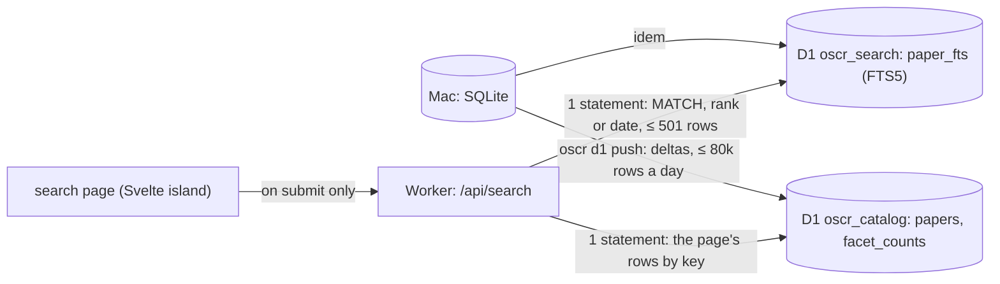
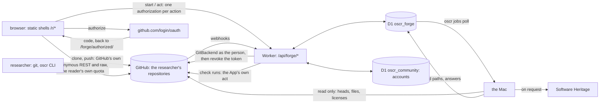

# Architecture, at $0

The rules that govern everything below are in [CLAUDE.md](../CLAUDE.md):
- Zenodo DOIs only for tracing maps validated by one of the paper's authors;
- no paid service.

## The pieces

| Piece | Where it runs | What it does | Cost |
|---|---|---|---|
| **The harvester** (`oscr watch`) | the Mac Studio, continuously | reads the papers, finds and verifies the code, keeps the scripts' text in the private database (SQLite, WAL) | $0 |
| **The alignment** (`oscr align`) | the Mac; the harvester also runs it once a day for the papers still without pairs | pairs the paper's paragraphs with lines of the authors' code (method `lexical-v1`) and stores the pairs in the `alignment` table | $0 |
| **The local dashboard** (`oscr dashboard`) | the Mac, http://127.0.0.1:8790 | the table of the private database, for the owner only, read-only | $0 |
| **The public catalogue** (`oscr nightly`) | the Mac, at 04:17 | `data/public/` in public mode, then the Hugging Face dataset, then the website | $0 |
| **The website** (`website/`, Astro) | Cloudflare Workers (static assets) | the public site, built from the public catalogue, with the Code ↔ Paper reader | $0 |
| **The search index** (`oscr d1 push`, Phase 3) | the Mac → Cloudflare D1 | the papers with a page, projected into two D1 databases (`oscr_catalog`, `oscr_search`), pushed as deltas within 80,000 rows written a day ([SEARCH.md](SEARCH.md)) | $0 |
| **The Worker's code** (`website/worker/`, Phase 3) | Cloudflare Workers, `/api/*` only | `/api/search`: FTS5 in D1, facets, sorts, CSV and JSON exports | $0 (100,000 requests a day) |
| **The map DOIs** (`oscr zenodo`) | Zenodo (CERN) | a map validated by an author receives a DOI in the community | $0 |
| **The accounts** (`website/worker/account/`, Phase 5) | the Worker's code, `/api/auth/*` and `/api/account/*`, with the D1 database `oscr_community` | sign-in with ORCID, GitHub or Google; sessions; the verified authors and maintainers ([ACCOUNTS.md](ACCOUNTS.md)) | $0 |
| **The accounts' facts** (`oscr community`) | the Mac | the ORCID iDs of the papers with a page, the owners of their repositories and which paper each is the code of, pushed to `oscr_community` as deltas (locally, or to Cloudflare: nightly with `OSCR_COMMUNITY_PUSH=remote`) | $0 |
| **The contributions** (`website/worker/contributions/`, Phase 6) | the Worker's code, `/api/contributions`, `/api/submissions`, `/api/claims`, `/api/edits`, `/api/validations`, `/api/reports`, with `oscr_community` | submit a paper and its code, claim a paper, correct a record, validate a map, request a removal: checked at once, recorded with a job for the Mac ([CONTRIBUTIONS.md](CONTRIBUTIONS.md)) | $0 |
| **The job runner** (`oscr jobs poll`, Phase 6) | the Mac, every ten minutes (proposed: `tools/org.oscr.jobs.plist`, not installed) | reads the new jobs in `oscr_community`, harvests a submitted paper into a draft, applies corrections as new versions, deposits validated maps on the Zenodo sandbox, lists claims and removal requests for the owner (`oscr claims`, `oscr reports`, `oscr submissions`) | $0 |

The database is in WAL mode: the harvester writes while the dashboard and the nightly job
read, and none of them blocks the others. What leaves the Mac (`oscr_public.db`) is put back
into a single file, with no excerpt of any paper.

## The enriched record (Phase 1)

Every paper read gets a record beyond its links. It is built on the Mac from what the Mac
already holds: `oscr/enrich.py`, run on every new paper and by `oscr enrich` for the papers
read before.

| source | what it gives | module |
|---|---|---|
| the cached full text (JATS, both of Europe PMC's flavours) | type, abstract, journal (ISSN, publisher), volume, issue, pages, dates, authors (order, ORCID, affiliations, ROR, corresponding), funding, keywords, subjects, references, RRIDs, availability statements | `oscr/biblio.py` |
| the Europe PMC `core` result (kept in `epmc_record` since Phase 1) | MeSH, grants, more ORCIDs, citation count, open-access flag, corrections and retractions | `oscr/biblio.py` |
| the Retraction Watch data (a weekly download, looked up locally by DOI) | retractions, corrections, expressions of concern | `oscr/sources/retractions.py` |
| the stored file lists and scripts | notebooks, README, CITATION.cff, environment files, tests, CI; the tools used (imports and calls) | `oscr/repofeatures.py` |
| rules over title, keywords, MeSH, journal, abstract | on topic or not, modality, organism, population, subfield, each with a confidence and its reasons | `oscr/classify.py` |

- **The schema changes by numbered migrations** (`oscr/migrations/NNNN_*.sql`), applied once,
  in order, each in one transaction, when the database opens. Schema 4 adds the tables of
  [PLATFORM_PLAN.md](PLATFORM_PLAN.md) §4.
- **Provenance**: `field_provenance` says where each value came from (jats, epmc,
  retraction-watch…) and when.
- **Versions**: `version` keeps each change of a record, with what changed; texts appear
  there only as digests.
- **Every verdict on a repository** is kept in `alive_check`, not only the last one.
- **Categories** (owner's decision D6): the rules first; the owner's own labels
  (`oscr labels data/annotation/sample.csv`) win over the rules. A local model will decide
  the ambiguous cases, only between 01:00 and 07:00, once compared with the owner's labels
  (`tools/compare_models.py`).
- **Off-topic papers** (D7) stay on the Mac: they are out of every public output (the
  catalogue, the scripts, the matches, the public database) and out of the statistics.
- **No article text leaves** (`catalog.public_db`). Abstracts, the raw Europe PMC records and
  the versions are removed from the public database, and availability statements are kept
  only under CC BY, CC0, CC BY-SA or CC BY-NC (D1). The paper's page shows the abstract and the
  statements under the same licenses only (Phase 4, below).
- **Rates are computed on research articles** (`catalog.RESEARCH_TYPES`); reviews,
  conference abstracts, case reports and notices are counted apart.

## The Code ↔ Paper reader

A page of the website puts a paper and its authors' code side by side.

- **Left, the paper.** Its full text is fetched from Europe PMC (open access, CORS allowed)
  by the reader's browser, never by the site, and shown as plain text. The site never stores
  or serves the text of a paper.
- **Right, the code.** One view is prerendered at build time; the others are fetched on
  demand from the lot of their repository (`/scripts/NN.json`). A script whose license does
  not allow republication is not copied: the reader lists the file and links to it at the
  source, at the verified commit.
- **The pairs** come from `alignments/NN.json`, read at build time. A pair joins paragraph
  number *i* (the index of a `
` among all the `
` of the JATS `<body>`, in document
  order, which the browser computes the same way) and a line range of one file: the same
  color on both sides. Clicking one side brings the other into view. The build keeps only the
  known fields of a pair and drops any evidence term longer than 60 characters, so no
  sentence of a paper can reach the site.

The website's name is not written in its pages: it comes from `SITE_NAME` (default `OSCR`)
and `SITE_TAGLINE`, set in `website/src/config.ts` or at build time.

## The website's pages

Every page is static: Astro builds it from the public export (`data/public/`, written by
`oscr nightly` in public mode), and the Worker serves it as a static asset. Every `<title>`
ends with `SITE_NAME`; the only style is `science.css`.

| route | what it shows | from the export |
|---|---|---|
| `/` | the papers with their authors' code, by day of publication | `catalog.json` |
| `/paper/<slug>/` | a paper with code, code on request or data only (decision D2), in sections: Overview, Code, Map, Data, Versions, Cite, Similar (and Discussion, Reproductions, Activity, which open with sign-in); see "The paper's page" below | `catalog.json`, `entities/`, `papers/` |
| `/paper/<slug>/code/` | the Code ↔ Paper reader, for the papers with code | `catalog.json`, `alignments/`, `scripts/` |
| `/browse/` | the categories by facet, with their counts; the other ways in | `entities/categories.json` |
| `/browse/<facet>/<value>/` | the papers of a category, by day | `entities/categories.json` |
| `/authors/`, `/author/<orcid>/` | the authors with an ORCID iD: latest affiliations, institutions, tools, papers | `entities/authors.json` |
| `/journals/`, `/journal/<id>/` | ISSN, publisher, papers with code out of papers read | `entities/journals.json` |
| `/institutions/`, `/institution/<ror>/` | the authors' institutions, by ROR id | `entities/institutions.json` |
| `/tools/`, `/tool/<id>/` | the tools found in the authors' code: repositories, papers | `entities/tools.json` |
| `/datasets/`, `/dataset/<id>/` | the datasets cited, by repository | `entities/datasets.json` |
| `/lookup/` | the DOI lookup: any paper read, with or without a page | `lookup/NNN.json`, fetched by the browser |
| `/search/` | the search (Phase 3): a static page and a Svelte island that asks `/api/search` only when a search is submitted | D1, through the Worker |
| `/account/` | sign-in, the linked identities, the roles, "your papers", the maintainer claim form (Phase 5) | nothing: the page asks `/api/account/me` |
| `/about/` | what the registry is, and what it never publishes | — |

- **Who counts.** `oscr/entities.py` counts only the papers with a page (D2): the authors'
  code (verified, found, empty, dead), code on request, data only. An off-topic paper appears
  nowhere, the lookup included (D7).
- **People** are merged by ORCID iD only; a name without one stays a name on its paper's
  page. No email address or telephone number leaves the export, and the build removes any
  string that still looks like an address.
- **The lookup** is static: the page fetches one shard, `/lookup/NNN.json` (the first 3 hex
  characters of the SHA-1 of the lowercased DOI), only when its form is submitted.
- **Bounded.** `STATIC_MAX` (`website/src/lib/entities.ts`): 2,000 pages per entity type,
  the entities with the most papers; beyond, pages will be rendered on demand by the Worker
  from D1 (Phase 3). `npm run check` (in CI with `--every-route`) checks every route and every
  internal link after the build, and prints the number of files.

## The paper's page (Phase 4)

One page per paper, in sections reached through a bar of in-page links (`#overview`,
`#code`, `#map`, `#data`, `#versions`, `#cite`, `#similar`, `#discussion`, `#reproductions`,
`#activity`): no route of their own, no JavaScript needed, so the number of files does not
change (5,999 files for a 3,032-paper export, before and after). The Code ↔ Paper reader stays
at `/paper/<slug>/code/`.

`oscr/paperpage.py` writes what the sections need into `papers/NN.json` (lots keyed by paper
id, like `alignments/`), for the papers with a page only; the site reads them when it is built
(`website/src/lib/paper.ts`, `src/components/paper/`).

| section | shows | from |
|---|---|---|
| Overview | authors in order (their pages, their ORCID records), affiliations (the institution's text; no email, no phone), journal, volume, issue, pages, dates, type, language, license, identifiers, categories, keywords, MeSH, journal subjects, funding, citation count, references, RRIDs, integrity notices (a retraction, a correction or an expression of concern is said first, under the title); the abstract **only under D1's licenses** | `article`, `paper_author`, `paper_subject`, `grant_award`, `funder`, `paper_rrid`, `integrity_notice` |
| Code | each repository: state, license, commit and its date, languages, size, Software Heritage, where it was found, what it holds (README, license file, CITATION.cff, environment files, tests, CI, notebooks), the tools found in it, the history of its availability checks (the last 20: date, state, HTTP status; a check's error text stays on the Mac); the way into the reader; the code statement | `repository`, `repo_feature`, `repo_tool`, `alive_check`, `statement` |
| Map | proposed or validated (ORCID only), what the map holds, its DOI and its JSON on Zenodo once deposited (never the sandbox) | `validation`, `card_doi`, `file`, `alignment` |
| Data | the datasets cited (their pages), the other data links and where each was found, the data statement | `link`, `paper_dataset`, `dataset`, `statement` |
| Versions | the record's history, newest first: date, and what changed in its public facts, its code and data links included (Phase 6); a correction says by whom by role only ("a verified author") | `version` |
| Cite | the paper in an APA-like text, BibTeX, RIS and CSL-JSON, built at export; the map's too once it has a DOI; a copy button (`src/scripts/cite.ts`) | `article`, `journal`, `paper_author` |
| Similar | up to 10 papers with a page, ranked by the tools, categories, datasets, cited references (`paper_reference` DOIs) and authors (ORCID iD) they share, each weighed by its rarity, with the reasons in words ("shares FieldTrip, EEG, 3 references") | computed at export |
| Contribute (Phase 6) | how to sign in; for a signed-in reader, by their roles: claim the paper, correct its links, validate its map (with its digest), the badge's snippets; a removal request for anyone signed in (the sidebar links to it). Its script asks the Worker once, only when the browser holds a session | `map.digest`, the code's README (`repository.files`); the Worker's `/api/contributions/paper` |

**What never leaves**, tested on synthetic databases (`tests/test_paperpage.py`) and checked
again by `website/scripts/data.mjs`:
- **a paper's texts under a closed license** (decision D1, `catalog.statement_is_publishable`,
  applied to the abstract as to the statements): the page then says, from facts only, what the
  statements point to (datasets, repositories) and whether they say "on request", and links to
  the paper. Under CC BY, CC0, CC BY-SA or CC BY-NC, the text is shown with its license;
- **an email address** or a telephone number (`entities.scrub`, then a last check per lot);
- **anything of an off-topic paper** (D7), which is nobody's similar paper either;
- **from the versions, only `paperpage.VERSION_FIELDS`**: the digests of the abstract and of the
  statements, the classification's raw values (`categories`, `on_topic`) and any field added
  later stay on the Mac; a version that changed only those is not listed;
- Retraction Watch's reasons (the notice itself is linked), the Zenodo sandbox's tests.

The map's creators include the platform: the export writes it `{platform}` and the site puts
`SITE_NAME` there, escaped for each format.

## The tracing map

The map (`tracing-map.json`, see `oscr/zenodo.py`) says, for a paper:
- where its code is: repository, commit, license;
- what was found there: the path and digest of each file;
- how it was found;
- which paragraphs match which lines (`alignments`).

It contains neither the text of the paper nor the code.

Its life:
1. **Proposed** by the harvester. It is visible on the website, without a DOI.
2. **Validated** by an author, signed in with their ORCID (Phase 6: the paper's Contribute
   section). The page carries the map's digest (`zenodo.map_digest`) and the validation brings it
   back: the map kept is the one the author saw — if it changed since, the Mac asks the author to
   look again. While the site signs in with ORCID's sandbox, a validation is a test (`proof =
   'test'`), which only Zenodo's sandbox takes.
3. **Deposited** on Zenodo, in the community, by the Mac's job runner (`oscr jobs poll`; by hand:
   `oscr zenodo deposit`), on the sandbox while the platform is built. It receives a DOI, which
   goes back to the author's account page.
   - Relations: `IsSupplementTo` the paper, `References` the code repository, at the
     validated commit.
   - Creators: the author (ORCID) and the platform.
4. **Corrected** later: a new version, under the same concept DOI.

## Contributions (Phase 6)

What signed-in readers ask of the registry, and the Mac's answers ([CONTRIBUTIONS.md](CONTRIBUTIONS.md)):

- **The Worker checks and records; the Mac does the work.** A request is checked at once in the
  Worker (the session, its CSRF token and the site's Origin; the reader's role; for a link, that
  it points to a place the registry knows and answers; for a DOI, that it is registered), then
  written to `oscr_community` with a row in `jobs`. The Mac polls `jobs` and writes each outcome
  into the request's row: the Worker never harvests, verifies a license or talks to Zenodo, and
  the Mac never listens on the network.
- **A correction is a version.** Corrections of a record's links (by a verified author of the
  paper, or a maintainer of its code for their own repository) are kept on the Mac
  (`link_edit`), applied after every later scan, and each makes a new `version` with its
  provenance (the person's ORCID iD or GitHub login, on the Mac only). The Versions section says
  "a correction by a verified author".
- **The owner decides what the machine cannot**: manual author claims, claims GitHub cannot
  settle, removal requests, and submissions published by someone who is not among the paper's
  authors (`oscr claims`, `oscr reports`, `oscr submissions`; moderation in the site is Phase 7).
  An accepted removal takes the record out of every public output (`article.withdrawn`, like an
  off-topic paper).
- **Cheap by construction.** A request writes 3 rows (its row, its index entry, the job), an
  answer 1; per-account daily limits are counted from the rows; a signed-out reader's page view
  costs no Worker request (the pages ask only when the `__Host-oscr_signed_in` hint cookie is
  there).

## What remains to build, in order

1. ~~Deploy the website~~: done on 2026-09-26, https://oscr.yannbellec-b.workers.dev, rebuilt every night.
2. ~~Author validation~~: built. Sign-in (Phase 5, [ACCOUNTS.md](ACCOUNTS.md)): ORCID
   (`openid` scope, free for non-commercial use), GitHub and Google, and an ORCID iD found
   among a paper's authors makes a verified author of it. Phase 6 ([CONTRIBUTIONS.md](CONTRIBUTIONS.md)):
   the verified author validates the map in the site's Worker, which writes it to D1; the Mac
   picks it up and deposits the map on Zenodo (the sandbox while the platform is built).
3. ~~Search~~: built in Phase 3 (below, and [SEARCH.md](SEARCH.md)); the remote databases await the owner's approval.
4. ~~A first paper ↔ code alignment~~: `lexical-v1`, computed on the Mac. Next: GROBID for
   the text, tree-sitter for the code, a local model on the Mac.

## The free limits that matter

Checked on 2026-09-26 in Cloudflare's documentation; the full table, with sources, is in
[PLATFORM_PLAN.md](PLATFORM_PLAN.md) (§2 and Appendix A).

| Service | Limit | Consequence |
|---|---|---|
| Workers static assets | 20,000 files per version; 25 MiB per file; asset requests free and unlimited | one static page per paper holds up to ~15,000 papers with code. Beyond that: pages grouped, or rendered on demand |
| Workers | 100,000 requests per day for all dynamic routes, cached or not; 10 ms of CPU per request; 64 MiB per Worker | kept for actions: sign-in, contributions, search, API; a signed-out reader's page asks nothing |
| D1 | 500 MB per database, 10 databases; 5 M rows read and 100,000 written per day | the catalogue projection, the script index and the community, pushed as deltas |
| Hugging Face | public datasets free ("best-effort"); byte ranges with CORS | the open data, and the script blocks |
| Zenodo | 50 GB per record; 60 requests per minute without a token | a map weighs a few KB |

**The scripts' text.** Today, 32 lots in `public/scripts/`. Decided on 2026-09-26
([SCRIPT_STORAGE.md](SCRIPT_STORAGE.md)): deduplicated, zstd, Parquet blocks on a public
Hugging Face dataset, read by the reader in the browser with range requests (~78 KB per
script), with an index in D1. Measured: 155 MB of text become 25.6 MB; ~3.3 GB at the full
neuro stock, of which ~2.3 GB are public.

## Planned platform

The platform extension (a normalized D1 catalogue, accounts, search and a community) is
specified in [PLATFORM_PLAN.md](PLATFORM_PLAN.md). Each phase follows the rules of
[CLAUDE.md](../CLAUDE.md); Phase 2 (navigation, the pages above) and Phase 3 (the search,
below) are built on their branches and await the owner's review.

### Search engine

**Built (Phase 3), awaiting the owner's review; the remote databases await approval.** SQLite
FTS5 in D1, not Pagefind; the details, the API and the measurements are in
[SEARCH.md](SEARCH.md), the choice in [PLATFORM_PLAN.md](PLATFORM_PLAN.md) §7.

- **Two databases**, because a D1 database that holds FTS5 cannot be exported: `oscr_catalog`
  (what a result row shows, the precomputed counts of the unfiltered view) and `oscr_search`
  (the index).
- **The filters are index tokens**, not an index table: each facet value of a paper is a token
  of the index's `facets` column, so a filter is part of the MATCH, costs no row written per
  value, and D1 reads only the matching rows.
- **The key is the date**: YYYYMMDD × 100,000 + n. "Newest first" is the index's rowid order and
  a date range a rowid range, without an index.
- **Bounded costs**: a window of 500 results gives the page, the exact total and the facet
  counts up to 500 (past it, the counts are the first 500's, the total says "more than 500" and
  the pages stop there): a search reads at most ~540 rows (~600 at 50 results a page), an export
  ~1,500; the Worker's CPU stays under ~3 ms (measured in V8, docs/SEARCH.md §5).
- **Never an abstract in an answer**: abstracts are indexed only under an open license (D1's
  rule), in a contentless index; results carry title, journal, date, status and links.

**Why not Pagefind.** Pagefind writes one fragment file per indexed record, plus index
chunks, filter files and a start-up file that lists every record.
- A searchable catalogue of 50–90k papers needs ~50–90k files. The limit is 20,000 files per
  Pages deployment, which Pagefind reaches at ~15k records.
- Pagefind has no incremental index, so every rebuild re-uploads most chunks over a home
  uplink (~0.9 MB/s, and ~25 KB/s for a background task).
- Its maintainer calls ~180k pages "probably around the ceiling".
- Everything indexed can be downloaded by anyone.

**The cost to watch.** Every search is a Worker request, even when cached, out of 100,000 a
day for the whole site, plus D1 rows read (5 M a day). If that budget gets tight, the fallback
costs no request: a static inverted index published as Parquet blocks on Hugging Face and read
by byte ranges, like the scripts (the owner's plan B, decision D3).

## Git hosting (night run, phase 00)

Decided on the night of 2026-09-28/29. The options compared, the reasons and what would change
each choice are in [DECISIONS.md](DECISIONS.md), entries D00-1 to D00-16. Nothing of it is built
yet: phase 01 builds it on this design.

**No option lets OSCR hold Git repositories itself with certain compliance and at zero cost**
(D00-1):
- Hugging Face, a GitHub organization and the other hosted forges: their terms do not clearly
  allow one customer to serve other people's repositories.
- Every permanent free cloud VM asks for a payment card.
- A Git server on Cloudflare's free plan can neither index a real push within 10 ms of CPU nor
  hold ~100 GB.

**What OSCR does instead:**
- **Repositories live in the researcher's own GitHub account** (D00-2). OSCR's GitHub App
  creates them and acts on them with the researcher's consent: one authorization per action, as
  that person (D00-4).
- **The mirror mode is the same machinery**, applied to a repository the researcher already has.
- **OSCR keeps only its own layer**: links to papers and DOIs, tracing maps pinned to commits,
  reviews, the scientific issue types. It lives in a new D1 database and on the Mac.
- **`GitBackend` hides the forge**, so another storage can replace GitHub later without
  rewriting the rest (D00-13).

### The pieces

| Piece | Where it runs | What it does | Cost |
|---|---|---|---|
| **The repositories** | the researchers' own GitHub accounts | git over HTTPS and SSH; commits and merges made by GitHub's API as the person; pull requests, issues, releases; continuous integration for the repository's own tests only (D00-11) | $0 for OSCR: each researcher's own free quotas |
| **OSCR's GitHub App** | registered by the owner, installed by researchers | creates a repository when asked; acts as the person through a per-action authorization; sends webhooks; posts OSCR's check runs | $0 |
| **The repository pages** | static shells (`/r/*`, one `_redirects` rule, no file per repository) and the reader's browser | read public repositories straight from `api.github.com` and `raw.githubusercontent.com`, on the reader's own quota (D00-5); mask email addresses as `catalog.mask_emails` does; take OSCR's layer from a small static index | $0: no Worker request when signed out |
| **The forge service** (phase 01) | the Worker's code, `/api/forge/*` | per-action authorization (`start`, then `act`); webhooks; OSCR's live layer for signed-in readers; never a git proxy, never a stored user token | 2 requests per action, 1 per webhook |
| **`oscr_forge`** (new D1 database, binding `FORGE`) | Cloudflare D1 | repositories known by their forge id (public only), links to papers, installations, the paths tracing maps point to, the action log, jobs for the Mac; no Git object, token or email address | inside the Worker's D1 share (D00-12) |
| **`GitBackend`** | `website/worker/forge/` (Worker and browser); `oscr/forge.py` (the Mac, read-only) | the forge-neutral interface; the GitHub adapter; an in-memory double and a contract suite for tests | $0 |
| **The Mac** | as today | verifies linked repositories and their licenses; keeps the licensed script copies; computes tracing maps at pinned commits; polls public mirrors; asks Software Heritage to archive when a person requests it (D00-15). Never writes to a forge, never runs users' code | $0 |
| **The researcher's machine** | `git` and the `oscr` command-line tool (phase 14) | imports, keeping commit ids (D00-8); uploads above OSCR's caps; local blame. The tool's GitHub token stays in the researcher's keychain | $0 |

### Git over HTTPS, and tokens

- **Clones go straight to github.com.** Clone, fetch, pull and push use
  `https://github.com/<owner>/<name>.git` (or SSH) with GitHub's own credentials.
  - OSCR runs no git proxy and issues no git token (D00-3).
  - A proxy would pass GitHub's service on to others (GitHub's AUP §6), and Cloudflare's terms
    do not clearly allow a proxy in front of content hosted elsewhere.
- **The scoped tokens are GitHub App user tokens.** Each is limited to the App's permissions, the
  person's own rights and the repositories where the App is installed, and expires after 8 hours.
  - The command-line tool gets one through GitHub's device flow, so the token never reaches OSCR.
  - It acts as git's credential helper for github.com only.
- **A clone alias on OSCR's domain** is designed and switched off. It would be a `302` from
  `…/info/refs` to github.com, which git follows by default. The owner decides whether to turn it
  on.
- **OSCR's own tokens** (phases 09 and 14) will reach OSCR's API only, never git.

### Writing, and where commits and merges are made

- **Every write is one authorization per action** (D00-4):
  1. The page confirms the action with the person.
  2. `POST /api/forge/start` signs a 10-minute cookie. It holds the state, the PKCE verifier, the
     action and the SHA-256 of its payload. Nothing is written to D1.
  3. GitHub sends the browser back to a static page, which posts the code and the payload to
     `POST /api/forge/act`.
  4. The Worker exchanges the code and checks that the GitHub account is the one linked to the
     signed-in OSCR account.
  5. It acts through `GitBackend` as the person and checks that GitHub's answer matches the
     action.
  6. It revokes the token. The token is never stored.
- **The App's installation token** is minted in memory for the App's own acts only: OSCR's check
  run on a pull request, and reading an installed repository after its webhook.
- **Commits are made by GitHub** (D00-7):
  - a web edit is one `createCommitOnBranch` call: one request, compare-and-swap on the branch
    head, signed by GitHub, authored by the person;
  - moves, executable bits and commits with two parents use the Git data API.
- **Merges are made by GitHub.** Branch and pull-request merges go through GitHub's merge
  endpoints. A merge conflict is resolved in the browser and committed with two parents.
- **Nothing Git is built in the Worker or on the Mac.** Payloads through the Worker are capped at
  1 MiB to start, because of the 10 ms of CPU; the cap is raised once measured in V8.

### Large files, limits, the mirror mode, imports, deletion

- **Large files** (D00-9) go, in this order:
  1. to release assets (under 2 GiB each, with no limit on bandwidth);
  2. to a Zenodo record made by the researcher;
  3. to a Hugging Face dataset in the researcher's own account.

  Git LFS is for small binaries only: each GitHub Free owner gets 10 GiB of LFS storage and
  10 GiB of LFS download a month.
- **The limits** are shown at creation and in the editor: 100 MiB per file, 2 GB per push, a
  repository ideally under 1 GB. Through the Worker: web commits up to 1 MiB, release assets up
  to 25 MiB, streamed without parsing. Beyond that, GitHub's own pages or the command-line tool.
- **The mirror mode** (D00-2):
  - A researcher installs the App on an existing repository. OSCR then receives its webhooks and
    can write back with the researcher's authorization.
  - A public repository without the App is read only; the Mac polls it.
  - OSCR copies no Git data, except the licensed scripts it already keeps.
- **Imports** (D00-8) run on the researcher's machine: `git clone --mirror` then
  `git push --mirror`, or GitHub's own importer page. A Zenodo archive becomes one commit that
  cites its DOI. Never in the Worker or on the Mac.
- **Deletion** (D00-10):
  - OSCR archives the repository on GitHub and hides it at once, for a 30-day grace period during
    which it can be restored.
  - The deletion on GitHub is then the researcher's own act, through a fresh authorization, never
    OSCR's token or a timer.
  - Tracing maps that point to the repository are shown before anything is done.
- **Scope** (D00-14): public repositories only at first. The App asks for no account permission,
  so no email address. `GitBackend`'s types have no field for an email address.

### What each operation costs

The budgets (D00-12):
- 40,000 of the 100,000 Worker requests a day are planned for the GitHub side;
- the forge service's D1 writes are capped in code at 5,000 a day, inside the Worker's 10,000,
  until the owner confirms C3;
- no R2, no KV, no Durable Objects, no Cron Triggers.

| operation | Worker requests | D1 rows written | GitHub quota used, and whose |
|---|---|---|---|
| a repository page, a file, a commit list, a diff, signed out | 0 | 0 | the reader's own anonymous 60 an hour (raw files are not counted in them) |
| OSCR's layer for a signed-in reader | 1 | 0 (~10 read) | – |
| create a repository | 2 | ~5 | the person's own |
| a web commit, a branch, a pull request, a review, a merge, an issue | 2 | 1 (the action log) | the person's own |
| a scientific issue (OSCR's own) | 1 | 3 | – |
| a release; an asset up to 25 MiB | 2 | 1–2 | the person's own |
| a webhook (a push, a pull request with OSCR's check, a rename) | 1 | 0–2 | the installation's own, for the check run |
| the Mac polling a public mirror | 0 | 1 per changed head (the facts push's share) | `git ls-remote`, or the Mac's token (a `304` answer is free) |
| clone, fetch, push | 0 | 0 | the researcher's own |

A day at 3,000 repositories is estimated at about 7,000 Worker requests and 2,300 D1 rows
written.

### `GitBackend`

- **The interface** (`website/worker/forge/`). It groups repositories, git (refs, trees, files,
  commits, compare, blame, search, and making commits and merges), pull requests and reviews,
  issues, releases, checks, webhooks, the App's authorization, and links to the forge's own
  pages. It covers phases 01 to 07.
  - Errors are typed: one class, twelve codes. Limits and capabilities are given per kind of
    credential: anonymous, user, installation.
  - Its read side also runs in the browser.
  - An installation session may write nothing but check runs.
- **The GitHub adapter** uses REST, plus GraphQL where REST falls short: blame, review threads,
  auto-merge, reverting a pull request, pinning and transferring issues. It adds no dependency,
  and reaches the network only through an injected `fetch`.
- **An in-memory double** implements the whole interface, with git's real object ids, and a
  contract suite runs on every backend.
- **`oscr/forge.py`** is the Mac's read-only counterpart: a repository by its forge id, the head
  of a branch through conditional requests, whether a commit exists, the files at a commit.
- **Other forges can be added later.** A Forgejo, GitLab or Cloudflare backend would add an
  adapter that passes the same contract. That becomes possible if the owner ever unlocks
  OSCR-hosted storage (D00-1).

### The owner's steps [owner]

1. **Register the GitHub App.** It is separate from the sign-in OAuth App, which keeps no scope.
   - Name from `SITE_NAME`.
   - Callback URL `…/forge/authorized/`, with user authorization requested during installation.
     GitHub then allows no separate setup URL: the same page also receives the return from an
     installation.
   - Webhook `…/api/forge/webhook`, with a secret.
   - Repository permissions: Metadata (read); Repository creation, Administration, Contents, Pull
     requests, Issues and Checks (write). No account permission.
   - Installable by any account. Expiring user tokens. Device flow on, for the command-line tool.
2. **Give its values to `tools/setup_cloudflare.sh`**, which gains these questions in phase 01:
   `GITHUB_APP_ID`, `GITHUB_APP_CLIENT_ID`, `GITHUB_APP_CLIENT_SECRET`, `GITHUB_APP_PRIVATE_KEY`
   (GitHub's file as it is) and `GITHUB_APP_WEBHOOK_SECRET`, plus the variable
   `GITHUB_APP_SLUG`. The same script creates the D1 database `oscr_forge`. (Phase 01 stores the
   slug, and the owner's numeric GitHub id `FORGE_OWNER_GITHUB_ID`, as secrets too, so that a
   deployment never wipes them: D01-2.)
3. **Decide**:
   - C3: 20,000 D1 rows a day for the GitHub side;
   - whether a user token may stay, encrypted, in the session cookie for its 8 hours;
   - whether to switch on the clone alias;
   - whether OSCR may ask Software Heritage to archive the commits of validated maps by default.

### Git hosting (phase 01): the forge service, the pages, the Mac

Built on the night of 2026-09-29, on the design above; the contract (routes, action kinds and
their payloads, rows, caps, pages, jobs) is [FORGE.md](FORGE.md), the decisions D01-1 onwards in
[DECISIONS.md](DECISIONS.md).

- **The Worker** answers `/api/forge/*` (`website/worker/forge/service/`): `POST start` and
  `POST act`, one authorized action in two requests (D00-4); `POST webhook`, GitHub's deliveries;
  `GET repo` and `GET mine`, OSCR's layer for a signed-in reader. Every route needs the binding
  `FORGE` (D1 `oscr_forge`), and the signed-in ones the accounts; without them, 503
  `not_configured`.
- **Who may write**: `FORGE_OPEN` unset (the default) closes the write routes to everyone but the
  owner, the GitHub account `FORGE_OWNER_GITHUB_ID` names (D01-1). Phase 16's content rules open
  them.
- **An action** is a spec in a registry (`actions.ts`): it validates its payload, performs as the
  person through `GitBackend`, checks GitHub's answer, and returns its D1 rows as statements,
  written in one batch with the action row (`store.ts`).
- **The caps** are counted from the rows, with no counter row: 100 actions, 10 creations and 20
  links per account in 24 hours; 5,000 rows a UTC day for the whole service. The keys of `actions`
  and `deliveries` start with the UTC day, so each count is a key range (D01-11, D01-12).
- **The pages** are static: `/new/`, `/new/link/`, `/new/import/`, `/repositories/`,
  `/forge/authorized/`, the guides under `/hosting/`, and ONE shell for every repository page,
  `/r/<owner>/<name>/[settings/|branches/]` (`public/_redirects`: `/r/* /r/ 200`). Signed out, a
  repository page asks the Worker nothing: GitHub's anonymous API on the reader's quota, and OSCR's
  layer from at most 64 static shards (`/forge/layer/NN.json`).
- **The Mac** (`oscr forge …`, `oscr/forgejobs.py`, `oscr/forgelayer.py`) polls the jobs
  (`link`, `push`, `archive`, `delete_due`, `reconcile`) and the public mirrors' heads, pushes the
  traced paths, and writes the static layer before the nightly deployment
  (`OSCR_FORGE_PUSH=remote`). It reaches `oscr_forge` as it reaches `oscr_community`
  (`community.open_d1(target, database="oscr_forge")`).
- **The owner's setup** is the same script: `tools/setup_cloudflare.sh` creates, binds and
  migrates `oscr_forge`, and stores the App's values as Cloudflare secrets, the private key read
  from GitHub's `.pem` file; it never sets `FORGE_OPEN`.
