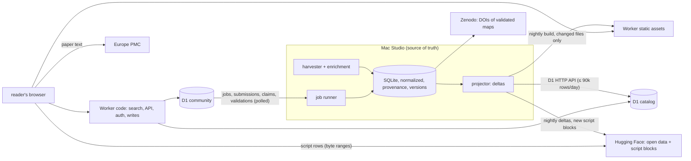

# Platform plan — Phase 0: audit and plan

Status: **Phase 0 validated by the owner on 2026-09-27, with the decisions of §13. Phases 1 and 2 are
deployed; Phase 3 (search) is built and awaits the owner's approval for its remote setup
(docs/SEARCH.md §7); Phase 4 (the full paper page) is built on its branch and awaits review
(§12); Phase 5 (accounts) is built on its branch and awaits review and the owner's
applications (§8, [ACCOUNTS.md](ACCOUNTS.md)); Phase 6 (submission, claims, edition, validation,
Zenodo sandbox, badge) is built on branch `phase-6`, tested locally, not deployed (§9,
[CONTRIBUTIONS.md](CONTRIBUTIONS.md)).**
Date: 2026-09-26. Scope: turn the catalogue into a full platform (arXiv + SSRN + PubMed +
a Kaggle dataset page), at zero cost, following `CLAUDE.md`. The platform's name lives in
one configuration variable, `SITE_NAME` (current value: `OSCR`).

Legend used below: **[M]** the Mac (harvester, SQLite, source of truth) · **[C]** Cloudflare
D1 "catalog" database · **[U]** Cloudflare D1 "community" database · **[S]** static files
on Cloudflare Workers (static assets) · **[B]** fetched by the reader's browser.

---

## 1. Current state (2026-09-26, 17:45 local time)

### What runs

| component | state |
|---|---|
| Harvester (launchd, continuous) | 2,501 papers read (mostly 2026; the backfill is on 2026-09) |
| Papers with the authors' code | 303 (283 verified alive, 4 found, 9 empty, 7 dead) · 60 "on request" · 136 data only · 31 without a readable text |
| Code repositories | 463 (435 alive): GitHub 318, Zenodo 76, OSF 29, GitLab 5, figshare 4, ModelDB 3, GIN 3, Dryad 3, others 22 |
| Script texts (private DB) | 15,978 files with text, 144 MB, i.e. **0.48 MB per paper with code** |
| Private database / cache | 166 MB / 417 MB (full texts cached forever) |
| Quality (measured) | precision 10/11 verdicts on unseen papers; recall 72% text-only (independent Zenodo benchmark) |
| Throughput (measured) | 540–820 papers/h (hourly counts today, background mode) |
| Website | Astro, static, `science.css` only: listing by day, record page (`.record` + `.sidebar`), About; client-side filter only |
| Open data | private Hugging Face dataset (CSV, JSONL, public SQLite copy), nightly |
| DOIs | Zenodo sandbox: community + one test deposit (rules of `CLAUDE.md` checked on the record) |

### Done since the plan was drafted (2026-09-26, evening)

- **The English switch** (approved by the owner): the `oscr` package, the English schema, the
  `org.oscr.*` launchd tasks, the Hugging Face dataset renamed `opsecsystems/oscr-catalog`
  (still private), the Zenodo sandbox community `oscr`, the website on Cloudflare Workers
  (https://oscr.yannbellec-b.workers.dev).
- **The paper ↔ code alignment engine** (`oscr/align.py`, method `lexical-v1`): on 25 papers,
  159 pairs; a fresh hand-checked sample of 33 gave 24 correct, 9 plausible, 0 wrong. Pairs are
  stored with paragraph numbers and short evidence terms only.
- **The Code ↔ Paper reader**: side-by-side view; the paper is loaded in the reader's browser
  from Europe PMC (CORS verified); OSCR never stores or serves article text.
- **The script storage decision** (`SCRIPT_STORAGE.md`): deduplicated, zstd, Parquet blocks on
  the Hugging Face dataset `OpenScientificCodeRegistry/Database`, one manifest per repository.
- README, Apache-2.0 license (data and maps CC0-1.0), docs, figures.

### Gaps against the mission

No search engine, no categories, no entity pages (authors, journals, institutions, tools,
datasets), no accounts, no submission/claim flow, no discussions, no versions, no feeds,
no API. Most bibliographic metadata is **already downloaded and discarded** (see §5).

### What the audit measured (2,444 cached full texts, the working database)

- **The article type is known but unused.** 1,624 research articles, 322 reviews,
  262 conference abstracts, 76 case reports, 20 corrections, 12 editorials, 6 retractions…
  17.4% of research articles have the authors' code (264/1,517), reviews 0.9%, abstracts,
  case reports, corrections and editorials 0%. Today every type counts in the "papers read",
  which dilutes the rates. **Proposal:** store the type, compute every rate on research
  articles (plus methods, brief reports, data papers), and show the other types as such.
- **245 records are conference abstracts with no body** (10% of the full texts): the
  harvester files them as "no code found" although it had nothing to read. They become
  `type = abstract`, excluded from the rates.
- **Two XML flavours at Europe PMC.** 43% of the full texts have a normal `<back>`; in 45%
  the back matter (references, declarations) sits in the last body sections instead, and the
  ISSN, the history dates and the keywords are missing; 10% are front matter only (the
  abstracts above). The parsers must read both flavours; the missing fields come from the
  Europe PMC answer (§5).
- **Europe PMC answers are not cached** (only the full texts are, forever): the `core`
  metadata that each pass receives is thrown away. Keeping it costs nothing from now on; the
  2,501 papers already read need one batched re-query (~25 requests).
- **Typographic hyphens in URLs.** Wiley's XML writes URL hyphens as U+2010: 35 repositories
  exist twice, the typographic copy always dead (record pages list both), and one paper
  (10.1002/alz.71822) is filed "code dead" only through such a copy. Fixed in the English
  harvester (`oscr/links.py`, with a test); the rescan of the switch repairs the records.

---

## 2. Constraints that shape everything

Every figure below was checked on 2026-09-26 on the official documentation (sources in
[Appendix A](#appendix-a-free-tier-facts-and-sources)); "measured" means measured here.

| constraint | value | consequence |
|---|---|---|
| Workers static assets: files per version | 20,000 (25 MiB per file); the same limit as Pages | one static HTML page per paper stops at ~15,000 papers (margin kept) |
| Deployments | a Worker deployment uploads only the changed assets; no build at Cloudflare (Pages allowed 500 builds a month) | one deployment per night |
| Static requests | free and unlimited, as long as they do not run the Worker's code (assets are served first) | static first, always |
| Workers (dynamic routes) | **100,000 requests a day for all dynamic routes together** (reset 00:00 UTC; "fail open" possible); 10 ms CPU per request; 128 MB; 50 subrequests | search, API, sign-in and writes only; **a cached response still counts as a request** (Cache API runs the Worker) |
| Worker size | 64 MiB uncompressed, start-up ≤ 1 s (the 3 MB limit of the mission was removed on 2026-09-04) | a Markdown sanitizer and a small router fit |
| Astro on Cloudflare | the Cloudflare adapter (v13+) no longer deploys on-demand pages to Pages: SSR and server islands need Workers | Astro stays static; dynamic endpoints are plain Pages Functions (or the site moves to Workers, decision D10) |
| D1 | 500 MB per database, 10 databases (5 GB); **5 M rows read and 100 k rows written a day** (each index adds a write); 50 queries per request, 100 parameters, 30 s per query; FTS5 supported, but a database with FTS5 cannot be exported (drop, export, recreate) | D1 holds a projection pushed as deltas; facet counts are precomputed; FTS5 in its own database; the Mac stays the source of truth and backup (plus 7 days of Time Travel) |
| D1 from the Mac | REST API, "for administrative use", 1,200 calls per 5 minutes | batched upserts, a few hundred calls a night |
| KV | 100 k reads, 1,000 writes a day | never for sessions or counters |
| Queues, Cron Triggers | Queues 10,000 operations a day; 5 Cron Triggers, 10 ms CPU | jobs are D1 rows polled by the Mac |
| R2 | 10 GB free, but a "purchase" step and, for production, a custom domain (r2.dev is rate-limited, not for production) | not used |
| Email | sending to arbitrary recipients needs Workers Paid; Resend free: 3,000 a month, 100 a day | in-site notifications (D5) |
| Turnstile | free, unlimited | on every public form |
| Hugging Face (public dataset) | free "best-effort", responsible use beyond a few GB; < 100k files per repository; byte ranges with CORS (checked) | script blocks and open data (`SCRIPT_STORAGE.md`) |
| Home uplink | ~0.9 MB/s measured (first Cloudflare deployment: 143 MB in 159 s); a launchd task at background priority is throttled by macOS (~25 KB/s measured for the nightly Hugging Face upload) | everything published is incremental; big one-off uploads run at normal priority |
| Script texts at full stock | 15–26 GB raw → **2.3–4.3 GB stored** (deduplicated, Parquet zstd) → 1.6–3.0 GB public | Parquet blocks on Hugging Face, read in the browser; positions in the static pages, one manifest per repository (decided, `SCRIPT_STORAGE.md`) |

**Upstream APIs.**
- **OpenAlex** now needs a free API key (since 2026-02-13). The free credit is $1 a day.
  DOI lookups are free; list queries cost $0.10 per 1,000 calls. OSCR makes single lookups
  only (`/works/doi:…`, measured 2026-09-28: `x-ratelimit-cost-usd: 0`): the 610k papers take
  610k free calls, ~42 hours at 4 a second, and $0. The key travels in the `Authorization`
  header, never in a URL.
- **Crossref** list queries: 1–3 a second, measured on the live headers. Retractions come
  from the Retraction Watch data (a daily `git pull`), not from the API.
- **GitHub**: 5,000 requests an hour with a token.
- **Software Heritage**: 120 an hour without a token. The Mac's allowance was almost used up
  when checked.
- **ORCID** public API and sign-in: free for non-commercial use only. OSCR qualifies.
- **Zenodo**: 60 requests a minute.

**Projected sizes at the full neuro stock.** Europe PMC counts 609,746 open-access papers with
a full text for the "neuro" query, 2000–2026 (counted today, per year). Two thirds are from
2020 or later:

| years | papers | share of papers with the authors' code (all types) | papers with code |
|---|---|---|---|
| 2026 (to date) | 49,641 | 12% (measured: 303 / 2,501) | ~6,000 |
| 2020–2025 | 356,202 | 6–11% (assumed, declining) | ~31,000 |
| 2015–2019 | 128,921 | 2–5% (assumed) | ~4,500 |
| 2000–2014 | 74,982 | ≤1% (assumed; 0 in a small 2016 sample) | ~700 |
| **total** | **609,746** | | **~42,000 (30–55k)** |

Pages for papers with code, "on request" and "data only" (0.65 per paper with code in 2026):
**50–90k**. The assumed rates get measured as the backfill goes back in time. Authors on those
papers ~150k (25% of the authors have an ORCID in the JATS, more through OpenAlex); journals
~5k; institutions (ROR) ~20–30k; tools ~300–1,000; datasets ~10–30k; categories ~100.
Per-paper metadata document: 4–8 KB.

---

## 3. Architecture: five tiers, one source of truth

- **[M] The Mac** keeps the complete, normalized database with provenance and history, and
  does all heavy work (harvest, enrichment, alignment, tool detection, classification with a
  local model). Nothing listens on the network.
- **[C] D1 catalog**: a read-optimized projection of what the site needs to render and search
  — papers with code (and "on request" / "data only"), their entities, facets and a full-text
  index. Pushed by the Mac as idempotent upserts, within a daily row budget. The scripts
  have no index in D1: their (block, row) positions are written into the static pages, and
  one manifest per repository sits next to the blocks on Hugging Face.
- **[U] D1 community**: accounts, identities, roles, sessions, claims, submissions, jobs,
  discussions, votes, reproduction reports, moderation, collections, subscriptions,
  notifications, saved searches, audit log. Written by the site; polled by the Mac.
- **[S] The Worker**: its static assets are the prerendered bounded pages, JSON shards and
  feeds (free, unlimited); its code serves search, API, sign-in and writes, and the entity
  pages rendered on demand.
- **[B] The browser** fetches the heavy texts: the paper from Europe PMC (never stored nor
  served by OSCR; CORS verified), and a script from the **Parquet blocks on Hugging Face**
  with HTTP range requests (~78 KB per script shown; decided 2026-09-26, `SCRIPT_STORAGE.md`).
  A file whose license does not allow redistribution is not in the blocks: the reader lists it
  and links to its lines at the source, at the verified commit.

Why not everything in D1: at the full stock the documents alone exceed what the free plan
accepts, and the backfill produces far more than 100,000 row writes a day. The Mac pushes the
subset that makes the site dense and searchable; the complete data stays on the Mac and in the
open dataset.

---

## 4. Data schema

Normalized on the Mac; D1 receives the same tables (same names and keys) minus the heavy
ones, plus a denormalized `doc` JSON column on `papers` used to render a page in one read.
Migrations are versioned files (`migrations/mac/NNNN_*.sql`, `migrations/d1/NNNN_*.sql`,
applied with `wrangler d1 migrations apply` on Cloudflare and by `oscr` on the Mac).

### Catalogue [M] and [C]

| table | key columns (✱ = indexed for filters or joins) | where |
|---|---|---|
| `papers` | `id` (doi:… / pmcid:…), `doi`✱, `pmid`, `pmcid`, `openalex_id`, `preprint_id` (arXiv/bioRxiv), `title`, `abstract`, `type`✱ (research-article, review, abstract, correction…), `language`, `journal_id`✱, `volume`, `issue`, `pages`, `received`, `accepted`, `published_online`, `published_print`, `published`✱, `license`, `oa_status`✱, `oa_url`, `cited_by_count`✱, `references_count`, `code_status`✱ (verified, found, empty, dead, on_request, data_only, none), `map_status`✱ (none, proposed, validated), `traceability_score`✱, `repro` (JSON indicators), `retracted`✱, `corrected`, `concern`, `scanned_at`, `updated_at`, `doc` (JSON, [C] only) | M, C |
| `authors` | `id`, `orcid`✱ (unique when present), `openalex_id`, `display_name`, `last_institution_id` — **no email, ever** | M, C |
| `paper_authors` | `paper_id`✱, `position`, `author_id`✱, `raw_name`, `is_corresponding`, `affiliation_ids` (JSON) | M, C |
| `institutions` | `id` (ROR)✱, `name`, `country`✱, `type`, `openalex_id` | M, C |
| `journals` | `id` (ISSN-L or OpenAlex source)✱, `title`, `issn`, `eissn`, `publisher`, `homepage`, `subjects` (JSON) | M, C |
| `repos` | `id` (github.com/o/r, zenodo:123…)✱, `host`✱, `owner`, `name`, `url`, `description`, `topics`, `default_branch`, `license_spdx`✱, `redistributable`, `created_at`, `pushed_at`, `archived`, `stars`✱, `forks`, `watchers`, `open_issues`, `contributors`, `size_kb`, `n_files`, `n_scripts`, `n_notebooks`, `languages` (JSON)✱, `has_readme`, `has_citation_cff`, `env_files` (JSON), `has_tests`, `has_ci`, `zenodo_doi`, `swh_archived`, `state`✱, `verified_at` | M, C |
| `paper_repos` | `paper_id`✱, `repo_id`✱, `role` (code, data, tool), `confidence`, `found_by`, `section`, `reasons` (JSON) — today's `link`; `excerpt` stays on the Mac | M, C (no excerpt) |
| `repo_snapshots` | `repo_id`✱, `commit_sha`, `commit_date`, `kind` (publication, latest, release), `tag`, `fetched_at` | M, C |
| `repo_files` | `repo_id`✱, `commit_sha`, `path`, `language`, `kind`, `size`, `lines`, `digest`, `text` (Mac only), `note` | M (C: paths and digests only, no text) |
| `alive_checks` | `repo_id`✱, `checked_at`, `http_status`, `result`, `error` | M, C (last 20 per repo) |
| `trace_maps` | `id`, `paper_id`✱, `status`, `current_version`, `doi`, `concept_doi`, `validated_by`, `validated_at` | M, C |
| `trace_map_versions` | `map_id`✱, `version`, `created_at`, `created_by`, `card` (JSON), `zenodo_record_id`, `doi`, `diff` (JSON) | M, C |
| `alignments` | `paper_id`✱, `pair`, `paragraph`, `section`, `repo_id`, `path`, `start_line`, `end_line`, `symbol`, `score`, `evidence`, `method` | M, C |
| `datasets` | `id` (openneuro:ds000117, dandi:000001, neurovault:1234, osf:…, figshare:…, zenodo:…, gin:…)✱, `repository`, `title`, `url`, `license`, `modality` | M, C |
| `paper_datasets` | `paper_id`✱, `dataset_id`✱, `relation` (used, produced), `found_by` | M, C |
| `tools` | `id` (slug)✱, `name`, `kind` (library, toolbox, software), `language`, `homepage`, `rrid` | M, C |
| `repo_tools` | `repo_id`✱, `tool_id`✱, `evidence` (imports count), `detected_by` (tree-sitter, regex) | M, C |
| `paper_rrids` | `paper_id`✱, `rrid`, `kind` (software, organism, antibody…), `name` | M, C |
| `categories` | `id` (e.g. `ephys.eeg`)✱, `parent_id`, `name`, `level` | M, C |
| `paper_categories` | `paper_id`✱, `category_id`✱, `facet` (field, modality, organism, population, subfield), `confidence`, `method` (rule, model, journal, mesh) | M, C |
| `funders` | `id` (Crossref Funder / ROR)✱, `name`, `country` | M, C |
| `grants` | `paper_id`✱, `funder_id`✱, `award` | M, C |
| `paper_subjects` | `paper_id`✱, `scheme` (keyword, mesh, openalex_topic), `term`✱ | M, C |
| `paper_references` | `paper_id`✱, `cited_doi`✱ / `cited_openalex_id` | M (C: counts and top links in `doc`) |
| `integrity_notices` | `paper_id`✱, `kind` (retraction, correction, concern), `notice_doi`, `date`, `source` | M, C |
| `statements` | `paper_id`✱, `kind` (code, data), `text`, `license_gate` | M (C: see decision D1) |
| `field_provenance` | `entity`, `entity_id`✱, `field`, `source` (openalex, crossref, epmc, jats, pubmed, unpaywall, github, git, zenodo, rule, model), `source_ref`, `fetched_at` | M (C: compact map inside `doc`) |
| `versions` | `entity`, `entity_id`✱, `version`, `created_at`, `actor` (harvester or user id), `snapshot` (JSON), `diff` (JSON) | M, C |
| `paper_fts` | FTS5 over title, abstract (open licenses only), authors, keywords, MeSH, journal, repository names, tools, identifiers, plus the filters as tokens; in its own database, `oscr_search` (Phase 3, `migrations/d1/`) | C |

### Community [U]

| table | key columns |
|---|---|
| `users` | `id`, `display_name`, `created_at`, public handles only (ORCID iD, GitHub login) — **no email, ever** (D5: notifications in the site). Built (Phase 5) |
| `identities` | `user_id`✱, `provider` (orcid, github, google), `subject` (OIDC `sub` / GitHub id; key with the provider), `linked_at`. Built |
| `sessions` | `id_hash` (key), `user_id`✱, `created_at`, `expires_at`, `last_seen_at`, `user_agent_hint`. Built |
| `roles` | `user_id` (key prefix), `role` (member, verified_author, maintainer, moderator, admin), `scope_kind`, `scope_id`, `granted_by`, `granted_at`. Built |
| `claims` | `id`, `user_id`✱, `kind` (author, maintainer), `paper_id` or `repo`, `evidence`, `status`, `decided_by`, `decided_at`. Built |
| `paper_orcid`, `repo_owner` | the facts the verifications need, pushed by the Mac (`oscr community`). Built |
| `submissions` | `id`, `user_id`, `doi`, `code_urls` (JSON), `note`, `checks` (JSON), `status`, `revisions`, `paper_id`, `author`, `draft` (JSON, written by the Mac), `message`, `created_at`, `updated_at`; index (user, DOI), unique. Built (Phase 6): no status index — the Mac finds work through `jobs` |
| `jobs` | `id`, `kind` (submission, publish, edit, validation, claim, report), `ref` (the request's id), `user_id`, `created_at`. Built (Phase 6), append-only and without index: the Mac reads the rows after the last one it saw and keeps each job's status, attempts and result on its side (`data/community/state.db`); the outcome goes into the request's own row. A status column, its index and an update per job would cost three more rows a request |
| `edits` | `id`, `user_id`, `paper_id`, `as_role` (verified_author, maintainer), `repo`, `changes` (JSON: add, remove, role of a link), `note`, `status`, `version`, `message`, `created_at`, `decided_at`; index (user, created_at). Built (Phase 6) |
| `validations` | `id`, `user_id`, `paper_id`, `orcid`, `proof` (orcid, orcid-sandbox), `map_digest`, `status`, `instance`, `doi`, `record_url`, `message`, `created_at`, `decided_at`; index (user, created_at). Built (Phase 6) |
| `paper_repo` | the forge repositories that are a paper's code, pushed by the Mac (`oscr community`). Built (Phase 6) |
| `discussions` | `id`, `paper_id`✱, `kind` (question, error_report, reproduction), `title`, `status`✱, `author_id`, `created_at`, `resolved_by` |
| `comments` | `id`, `discussion_id`✱, `parent_id`, `author_id`, `body_md`, `body_html` (sanitized at write), `created_at`, `edited_at`, `hidden` |
| `votes` | `user_id`, `target_kind`, `target_id`✱, `value`, `created_at` (unique per user and target) |
| `reproduction_reports` | `id`, `paper_id`✱, `user_id`, `outcome` (reproduced, partially, failed), `environment` (JSON), `repo_commit`, `datasets` (JSON), `notes_md`, `created_at` |
| `reports` | `id`, `user_id`, `target_kind` (paper), `target_id`, `reason` (author_request, copyright, personal_data, incorrect, other), `details`, `status`, `message`, `created_at`, `decided_at`; index (user, kind, target), unique. Built (Phase 6) for removal requests; other reports with Phase 7 |
| `moderation_actions` | `id`, `moderator_id`, `target_kind`, `target_id`, `action`, `reason`, `created_at` |
| `collections`, `collection_items` | `id`, `owner_id`, `title`, `public`; items `(collection_id, paper_id)` |
| `subscriptions` | `user_id`✱, `target_kind` (category, journal, author, tool, dataset, search), `target_id`, `created_at` |
| `notifications` | `id`, `user_id`✱, `kind`, `payload`, `created_at`, `read_at` |
| `saved_searches` | `id`, `user_id`✱, `query` (the search URL), `name`, `notify` |
| `audit_log` | `id`, `actor_id`, `action`, `entity`, `entity_id`✱, `before_hash`, `after_hash`, `created_at` |

---

## 5. What the harvester collects today, and what is missing

✅ collected · **J** in the full text cached forever (no request; coverage measured on 400
cached texts) · **E** in the Europe PMC `core` answer that every pass already receives and
throws away (kept from now on; ~25 batched requests for the papers already read) ·
**G** in the git clone or the stored file list (no request) · 🔴 needs a new source.

### Paper

| field | today | source to use (coverage measured) |
|---|---|---|
| DOI, PMID, PMCID | ✅ | — |
| arXiv / bioRxiv id of a linked preprint | ✅ OpenAlex 4% (12% of the papers with a page) | OpenAlex locations (`article.preprint_id`); Europe PMC `commentCorrectionList` **E** |
| OpenAlex id | ✅ 97% | OpenAlex, one free lookup by DOI (else PMID) per paper (`article.openalex_id`) |
| title | ✅ | — |
| abstract | **J** 97% · **E** | JATS `<abstract>`, Europe PMC `abstractText` |
| article type | **J** 100% · **E** | JATS `article-type` (see §1), Europe PMC `pubTypeList` |
| language | **E** | Europe PMC `language` |
| journal title | ✅ | — |
| ISSN | **J** 50% · **E** | Europe PMC `journalInfo.journal` (ISSN, eISSN) |
| volume, issue, pages | **J** 96% / 72% / 99% · **E** | JATS, Europe PMC `journalInfo`, `pageInfo` |
| publisher | **J** 83% · ✅ OpenAlex for the rest | JATS `<publisher-name>`; OpenAlex's host organization for the rest |
| dates: received, accepted | **J** 42% | JATS `<history>`; Crossref for the rest (partial) |
| dates: online, print | **J** 49% / 10% · **E** | JATS `<pub-date>`, Europe PMC `firstPublicationDate`, `journalInfo.printPublicationDate` |
| authors: names | ✅ (strings) | — |
| authors: order, ORCID, affiliations | **J** (ORCID 25% of authors, affiliations 99%) · **E** · ✅ OpenAlex | JATS `<contrib>`, `<aff>`; Europe PMC `authorList` (ORCID in `authorId`); OpenAlex for more ORCIDs — only those the publisher deposited for the authorship (`raw_orcid`), never its author profiles' (they decide who is a verified author); the OpenAlex author id (`paper_author.openalex_id`) |
| institutions (ROR), countries | ✅ OpenAlex 95% of the papers (was 11%) (ROR in the JATS: rare) | OpenAlex authorships: `institution` (ROR id, name, country, type), each placed on the author's affiliation it is (`paper_author.ror`) |
| corresponding author (name only) | **J** 46% · ✅ OpenAlex for the rest | JATS `<corresp>` / `corresp="yes"`; OpenAlex `is_corresponding` only when the paper names none |
| open-access status, OA link | **E** · ✅ OpenAlex 97% | Europe PMC `isOpenAccess`, `fullTextUrlList`; OpenAlex `open_access` (Unpaywall data, so no separate Unpaywall calls): `article.oa_status`, `oa_url` |
| article license | ✅ (100% of texts) | — |
| funders, grant numbers | **J** 30% (award ids 22%) · **E** · ✅ OpenAlex for the rest | JATS `<funding-group>`, Europe PMC `grantsList`; OpenAlex `funders` (ROR ids) and `awards` when both are silent; Crossref funder ids |
| keywords | **J** 39% · **E** | JATS `<kwd-group>`, Europe PMC `keywordList` |
| MeSH terms | **E** | Europe PMC `meshHeadingList` (no PubMed call needed) |
| OpenAlex topics, journal subjects | ✅ OpenAlex 96% (JATS subject groups 50%) | OpenAlex `topics`, the primary one with its subfield, field and domain (`topic`, `paper_topic`) |
| citation count | **E** · ✅ OpenAlex for the rest | Europe PMC `citedByCount` first; OpenAlex `cited_by_count` when Europe PMC has none (the page names the source) |
| references (count, cited DOIs) | **J** (87–100% of texts; 50% of references carry a DOI) · ✅ OpenAlex | JATS `<ref-list>` (both flavours); OpenAlex `referenced_works` as OpenAlex ids (`paper_work`), and their count when the paper gives none. OpenAlex gives no DOI for them: a DOI per cited work would take a paid list call |
| related works | ✅ OpenAlex 3% | OpenAlex `related_works` (`paper_work`) |
| retractions, corrections, expressions of concern | **E** / 🔴 | Europe PMC `commentCorrectionList`; Crossref updates (Retraction Watch data); the 6 retraction notices and 20 corrections already read |
| Code / Data availability statements (full text) | **J** (data 67%, code 5% of texts) | parsed today for judging, not stored — publication subject to decision D1 |
| datasets cited (OpenNeuro, DANDI, NeuroVault, OSF, figshare, Zenodo, GIN) | **J** | today's `data` links, to normalize into `datasets` with their identifiers |
| RRIDs | **J** 5% of texts | regular expression over the cached JATS |
| neuro classification (modality, organism, population, subfield) | 🔴 | rules (MeSH, keywords, methods vocabulary, journal) + a local model on the Mac, with confidence |
| method families (stat_bruteforce vocabulary) | ✅ | — |
| provenance per field (`source`, `fetched_at`) | 🔴 | new `field_provenance` |

### Repository

| field | today | source to use |
|---|---|---|
| URL, host, owner, name | ✅ | — |
| description, topics | 🔴 | GitHub/GitLab API (token); Zenodo/OSF/figshare records already fetched |
| commit at the paper's publication | 🔴 | blobless clone with history + `git log --before=<date>` (no API quota) |
| latest commit | ✅ | — |
| default branch, tags | 🔴 → free | `git ls-remote --symref` / `--tags` (no API quota) |
| releases, archived flag, last push, stars, forks, watchers, open issues, contributors, size | 🔴 | GitHub API (5,000 requests/h with a token †) |
| Zenodo DOI linked | ✅ partly (`linked_to`) · **G** | Zenodo records; `CITATION.cff`, README badges |
| created | ✅ (partly) | — |
| license (SPDX) | ✅ | — |
| languages, number of files | ✅ | — |
| number of notebooks | **G** | file list |
| README, `CITATION.cff`, environment files, tests, CI (presence + short summary) | **G** | file list and stored texts |
| libraries and tools used (MNE, FieldTrip, EEGLAB, SPM, FSL, nilearn, NumPy, PyTorch…) | **G** | imports in the stored script texts (tree-sitter; Python `ast`) |
| accessibility history | 🔴 | new `alive_checks` (today: the last state only) |
| Software Heritage archive | ✅ | — |

### Derived

Traceability score and reproducibility indicators (environment pinned, versions pinned, data
reachable, license present, tests) — computed from the fields above, each with the list of
inputs it used, so a page can explain its score.

**Cost of the enrichment at full scale.** J, E and G fields: no new request (E: the answers
are kept from now on). OpenAlex:
one free lookup per paper, 610k for the full stock ($0). Crossref: one request per DOI (integrity, funders),
spread over the backfill. GitHub API: one or two requests per GitHub repository (~50–80k),
within 5,000/h. Git history: local, no quota.

---

## 6. Site map and rendering

| route | content | rendering |
|---|---|---|
| `/` | search bar, key figures, new today / this week, categories with counts, top journals and tools | static, rebuilt nightly |
| `/search` | simple and advanced search, facets with counts, sorts, export | static shell + Svelte island + search API |
| `/browse/`, `/browse/<facet>/<value>/` (built, Phase 2); `/browse/<category>/<year>/` | category tree by facet with counts; a category's papers by day; later by year, paginated like arXiv lists | static (bounded) |
| `/paper/<id>/` + tabs (`code`, `map`, `data`, `versions`, `discussion`, `reproductions`, `cite`, `activity`, `similar`) | the central page; since Phase 2 also for "on request" and "data only" (D2), linking to its authors, journal, tools, datasets and categories. Since Phase 4 the tabs are sections of the one page (`#overview`, `#code`, …), not routes: no file added | static while under the file budget, then on demand (SSR from `papers.doc`); tabs with live data are islands |
| `/paper/<id>/read/` | Code ↔ Paper reader | same shell as the paper; texts fetched by the browser |
| `/authors/`, `/author/<orcid>/`, `/journals/`, `/journal/<id>/`, `/institutions/`, `/institution/<ror>/`, `/tools/`, `/tool/<id>/`, `/datasets/`, `/dataset/<id>/` (built, Phase 2) | entity indexes and pages | static for the top `STATIC_MAX` (2,000) of each type by papers, on demand for the long tail (Phase 3) |
| `/lookup/` (built, Phase 2) | the DOI lookup: any in-scope paper read, with or without a page (D2) | static page; the browser fetches one of ≤ 4,096 shards `/lookup/NNN.json` (first 3 hex characters of sha1(DOI)) |
| `/observatory/` | reserved for statistics and reports | static placeholder |
| `/account/…`, `/submit/`, `/admin/…`, `/moderation/…` | accounts, submission, administration | on demand (Functions), never cached |
| `/about/`, `/governance/`, `/cite/`, `/data-license/`, `/takedown/`, `/privacy/`, `/terms/`, `/help/`, `/api/` | institutional pages | static |
| `/feeds/…`, `/api/v1/…` | RSS/Atom, public JSON API | static files for entities and feeds; Functions for search |

Every route is written so that switching one entity type from prerendered to on-demand is a
configuration change (`prerender` per route, same component, data from `papers.doc`).

**Built in Phase 2.** `oscr/entities.py` writes `entities/*.json` (authors with an ORCID iD,
journals, institutions by ROR id, tools, datasets, categories) and `lookup/NNN.json` into the
public export; only the papers with a page count, and off-topic papers appear nowhere, the
lookup included (D7). A category is shown when the owner or a model set it, or the rules did
with a confidence of at least 0.6 and no ambiguity. Measured on a synthetic export at today's
scale (2,380 papers read, 471 with a page, 548 authors with an ORCID iD): 3,736 files, of which
1,949 pages and 1,782 lookup shards. At the full stock the lookup takes 4,096 files and the
entities at most 2,000 per type: the paper pages must go on demand first (Phase 3).

### Page counts

| entity | now | full neuro stock | strategy |
|---|---|---|---|
| papers with code (+ on request, data only) | ~500 | 50–90k | static now; on demand beyond ~12k |
| authors with ORCID (on those papers) | ~1k | ~100k | top 2k static, rest on demand |
| journals | ~300 | ~5k | static |
| institutions | ~800 | 20–30k | top 2k static, rest on demand |
| tools | ~100 | 300–1,000 | static |
| datasets | ~150 | 10–30k | top 2k static, rest on demand |
| categories × lists | ~100 | ~3k | static |
| institutional, help, API docs | ~15 | ~15 | static |

Static budget kept under ~15,000 files (margin under the 20,000 limit); everything else on
demand, with the Workers budget reserved first for accounts and writes.

---

## 7. Search engine

Measured and documented facts (Appendix A):

| | Pagefind 1.5 (static index) | FTS5 in D1 |
|---|---|---|
| cost per search | no Worker request; the browser downloads index chunks | one Worker request (cached or not) + D1 rows read (FTS5 accounting undocumented: to measure with `meta.rows_read`) |
| files | **one fragment file per record** + ~20k-word index chunks + one filter file per facet + a start-up file listing every record: ~100k records → ~101k files, ~250 MB; the 20,000-file Pages limit is passed at ~15k records | none |
| scale | the maintainer calls ~180k pages "probably around the ceiling"; users report out-of-memory at 30–50k pages | a 500 MB database holds the searchable subset |
| daily updates | no incremental index: most chunks change on every rebuild, a large upload every night | row upserts: small deltas |
| facets with counts | built in | precomputed per category, journal, year…; exact counts on filtered queries |
| boolean operators, fielded search | limited | full (`AND`, `OR`, `NOT`, phrases, column filters) |
| ranking, sorts | built in; records without the sort key disappear from sorted results | `bm25()` with column weights; indexed sort columns |
| privacy | everything indexed is downloadable | only what the query returns |

**Proposed choice: FTS5 in D1**, in a database of its own, over the searchable catalogue
(papers with code, on request, data only):
- search state in the URL;
- facet counts precomputed nightly for the unfiltered views, and exact on filtered
  queries (bounded candidate sets);
- the Worker request budget protected by a static first page of results for the common
  entry points.

**The risk: every search is a Worker request**, even when cached (100,000 a day for the
whole site).
- **Fallback, at no request cost:** a static index published as Parquet blocks on Hugging
  Face and read by byte ranges, like the scripts. It is terms → postings, sorted, with
  precomputed facets.
- Pagefind stays an option for the ~15 institutional and help pages only.

The justification is in `docs/ARCHITECTURE.md` ("Search engine").

### Built (Phase 3, branch `phase-3`), awaiting the owner's review

The choice above, built and measured on a local D1 (wrangler 4.141); the contract, the figures
and the remote steps awaiting approval are in `docs/SEARCH.md`.
- **Two databases**, as proposed: `oscr_catalog` (`papers` with the filter columns and the result
  row's `doc`, one secondary index for "most cited", `facet_counts`, `meta`) and `oscr_search`
  (`paper_fts`, FTS5, contentless: abstracts indexed only under an open license, never stored nor
  returned).
- **Three changes from the proposal, measured first:**
  - the filters are **tokens of the index** (its `facets` column), not a `paper_facet` table:
    such a table costs ~8 rows written per paper (31,000 for 3,700 papers) and 20,000–32,000 rows
    read to count the facets of 1,000 results, where the tokens cost no row written and the counts
    come from the rows the index returns anyway;
  - the facet counts are **exact over the results up to 500**; past 500, they are the first 500
    results' (and the page says so); the empty query shows the precomputed counts;
  - the key is **the publication date** (YYYYMMDD × 100,000 + n): "newest first" and date ranges
    cost no index.
- `ORDER BY rank` with the column weights configured in the table: D1 counts only the rows
  returned (19 rows read for the top 20 of 48,000 matches), where `ORDER BY bm25(…)` reads every
  match twice. A search reads ~40–120 rows when it is narrow and ~540 at most (the pages stop at
  the first 500 results); an export ~1,500; the empty query ~150. The Worker's CPU: under ~3 ms
  per search, measured in V8 at a simulated full stock of 91,500 papers.
- The Mac pushes deltas (`oscr d1 push`): ~3 rows written per paper (measured), ~270k for 90k
  papers, so a first full load takes 2–4 days within the 80,000-row daily budget, and then a
  day's new papers and changes a few thousand rows.

---

## 8. Accounts, roles, sessions

**Built in Phase 5** (branch `phase-5`, not deployed; details, measurements and the owner's
steps: [ACCOUNTS.md](ACCOUNTS.md)).

- Sign-in with ORCID (OpenID Connect, `openid`), GitHub (OAuth, no scope) and Google (OpenID
  Connect, `openid` only) in the Worker's code (`website/worker/account/`): authorization code
  flow, `state`, PKCE (S256), a nonce and the ID token's RS256 signature checked with WebCrypto.
  Several identities linked to one account; no email address asked for, read or stored.
- Sessions: a random 256-bit id in a `__Host-` cookie, `HttpOnly; Secure; SameSite=Lax`; only
  its SHA-256 in D1; 30 days, sliding at most once a day; a CSRF token (an HMAC bound to the
  session) and the site's `Origin` on every POST; no in-memory state.
- Secrets (client ids and secrets, the server key) in Cloudflare secrets, `.dev.vars` locally
  (gitignored) — never in the repository.
- Verified author: the signed-in ORCID iD appears among the authors of a paper with a page
  (`paper_orcid`, pushed by the Mac from the papers' metadata), at sign-in and on request.
  Maintainer: on request, the GitHub account owns the repository, belongs publicly to its
  organization or contributed to it — checked by the Worker with the person's own fresh token
  (not kept), else a pending claim for moderation (Phase 7). Manual author claims: built in
  Phase 6, decided by the owner (`oscr claims`) until the moderation of Phase 7.
- D1 writes per sign-in (measured): 5 for a new account, 2 for a returning one; 3 for a link.

## 9. Submission, claim, edition, validation

**Built in Phase 6** (branch `phase-6`, not deployed; the flows, the routes' contract, the D1
writes per action and the owner's steps: [CONTRIBUTIONS.md](CONTRIBUTIONS.md)).

- **Submit** (`/submit/`): a DOI and one to five code links → immediate checks in the Worker (the
  DOI resolves at doi.org's handle API, each link answers, the place is one the registry knows;
  the license is left to the Mac, which reads it from the repository) → a `submissions` row and a
  `jobs` row → the Mac polls (`oscr jobs poll`), harvests the DOI (`harvest.scan_article`),
  verifies the links and their license, counts the matches, and writes a draft back → the
  submitter reviews and corrects it on the account page → publication: at once when their ORCID
  iD is among the paper's authors, otherwise after the owner's decision; the links become a new
  version of the record.
- **Claim**: automatic for an ORCID iD the paper's metadata lists (Phase 5); otherwise a statement
  and a link, pending until the owner decides (`oscr claims`); a decided claim writes the role.
- **Edit** (a verified author, or a maintainer of the paper's code): links added, removed or given
  a role, never markup; the Mac applies them with their provenance as a new `version`, which the
  Versions section shows ("a correction by a verified author").
- **Validate the map** (a verified author, with their ORCID iD): the map the page showed (its
  digest), then `zenodo.validate` and `zenodo.deposit_map` on the Zenodo **sandbox** per
  `CLAUDE.md`; the DOI goes back to the author. From ORCID's sandbox, a validation is a test.
- **Badge**: one static image and snippets (Markdown, reStructuredText, HTML) linking to the
  paper's page; the author opens the pull request in GitHub's own editor (explicit consent, no
  permission asked). The one-click pull request is not built: it would need the `public_repo`
  scope.
- **Takedown request** from every record (signed in until Turnstile, Phase 7), decided by the owner
  (`oscr reports`): accepted, the record leaves every public output.

## 10. Community

Markdown comments sanitized at write time (a small allow-list renderer: the Worker size limit
rules out large sanitizers), typed threads, votes, "resolved", mentions; structured
reproduction reports; reports, moderation queue and log; Turnstile on every public form;
per-account rate limits stored in D1 (not KV). Notifications in the site; email only per
decision D5.

## 11. Open data

RSS/Atom as static files per category, journal and tool (regenerated nightly); saved-search
feeds on demand. Public JSON API: static per-entity files + search endpoint. Full export
nightly to Hugging Face as JSON and Parquet (deltas only, to fit the uplink).

---

## 12. Phases (as in the mission), with what each delivers

| phase | delivers | depends on |
|---|---|---|
| 1 — harvester enrichment | the J, E and G fields first (no new request), the article type and the rates on research articles, then OpenAlex, Crossref integrity, GitHub metadata, git history, tool detection, RRIDs, datasets, classification (rules, then local model), provenance, versions; migrations; backfill of the papers already read | decisions D1, D6 |
| 2 — navigation | categories, journals, institutions, authors, tools, datasets pages; the DOI lookup; pages for "on request" and "data only" (D2). **Built on branch `phase-2`, awaiting review, not deployed**; institutions get their ROR ids, names and countries from OpenAlex since 2026-09-28 | 1 |
| 3 — search | D1 projection + FTS5, facets, advanced search, export. **Built on branch `phase-3`, awaiting review, not deployed; the remote D1 databases await approval** (`docs/SEARCH.md`) | 1, D3 |
| 4 — full paper page | all tabs, Versions with diff. **Built on branch `phase-4`, awaiting review, not deployed**: `oscr/paperpage.py` writes `papers/NN.json`; the tabs are sections of one page (Overview, Code, Map, Data, Versions, Cite, Similar; Discussion, Reproductions and Activity say what they will hold and that they open with sign-in); abstracts under D1's rule; the tab bar's style awaits the owner (markup only until then) | 1–3 |
| 5 — accounts | ORCID, GitHub, Google, roles, author and maintainer verification. **Built on branch `phase-5`, awaiting review, not deployed**; awaits the owner's applications, secrets and database ([ACCOUNTS.md](ACCOUNTS.md)) | D4 (OAuth apps) |
| 6 — submission, claims, edition, validation, Zenodo sandbox, badge | submission with immediate checks and a draft from the Mac; manual author claims; corrections of a record's links as new versions; map validation → Zenodo sandbox deposit; the badge; removal requests; the Mac's job runner and the owner's commands; the remote push of the facts. **Built on branch `phase-6`, tested locally (end to end with mocks), not deployed**; awaits the owner's steps ([CONTRIBUTIONS.md](CONTRIBUTIONS.md)) | 5 |
| 7 — discussions, reproductions, moderation, notifications | | 5, D5 |
| 8 — feeds, API, exports, institutional pages | | 1–4 |

Each phase: one commit on a dedicated branch (`platform/phase-N`), tests added (the existing
suite keeps passing), screenshots desktop and phone, `docs/ARCHITECTURE.md` and `CLAUDE.md`
updated, nothing deployed without the owner's go-ahead.

---

### Phase 1, as built (2026-09-27)

Measured on a copy of the database (3,685 papers read; `oscr enrich --all --epmc`: 3,642
Europe PMC records in 37 requests and 55 s, then 3,685 papers enriched in 4 min 44 s,
0 errors):

| field | papers |
|---|---|
| type | 99.1% |
| abstract (kept private) | 97.3% |
| authors | 98.9% |
| an author with an ORCID | 63.3% |
| keywords | 80.7% |
| MeSH | 51.0% |
| funding | 50.8% |
| references | 90.8% |
| availability statements (kept private; public under D1) | 70.1% |
| RRIDs | 4.7% |
| datasets | 10.1% |
| categories (rules) | 100% |

- **Off-topic** (D7): 653 papers (17.7%), 102 of them with code, stay on the Mac. Agent's
  review of the 88 off-topic papers with code in an earlier snapshot: none was
  neuroscience.
- **In scope**: 3,032 papers. 17.6% of the research articles have the authors' code
  (350 of 1,990).
- **Repositories**: 705 described (features), tools found in 540 (233-tool vocabulary,
  110 checked RRIDs; 40 of 40 hand-checked detections correct).
- **Owner's labels**: `data/annotation/sample.csv` (150 papers) awaits the owner. Then
  `oscr labels`, and the model comparison (`tools/compare_models.py`, 01:00–07:00 only).
- **Not yet**: GitHub metadata (needs a token); the commit at the paper's publication (needs
  deeper clones); a model for the ambiguous categories (after the comparison).

#### OpenAlex (2026-09-28, schema 7)

`oscr/sources/openalex.py`; `oscr enrich --openalex [--all]`; new papers during their scan, the
papers OpenAlex did not know yet in the watch's daily round. Measured on a copy of the database
(21,100 papers read on 2026-09-28, of which 16,623 in scope and 3,683 with a page; `oscr enrich --openalex`: 20,597 lookups (every paper with a DOI or a PMID) in 3 h 47 min, most of it the enrichment run again on each paper; $0.00 spent, 0 paused):

| field | papers read | in scope | with a page | before |
|---|---|---|---|---|
| found in OpenAlex | 97.1% | 96.5% | 99.7% | — |
| an institution with a ROR id | 95.2% | 94.7% | 98.7% | 10.8% (JATS) |
| OpenAlex topic (primary: subfield, field, domain) | 96.4% | 95.8% | 99.4% | — |
| open-access status | 97.1% | 96.5% | 99.7% | — (Europe PMC's yes/no: 98.9%) |
| citation count | 99.1% | 98.9% | 99.9% | 98.9% (Europe PMC first; OpenAlex fills 38 papers) |
| a linked preprint | 4.1% | 4.3% | 12.2% | — |
| referenced works (OpenAlex ids) | 82.9% | 83.5% | 82.3% | — (JATS references: 90.8%) |
| related works | 2.8% | 3.2% | 8.5% | — |
| an author with an ORCID iD | 67.0% | 67.2% | 83.4% | 64.2% |
| a corresponding author | 96.1% | 95.6% | 98.6% | 92.7% |
| funding | 62.5% | 63.6% | 86.0% | 50.8% |

- **Institutions**: 13,961 by ROR id, in 173 countries (types: education, healthcare, facility,
  company…); an author's ROR id is placed on the affiliation it is when their texts match, and
  names the institution on its page. 94.8% of the 156,598 authorships carry an OpenAlex author
  id. ORCID iDs: +2,501 (to 49,000), only those the publishers deposited. OpenAlex's author
  profiles carry one for 54,280 more authorships: not taken — they come from its
  disambiguation, and an ORCID iD on a paper makes its holder a verified author of it (to
  decide with the owner: shown as "OpenAlex's profile" without the verified-author rights?).
- **Topics**: 2,456; primary field Medicine 9,001, Neuroscience 4,455, Biochemistry, Genetics
  and Molecular Biology 2,765, Engineering 798, Psychology 713, Computer Science 613. Open
  access: gold 15,325, hybrid 3,347, diamond 1,351, green 423, bronze 22, closed 13.
- **Not found**: 116 papers (100 without a DOI, looked up by PMID; 16 recent DOIs), asked again
  after a week. 503 papers without DOI or PMID are not asked (OpenAlex has no lookup by PMCID;
  its filter would be a paid call).
- **Nothing else moved**: 0 off-topic verdicts and 0 statuses changed. 4 enrichment errors,
  none from OpenAlex (2 a crash of the tool detection on a shell script, 2 Europe PMC 503s).
  20,118 new versions: 14,291 only record Phase 6's link keys (not shown on the pages), the
  others funders (2,463), publishers (2,434) and authors (1,157).
- **What leaves**: the public export of the copy lists 4,688 institutions (4,607 named by
  OpenAlex, with their country), and among the 3,683 pages 3,636 show institutions, 3,661 a
  topic, 3,673 an open-access status, 450 a preprint; no email address. The raw records
  (`openalex_record`) stay on the Mac. The site built from it: 16,905 files, past the
  15,000-file margin (the institution pages go from 1,217 to the 2,000 cap; the site was
  already at ~16,100 without them) — the entity pages on demand become urgent.
- **Storage**: a kept record averages 4.8 KB (~100 MB today, ~3 GB at the full stock), and
  `paper_work` ~48 rows a paper.

## 13. The owner's decisions (2026-09-27)

Also in `CLAUDE.md`, which binds every phase.

| | decision |
|---|---|
| D1 | Availability statements: full text only under an open license (CC BY, CC0, CC BY-SA, CC BY-NC); otherwise a short summary and a link |
| D2 | Pages only for papers with code, "on request" and "data only"; a DOI lookup for every other paper read |
| D3 | FTS5 in D1; a search runs only when submitted; a clear message when the quota is spent; plan B: a static index on Hugging Face |
| D4 | The owner creates the ORCID (sandbox first), GitHub and Google applications |
| D5 | Notifications in the site only |
| D6 | Compare two or three local models on a sample the owner labels by hand (annotation file prepared in Phase 1); rules first, a model for the ambiguous cases; GPU from 01:00 to 07:00 |
| D7 | Broad harvest, filtered by classification; off-topic papers stay on the Mac, out of the site and the statistics |
| D8 | The free address while building (https://oscr.yannbellec-b.workers.dev); a domain before the public launch |
| D9 | Cloudflare Workers now (done 2026-09-27; the old Pages address redirects) |
| D10 | The owner creates the OpenAlex key |
| scripts | No D1 index: positions in the static pages at build, one manifest per repository on Hugging Face (`OpenScientificCodeRegistry/Database`); published only once the license filter is applied and verified |

**Phase 4 (the paper page):** abstracts are article text too. D1's rule is applied to them, as
proposed: in full under CC BY, CC0, CC BY-SA or CC BY-NC only; otherwise a line and a link to
the paper. For the owner to confirm at review.

## 14. Risks

- Free-tier ceilings: 100,000 Worker requests a day shared by all dynamic routes (caching does
  not reduce the count), D1 row reads on broad searches, 100,000 D1 row writes a day during the
  backfill. Mitigations: static first, precomputed facets, a static search fallback, queued
  pushes from the Mac, "fail open" so that the static site stays up when the budget is spent.
- The uplink: every publication must be incremental; the paper's text is fetched by the
  browser from Europe PMC, the scripts from the Hugging Face blocks.
- Third-party availability for browser fetches (Europe PMC, Hugging Face): to monitor; fall
  back to "open at the source".
- Legal: abstracts and statements under their article license; scripts published only when
  their license allows redistribution.
- Moderation workload once discussions open.

---

## Appendix A. Free-tier facts and sources

Checked on 2026-09-26; "live" means seen in real API responses.

| service | fact | source |
|---|---|---|
| Cloudflare Pages | 20,000 files per site, 25 MiB per file, 500 builds a month; `_redirects` 200 rewrites (2,000 static + 100 dynamic rules); `_headers` (100 rules) | developers.cloudflare.com/pages/platform/limits/, …/pages/configuration/redirects/, …/headers/ |
| Pages Functions | share the Workers Free 100,000 requests a day; static requests free and unlimited; `_routes.json` (100 rules) | …/pages/functions/pricing/, …/pages/functions/routing/ |
| Workers Free | 100,000 requests a day (error 1027, fail open or closed), 10 ms CPU, 128 MB, 50 subrequests (1,000 to Cloudflare services), 64 MiB uncompressed script (changelog 2026-09-04), 1 s start-up, 5 Cron Triggers | …/workers/platform/limits/, …/changelog/post/2026-09-04-increased-worker-size-limit/ |
| Cache | the Cache API runs the Worker on every request; "Workers Cache" hits are still billed as requests | …/workers/runtime-apis/cache/, …/workers/cache/ |
| D1 Free | 500 MB per database, 10 databases, 5 GB; 5 M rows read and 100 k rows written a day (each index adds a write); 50 queries per invocation, 100 bound parameters, 100 KB per statement, 30 s per query; FTS5 supported; export fails with virtual tables; Time Travel 7 days | …/d1/platform/limits/, …/d1/platform/pricing/, …/d1/sql-api/sql-statements/, …/d1/best-practices/import-export-data/ |
| D1 REST API | "best suited for administrative use"; Cloudflare API: 1,200 requests per 5 minutes | …/api/resources/d1/…/query/, …/fundamentals/api/reference/limits/ |
| KV | 100,000 reads, 1,000 writes a day, 1 GB | …/kv/platform/limits/ |
| Queues | Free since 2026-02-04: 10,000 operations a day | …/changelog/post/2026-02-04-queues-free-plan/ |
| R2 | 10 GB-month, 1 M class A and 10 M class B operations a month; "purchase" step; r2.dev not for production; custom domain must be a Cloudflare zone | …/r2/pricing/, …/r2/platform/limits/, …/r2/buckets/public-buckets/ |
| Email | Workers Free sends only to verified destination addresses; Resend free 3,000 a month, 100 a day | …/email-service/platform/pricing/, resend.com/pricing |
| Turnstile | unlimited challenges, 20 widgets | …/turnstile/plans/ |
| Astro | astro 7.3.5; @astrojs/svelte 9.0.1 (Svelte 5); @astrojs/cloudflare 14.3.3 no longer deploys to Pages (on-demand pages need Workers) | docs.astro.build/en/guides/integrations-guide/cloudflare/ |
| Pagefind 1.5.2 | one fragment file per record, no incremental index, ~180k pages "probably around the ceiling" | pagefind source; GitHub issues #49, #71, #842 |
| Hugging Face | public storage "best-effort"; < 100k files per repository, < 10k per folder; byte ranges with CORS on dataset files (checked live) | huggingface.co/docs/hub/storage-limits |
| OpenAlex | API key required since 2026-02-13; $1 a day free; ID/DOI lookups free, list queries $0.10 per 1,000; 100 requests a second | help.openalex.org/api/authentication/, …/access/example-costs/ |
| Crossref | docs: 5 (public) or 10 (polite) requests a second; live headers on list queries: 1 or 3; `updated-by` for retractions; Retraction Watch data as a git repository | crossref.org/documentation/retrieve-metadata/rest-api/…; gitlab.com/crossref/retraction-watch-data |
| Unpaywall | 100,000 calls a day, `email` required; now served from OpenAlex | unpaywall.org/products/api |
| PubMed | 3 requests a second (10 with a free key) | support.nlm.nih.gov KA-05317 |
| Europe PMC | no published limit (per IP); `core` results carry abstract, MeSH, keywords, grants, affiliations, ORCIDs, corrections | Europe PMC web services forum; live |
| ROR | 2,000 requests per 5 minutes per IP | ror.readme.io/docs/rest-api |
| ORCID | public API and sign-in free for non-commercial use; 12 requests a second, 100k reads a day per client | info.orcid.org (public client terms, API limits) |
| GitHub | 5,000 REST requests an hour with a token; 60 without | docs.github.com (rate limits) |
| Software Heritage | 120 requests an hour without a token (live) | archive.softwareheritage.org/api/ |
| Zenodo | 60 requests a minute and 2,000 an hour without login; 100 and 5,000 with | developers.zenodo.org (rate limiting) |
| OpenNeuro, DANDI, RRID | OpenNeuro GraphQL and DANDI REST answer without a key; RRID resolver needs no key | docs.openneuro.org, docs.dandiarchive.org, scicrunch.org/resolver |
