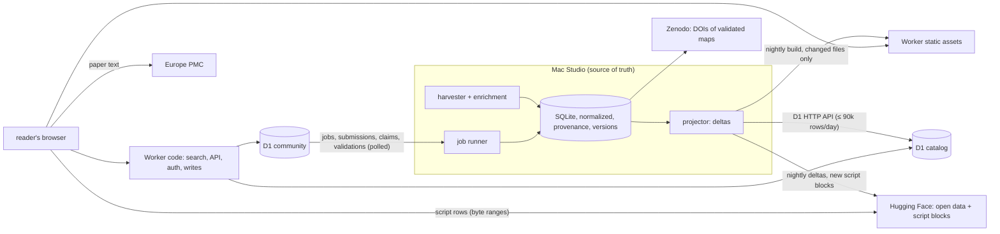

# Platform plan, Phase 0: audit and plan

Status: **Phase 0 validated by the owner on 2026-09-27, with the decisions of §13. Phases 1 and 2 are
deployed; Phase 3 (search) is built and awaits the owner's approval for its remote setup
(docs/SEARCH.md §7); Phase 4 (the full paper page) is built on its branch and awaits review
(§12); Phase 5 (accounts) is built on its branch and awaits review and the owner's
applications (§8, [ACCOUNTS.md](ACCOUNTS.md)); Phase 6 (submission, claims, edition, validation,
Zenodo sandbox, badge) is built on branch `phase-6`, tested locally, not deployed (§9,
[CONTRIBUTIONS.md](CONTRIBUTIONS.md)).**
Date: 2026-09-26. Scope: turn the catalogue into a full platform (arXiv + SSRN + PubMed +
a Kaggle dataset page), at zero cost, following `CLAUDE.md`. The platform's name lives in
one configuration variable, `SITE_NAME` (current value: `OSCR`).

**Night run (2026-09-28/29):** the "GitHub" side (hosting, versioning, editing and evolving
research code, linked to papers) is planned in [§15](#15-the-github-side-night-run), as the
night phases 01 to 16, on the storage decision of [DECISIONS.md](DECISIONS.md) (D00-1 to
D00-16). Nothing above changes.

Legend used below: **[M]** the Mac (harvester, SQLite, source of truth) · **[C]** Cloudflare
D1 "catalog" database · **[U]** Cloudflare D1 "community" database · **[S]** static files
on Cloudflare Workers (static assets) · **[B]** fetched by the reader's browser.

---

## 1. Current state (2026-09-26, 17:45 local time)

### What runs

| component | state |
|---|---|
| Harvester (launchd, continuous) | 2,501 papers read (mostly 2026; the backfill is on 2026-09) |
| Papers with the authors' code | 303 (283 verified alive, 4 found, 9 empty, 7 dead) · 60 "on request" · 136 data only · 31 without a readable text |
| Code repositories | 463 (435 alive): GitHub 318, Zenodo 76, OSF 29, GitLab 5, figshare 4, ModelDB 3, GIN 3, Dryad 3, others 22 |
| Script texts (private DB) | 15,978 files with text, 144 MB, i.e. **0.48 MB per paper with code** |
| Private database / cache | 166 MB / 417 MB (full texts cached forever) |
| Quality (measured) | precision 10/11 verdicts on unseen papers; recall 72% text-only (independent Zenodo benchmark) |
| Throughput (measured) | 540–820 papers/h (hourly counts today, background mode) |
| Website | Astro, static, `science.css` only: listing by day, record page (`.record` + `.sidebar`), About; client-side filter only |
| Open data | private Hugging Face dataset (CSV, JSONL, public SQLite copy), nightly |
| DOIs | Zenodo sandbox: community + one test deposit (rules of `CLAUDE.md` checked on the record) |

### Done since the plan was drafted (2026-09-26, evening)

- **The English switch** (approved by the owner): the `oscr` package, the English schema, the
  `org.oscr.*` launchd tasks, the Hugging Face dataset renamed `opsecsystems/oscr-catalog`
  (still private), the Zenodo sandbox community `oscr`, the website on Cloudflare Workers
  (https://oscr.yannbellec-b.workers.dev).
- **The paper ↔ code alignment engine** (`oscr/align.py`, method `lexical-v1`): on 25 papers,
  159 pairs; a fresh hand-checked sample of 33 gave 24 correct, 9 plausible, 0 wrong. Pairs are
  stored with paragraph numbers and short evidence terms only.
- **The Code ↔ Paper reader**: side-by-side view; the paper is loaded in the reader's browser
  from Europe PMC (CORS verified); OSCR never stores or serves article text.
- **The script storage decision** (`SCRIPT_STORAGE.md`): deduplicated, zstd, Parquet blocks on
  the Hugging Face dataset `OpenScientificCodeRegistry/Database`, one manifest per repository.
- README, Apache-2.0 license (data and maps CC0-1.0), docs, figures.

### Gaps against the mission

No search engine, no categories, no entity pages (authors, journals, institutions, tools,
datasets), no accounts, no submission/claim flow, no discussions, no versions, no feeds,
no API. Most bibliographic metadata is **already downloaded and discarded** (see §5).

### What the audit measured (2,444 cached full texts, the working database)

- **The article type is known but unused.** 1,624 research articles, 322 reviews,
  262 conference abstracts, 76 case reports, 20 corrections, 12 editorials, 6 retractions…
  17.4% of research articles have the authors' code (264/1,517), reviews 0.9%, abstracts,
  case reports, corrections and editorials 0%. Today every type counts in the "papers read",
  which dilutes the rates. **Proposal:** store the type, compute every rate on research
  articles (plus methods, brief reports, data papers), and show the other types as such.
- **245 records are conference abstracts with no body** (10% of the full texts): the
  harvester files them as "no code found" although it had nothing to read. They become
  `type = abstract`, excluded from the rates.
- **Two XML flavours at Europe PMC.** 43% of the full texts have a normal `<back>`; in 45%
  the back matter (references, declarations) sits in the last body sections instead, and the
  ISSN, the history dates and the keywords are missing; 10% are front matter only (the
  abstracts above). The parsers must read both flavours; the missing fields come from the
  Europe PMC answer (§5).
- **Europe PMC answers are not cached** (only the full texts are, forever): the `core`
  metadata that each pass receives is thrown away. Keeping it costs nothing from now on; the
  2,501 papers already read need one batched re-query (~25 requests).
- **Typographic hyphens in URLs.** Wiley's XML writes URL hyphens as U+2010: 35 repositories
  exist twice, the typographic copy always dead (record pages list both), and one paper
  (10.1002/alz.71822) is filed "code dead" only through such a copy. Fixed in the English
  harvester (`oscr/links.py`, with a test); the rescan of the switch repairs the records.

---

## 2. Constraints that shape everything

Every figure below was checked on 2026-09-26 on the official documentation (sources in
[Appendix A](#appendix-a-free-tier-facts-and-sources)); "measured" means measured here.

| constraint | value | consequence |
|---|---|---|
| Workers static assets: files per version | 20,000 (25 MiB per file); the same limit as Pages | one static HTML page per paper stops at ~15,000 papers (margin kept) |
| Deployments | a Worker deployment uploads only the changed assets; no build at Cloudflare (Pages allowed 500 builds a month) | one deployment per night |
| Static requests | free and unlimited, as long as they do not run the Worker's code (assets are served first) | static first, always |
| Workers (dynamic routes) | **100,000 requests a day for all dynamic routes together** (reset 00:00 UTC; "fail open" possible); 10 ms CPU per request; 128 MB; 50 subrequests | search, API, sign-in and writes only; **a cached response still counts as a request** (Cache API runs the Worker) |
| Worker size | 64 MiB uncompressed, start-up ≤ 1 s (the 3 MB limit of the mission was removed on 2026-09-04) | a Markdown sanitizer and a small router fit |
| Astro on Cloudflare | the Cloudflare adapter (v13+) no longer deploys on-demand pages to Pages: SSR and server islands need Workers | Astro stays static; dynamic endpoints are plain Pages Functions (or the site moves to Workers, decision D10) |
| D1 | 500 MB per database, 10 databases (5 GB); **5 M rows read and 100 k rows written a day** (each index adds a write); 50 queries per request, 100 parameters, 30 s per query; FTS5 supported, but a database with FTS5 cannot be exported (drop, export, recreate) | D1 holds a projection pushed as deltas; facet counts are precomputed; FTS5 in its own database; the Mac stays the source of truth and backup (plus 7 days of Time Travel) |
| D1 from the Mac | REST API, "for administrative use", 1,200 calls per 5 minutes | batched upserts, a few hundred calls a night |
| KV | 100 k reads, 1,000 writes a day | never for sessions or counters |
| Queues, Cron Triggers | Queues 10,000 operations a day; 5 Cron Triggers, 10 ms CPU | jobs are D1 rows polled by the Mac |
| R2 | 10 GB free, but a "purchase" step and, for production, a custom domain (r2.dev is rate-limited, not for production) | not used |
| Email | sending to arbitrary recipients needs Workers Paid; Resend free: 3,000 a month, 100 a day | in-site notifications (D5) |
| Turnstile | free, unlimited | on every public form |
| Hugging Face (public dataset) | free "best-effort", responsible use beyond a few GB; < 100k files per repository; byte ranges with CORS (checked) | script blocks and open data (`SCRIPT_STORAGE.md`) |
| Home uplink | ~0.9 MB/s measured (first Cloudflare deployment: 143 MB in 159 s); a launchd task at background priority is throttled by macOS (~25 KB/s measured for the nightly Hugging Face upload) | everything published is incremental; big one-off uploads run at normal priority |
| Script texts at full stock | 15–26 GB raw → **2.3–4.3 GB stored** (deduplicated, Parquet zstd) → 1.6–3.0 GB public | Parquet blocks on Hugging Face, read in the browser; positions in the static pages, one manifest per repository (decided, `SCRIPT_STORAGE.md`) |

**Upstream APIs.**
- **OpenAlex** now needs a free API key (since 2026-02-13). The free credit is $1 a day.
  DOI lookups are free; list queries cost $0.10 per 1,000 calls. OSCR makes single lookups
  only (`/works/doi:…`, measured 2026-09-28: `x-ratelimit-cost-usd: 0`): the 610k papers take
  610k free calls, ~42 hours at 4 a second, and $0. The key travels in the `Authorization`
  header, never in a URL.
- **Crossref** list queries: 1–3 a second, measured on the live headers. Retractions come
  from the Retraction Watch data (a daily `git pull`), not from the API.
- **GitHub**: 5,000 requests an hour with a token.
- **Software Heritage**: 120 an hour without a token. The Mac's allowance was almost used up
  when checked.
- **ORCID** public API and sign-in: free for non-commercial use only. OSCR qualifies.
- **Zenodo**: 60 requests a minute.

**Projected sizes at the full neuro stock.** Europe PMC counts 609,746 open-access papers with
a full text for the "neuro" query, 2000–2026 (counted today, per year). Two thirds are from
2020 or later:

| years | papers | share of papers with the authors' code (all types) | papers with code |
|---|---|---|---|
| 2026 (to date) | 49,641 | 12% (measured: 303 / 2,501) | ~6,000 |
| 2020–2025 | 356,202 | 6–11% (assumed, declining) | ~31,000 |
| 2015–2019 | 128,921 | 2–5% (assumed) | ~4,500 |
| 2000–2014 | 74,982 | ≤1% (assumed; 0 in a small 2016 sample) | ~700 |
| **total** | **609,746** | | **~42,000 (30–55k)** |

Pages for papers with code, "on request" and "data only" (0.65 per paper with code in 2026):
**50–90k**. The assumed rates get measured as the backfill goes back in time. Authors on those
papers ~150k (25% of the authors have an ORCID in the JATS, more through OpenAlex); journals
~5k; institutions (ROR) ~20–30k; tools ~300–1,000; datasets ~10–30k; categories ~100.
Per-paper metadata document: 4–8 KB.

---

## 3. Architecture: five tiers, one source of truth

- **[M] The Mac** keeps the complete, normalized database with provenance and history, and
  does all heavy work (harvest, enrichment, alignment, tool detection, classification with a
  local model). Nothing listens on the network.
- **[C] D1 catalog**: a read-optimized projection of what the site needs to render and search:
  papers with code (and "on request" / "data only"), their entities, facets and a full-text
  index. Pushed by the Mac as idempotent upserts, within a daily row budget. The scripts
  have no index in D1: their (block, row) positions are written into the static pages, and
  one manifest per repository sits next to the blocks on Hugging Face.
- **[U] D1 community**: accounts, identities, roles, sessions, claims, submissions, jobs,
  discussions, votes, reproduction reports, moderation, collections, subscriptions,
  notifications, saved searches, audit log. Written by the site; polled by the Mac.
- **[S] The Worker**: its static assets are the prerendered bounded pages, JSON shards and
  feeds (free, unlimited); its code serves search, API, sign-in and writes, and the entity
  pages rendered on demand.
- **[B] The browser** fetches the heavy texts: the paper from Europe PMC (never stored nor
  served by OSCR; CORS verified), and a script from the **Parquet blocks on Hugging Face**
  with HTTP range requests (~78 KB per script shown; decided 2026-09-26, `SCRIPT_STORAGE.md`).
  A file whose license does not allow redistribution is not in the blocks: the reader lists it
  and links to its lines at the source, at the verified commit.

Why not everything in D1: at the full stock the documents alone exceed what the free plan
accepts, and the backfill produces far more than 100,000 row writes a day. The Mac pushes the
subset that makes the site dense and searchable; the complete data stays on the Mac and in the
open dataset.

---

## 4. Data schema

Normalized on the Mac; D1 receives the same tables (same names and keys) minus the heavy
ones, plus a denormalized `doc` JSON column on `papers` used to render a page in one read.
Migrations are versioned files (`migrations/mac/NNNN_*.sql`, `migrations/d1/NNNN_*.sql`,
applied with `wrangler d1 migrations apply` on Cloudflare and by `oscr` on the Mac).

### Catalogue [M] and [C]

| table | key columns (✱ = indexed for filters or joins) | where |
|---|---|---|
| `papers` | `id` (doi:… / pmcid:…), `doi`✱, `pmid`, `pmcid`, `openalex_id`, `preprint_id` (arXiv/bioRxiv), `title`, `abstract`, `type`✱ (research-article, review, abstract, correction…), `language`, `journal_id`✱, `volume`, `issue`, `pages`, `received`, `accepted`, `published_online`, `published_print`, `published`✱, `license`, `oa_status`✱, `oa_url`, `cited_by_count`✱, `references_count`, `code_status`✱ (verified, found, empty, dead, on_request, data_only, none), `map_status`✱ (none, proposed, validated), `traceability_score`✱, `repro` (JSON indicators), `retracted`✱, `corrected`, `concern`, `scanned_at`, `updated_at`, `doc` (JSON, [C] only) | M, C |
| `authors` | `id`, `orcid`✱ (unique when present), `openalex_id`, `display_name`, `last_institution_id`, **no email, ever** | M, C |
| `paper_authors` | `paper_id`✱, `position`, `author_id`✱, `raw_name`, `is_corresponding`, `affiliation_ids` (JSON) | M, C |
| `institutions` | `id` (ROR)✱, `name`, `country`✱, `type`, `openalex_id` | M, C |
| `journals` | `id` (ISSN-L or OpenAlex source)✱, `title`, `issn`, `eissn`, `publisher`, `homepage`, `subjects` (JSON) | M, C |
| `repos` | `id` (github.com/o/r, zenodo:123…)✱, `host`✱, `owner`, `name`, `url`, `description`, `topics`, `default_branch`, `license_spdx`✱, `redistributable`, `created_at`, `pushed_at`, `archived`, `stars`✱, `forks`, `watchers`, `open_issues`, `contributors`, `size_kb`, `n_files`, `n_scripts`, `n_notebooks`, `languages` (JSON)✱, `has_readme`, `has_citation_cff`, `env_files` (JSON), `has_tests`, `has_ci`, `zenodo_doi`, `swh_archived`, `state`✱, `verified_at` | M, C |
| `paper_repos` | `paper_id`✱, `repo_id`✱, `role` (code, data, tool), `confidence`, `found_by`, `section`, `reasons` (JSON), today's `link`; `excerpt` stays on the Mac | M, C (no excerpt) |
| `repo_snapshots` | `repo_id`✱, `commit_sha`, `commit_date`, `kind` (publication, latest, release), `tag`, `fetched_at` | M, C |
| `repo_files` | `repo_id`✱, `commit_sha`, `path`, `language`, `kind`, `size`, `lines`, `digest`, `text` (Mac only), `note` | M (C: paths and digests only, no text) |
| `alive_checks` | `repo_id`✱, `checked_at`, `http_status`, `result`, `error` | M, C (last 20 per repo) |
| `trace_maps` | `id`, `paper_id`✱, `status`, `current_version`, `doi`, `concept_doi`, `validated_by`, `validated_at` | M, C |
| `trace_map_versions` | `map_id`✱, `version`, `created_at`, `created_by`, `card` (JSON), `zenodo_record_id`, `doi`, `diff` (JSON) | M, C |
| `alignments` | `paper_id`✱, `pair`, `paragraph`, `section`, `repo_id`, `path`, `start_line`, `end_line`, `symbol`, `score`, `evidence`, `method` | M, C |
| `datasets` | `id` (openneuro:ds000117, dandi:000001, neurovault:1234, osf:…, figshare:…, zenodo:…, gin:…)✱, `repository`, `title`, `url`, `license`, `modality` | M, C |
| `paper_datasets` | `paper_id`✱, `dataset_id`✱, `relation` (used, produced), `found_by` | M, C |
| `tools` | `id` (slug)✱, `name`, `kind` (library, toolbox, software), `language`, `homepage`, `rrid` | M, C |
| `repo_tools` | `repo_id`✱, `tool_id`✱, `evidence` (imports count), `detected_by` (tree-sitter, regex) | M, C |
| `paper_rrids` | `paper_id`✱, `rrid`, `kind` (software, organism, antibody…), `name` | M, C |
| `categories` | `id` (e.g. `ephys.eeg`)✱, `parent_id`, `name`, `level` | M, C |
| `paper_categories` | `paper_id`✱, `category_id`✱, `facet` (field, modality, organism, population, subfield), `confidence`, `method` (rule, model, journal, mesh) | M, C |
| `funders` | `id` (Crossref Funder / ROR)✱, `name`, `country` | M, C |
| `grants` | `paper_id`✱, `funder_id`✱, `award` | M, C |
| `paper_subjects` | `paper_id`✱, `scheme` (keyword, mesh, openalex_topic), `term`✱ | M, C |
| `paper_references` | `paper_id`✱, `cited_doi`✱ / `cited_openalex_id` | M (C: counts and top links in `doc`) |
| `integrity_notices` | `paper_id`✱, `kind` (retraction, correction, concern), `notice_doi`, `date`, `source` | M, C |
| `statements` | `paper_id`✱, `kind` (code, data), `text`, `license_gate` | M (C: see decision D1) |
| `field_provenance` | `entity`, `entity_id`✱, `field`, `source` (openalex, crossref, epmc, jats, pubmed, unpaywall, github, git, zenodo, rule, model), `source_ref`, `fetched_at` | M (C: compact map inside `doc`) |
| `versions` | `entity`, `entity_id`✱, `version`, `created_at`, `actor` (harvester or user id), `snapshot` (JSON), `diff` (JSON) | M, C |
| `paper_fts` | FTS5 over title, abstract (open licenses only), authors, keywords, MeSH, journal, repository names, tools, identifiers, plus the filters as tokens; in its own database, `oscr_search` (Phase 3, `migrations/d1/`) | C |

### Community [U]

| table | key columns |
|---|---|
| `users` | `id`, `display_name`, `created_at`, public handles only (ORCID iD, GitHub login), **no email, ever** (D5: notifications in the site). Built (Phase 5) |
| `identities` | `user_id`✱, `provider` (orcid, github, google), `subject` (OIDC `sub` / GitHub id; key with the provider), `linked_at`. Built |
| `sessions` | `id_hash` (key), `user_id`✱, `created_at`, `expires_at`, `last_seen_at`, `user_agent_hint`. Built |
| `roles` | `user_id` (key prefix), `role` (member, verified_author, maintainer, moderator, admin), `scope_kind`, `scope_id`, `granted_by`, `granted_at`. Built |
| `claims` | `id`, `user_id`✱, `kind` (author, maintainer), `paper_id` or `repo`, `evidence`, `status`, `decided_by`, `decided_at`. Built |
| `paper_orcid`, `repo_owner` | the facts the verifications need, pushed by the Mac (`oscr community`). Built |
| `submissions` | `id`, `user_id`, `doi`, `code_urls` (JSON), `note`, `checks` (JSON), `status`, `revisions`, `paper_id`, `author`, `draft` (JSON, written by the Mac), `message`, `created_at`, `updated_at`; index (user, DOI), unique. Built (Phase 6): no status index, the Mac finds work through `jobs` |
| `jobs` | `id`, `kind` (submission, publish, edit, validation, claim, report), `ref` (the request's id), `user_id`, `created_at`. Built (Phase 6), append-only and without index: the Mac reads the rows after the last one it saw and keeps each job's status, attempts and result on its side (`data/community/state.db`); the outcome goes into the request's own row. A status column, its index and an update per job would cost three more rows a request |
| `edits` | `id`, `user_id`, `paper_id`, `as_role` (verified_author, maintainer), `repo`, `changes` (JSON: add, remove, role of a link), `note`, `status`, `version`, `message`, `created_at`, `decided_at`; index (user, created_at). Built (Phase 6) |
| `validations` | `id`, `user_id`, `paper_id`, `orcid`, `proof` (orcid, orcid-sandbox), `map_digest`, `status`, `instance`, `doi`, `record_url`, `message`, `created_at`, `decided_at`; index (user, created_at). Built (Phase 6) |
| `paper_repo` | the forge repositories that are a paper's code, pushed by the Mac (`oscr community`). Built (Phase 6) |
| `discussions` | `id`, `paper_id`✱, `kind` (question, error_report, reproduction), `title`, `status`✱, `author_id`, `created_at`, `resolved_by` |
| `comments` | `id`, `discussion_id`✱, `parent_id`, `author_id`, `body_md`, `body_html` (sanitized at write), `created_at`, `edited_at`, `hidden` |
| `votes` | `user_id`, `target_kind`, `target_id`✱, `value`, `created_at` (unique per user and target) |
| `reproduction_reports` | `id`, `paper_id`✱, `user_id`, `outcome` (reproduced, partially, failed), `environment` (JSON), `repo_commit`, `datasets` (JSON), `notes_md`, `created_at` |
| `reports` | `id`, `user_id`, `target_kind` (paper), `target_id`, `reason` (copyright, personal_data, not_my_work, retracted, incorrect, other; author_request before 2026-09-29), `details`, `requester_role`, `author_verified`, `scope` (record, scripts, repository, file, map), `scope_repo`, `scope_path`, `evidence_url`, `confirmed`, `status`, `message`, `created_at`, `updated_at`, `decided_at`; index (user, kind, target), unique. Built (Phase 6) for removal requests, made whole by the page /removal/ (migration 3, docs/CONTRIBUTIONS.md); other reports with Phase 7 |
| `moderation_actions` | `id`, `moderator_id`, `target_kind`, `target_id`, `action`, `reason`, `created_at` |
| `collections`, `collection_items` | `id`, `owner_id`, `title`, `public`; items `(collection_id, paper_id)` |
| `subscriptions` | `user_id`✱, `target_kind` (category, journal, author, tool, dataset, search), `target_id`, `created_at` |
| `notifications` | `id`, `user_id`✱, `kind`, `payload`, `created_at`, `read_at` |
| `saved_searches` | `id`, `user_id`✱, `query` (the search URL), `name`, `notify` |
| `audit_log` | `id`, `actor_id`, `action`, `entity`, `entity_id`✱, `before_hash`, `after_hash`, `created_at` |

---

## 5. What the harvester collects today, and what is missing

✅ collected · **J** in the full text cached forever (no request; coverage measured on 400
cached texts) · **E** in the Europe PMC `core` answer that every pass already receives and
throws away (kept from now on; ~25 batched requests for the papers already read) ·
**G** in the git clone or the stored file list (no request) · 🔴 needs a new source.

### Paper

| field | today | source to use (coverage measured) |
|---|---|---|
| DOI, PMID, PMCID | ✅ | n/a |
| arXiv / bioRxiv id of a linked preprint | ✅ OpenAlex 4% (12% of the papers with a page) | OpenAlex locations (`article.preprint_id`); Europe PMC `commentCorrectionList` **E** |
| OpenAlex id | ✅ 97% | OpenAlex, one free lookup by DOI (else PMID) per paper (`article.openalex_id`) |
| title | ✅ | n/a |
| abstract | **J** 97% · **E** | JATS `<abstract>`, Europe PMC `abstractText` |
| article type | **J** 100% · **E** | JATS `article-type` (see §1), Europe PMC `pubTypeList` |
| language | **E** | Europe PMC `language` |
| journal title | ✅ | n/a |
| ISSN | **J** 50% · **E** | Europe PMC `journalInfo.journal` (ISSN, eISSN) |
| volume, issue, pages | **J** 96% / 72% / 99% · **E** | JATS, Europe PMC `journalInfo`, `pageInfo` |
| publisher | **J** 83% · ✅ OpenAlex for the rest | JATS `<publisher-name>`; OpenAlex's host organization for the rest |
| dates: received, accepted | **J** 42% | JATS `<history>`; Crossref for the rest (partial) |
| dates: online, print | **J** 49% / 10% · **E** | JATS `<pub-date>`, Europe PMC `firstPublicationDate`, `journalInfo.printPublicationDate` |
| authors: names | ✅ (strings) | n/a |
| authors: order, ORCID, affiliations | **J** (ORCID 25% of authors, affiliations 99%) · **E** · ✅ OpenAlex | JATS `<contrib>`, `<aff>`; Europe PMC `authorList` (ORCID in `authorId`); OpenAlex for more ORCIDs, only those the publisher deposited for the authorship (`raw_orcid`), never its author profiles' (they decide who is a verified author); the OpenAlex author id (`paper_author.openalex_id`) |
| institutions (ROR), countries | ✅ OpenAlex 95% of the papers (was 11%) (ROR in the JATS: rare) | OpenAlex authorships: `institution` (ROR id, name, country, type), each placed on the author's affiliation it is (`paper_author.ror`) |
| corresponding author (name only) | **J** 46% · ✅ OpenAlex for the rest | JATS `<corresp>` / `corresp="yes"`; OpenAlex `is_corresponding` only when the paper names none |
| open-access status, OA link | **E** · ✅ OpenAlex 97% | Europe PMC `isOpenAccess`, `fullTextUrlList`; OpenAlex `open_access` (Unpaywall data, so no separate Unpaywall calls): `article.oa_status`, `oa_url` |
| article license | ✅ (100% of texts) | n/a |
| funders, grant numbers | **J** 30% (award ids 22%) · **E** · ✅ OpenAlex for the rest | JATS `<funding-group>`, Europe PMC `grantsList`; OpenAlex `funders` (ROR ids) and `awards` when both are silent; Crossref funder ids |
| keywords | **J** 39% · **E** | JATS `<kwd-group>`, Europe PMC `keywordList` |
| MeSH terms | **E** | Europe PMC `meshHeadingList` (no PubMed call needed) |
| OpenAlex topics, journal subjects | ✅ OpenAlex 96% (JATS subject groups 50%) | OpenAlex `topics`, the primary one with its subfield, field and domain (`topic`, `paper_topic`) |
| citation count | **E** · ✅ OpenAlex for the rest | Europe PMC `citedByCount` first; OpenAlex `cited_by_count` when Europe PMC has none (the page names the source) |
| references (count, cited DOIs) | **J** (87–100% of texts; 50% of references carry a DOI) · ✅ OpenAlex | JATS `<ref-list>` (both flavours); OpenAlex `referenced_works` as OpenAlex ids (`paper_work`), and their count when the paper gives none. OpenAlex gives no DOI for them: a DOI per cited work would take a paid list call |
| related works | ✅ OpenAlex 3% | OpenAlex `related_works` (`paper_work`) |
| retractions, corrections, expressions of concern | **E** / 🔴 | Europe PMC `commentCorrectionList`; Crossref updates (Retraction Watch data); the 6 retraction notices and 20 corrections already read |
| Code / Data availability statements (full text) | **J** (data 67%, code 5% of texts) | parsed today for judging, not stored, publication subject to decision D1 |
| datasets cited (OpenNeuro, DANDI, NeuroVault, OSF, figshare, Zenodo, GIN) | **J** | today's `data` links, to normalize into `datasets` with their identifiers |
| RRIDs | **J** 5% of texts | regular expression over the cached JATS |
| neuro classification (modality, organism, population, subfield) | 🔴 | rules (MeSH, keywords, methods vocabulary, journal) + a local model on the Mac, with confidence |
| method families (stat_bruteforce vocabulary) | ✅ | n/a |
| provenance per field (`source`, `fetched_at`) | 🔴 | new `field_provenance` |

### Repository

| field | today | source to use |
|---|---|---|
| URL, host, owner, name | ✅ | n/a |
| description, topics | 🔴 | GitHub/GitLab API (token); Zenodo/OSF/figshare records already fetched |
| commit at the paper's publication | 🔴 | blobless clone with history + `git log --before=<date>` (no API quota) |
| latest commit | ✅ | n/a |
| default branch, tags | 🔴 → free | `git ls-remote --symref` / `--tags` (no API quota) |
| releases, archived flag, last push, stars, forks, watchers, open issues, contributors, size | 🔴 | GitHub API (5,000 requests/h with a token †) |
| Zenodo DOI linked | ✅ partly (`linked_to`) · **G** | Zenodo records; `CITATION.cff`, README badges |
| created | ✅ (partly) | n/a |
| license (SPDX) | ✅ | n/a |
| languages, number of files | ✅ | n/a |
| number of notebooks | **G** | file list |
| README, `CITATION.cff`, environment files, tests, CI (presence + short summary) | **G** | file list and stored texts |
| libraries and tools used (MNE, FieldTrip, EEGLAB, SPM, FSL, nilearn, NumPy, PyTorch…) | **G** | imports in the stored script texts (tree-sitter; Python `ast`) |
| accessibility history | 🔴 | new `alive_checks` (today: the last state only) |
| Software Heritage archive | ✅ | n/a |

### Derived

Traceability score and reproducibility indicators (environment pinned, versions pinned, data
reachable, license present, tests), computed from the fields above, each with the list of
inputs it used, so a page can explain its score.

**Cost of the enrichment at full scale.** J, E and G fields: no new request (E: the answers
are kept from now on). OpenAlex:
one free lookup per paper, 610k for the full stock ($0). Crossref: one request per DOI (integrity, funders),
spread over the backfill. GitHub API: one or two requests per GitHub repository (~50–80k),
within 5,000/h. Git history: local, no quota.

---

## 6. Site map and rendering

| route | content | rendering |
|---|---|---|
| `/` | search bar, key figures, new today / this week, categories with counts, top journals and tools | static, rebuilt nightly |
| `/search` | simple and advanced search, facets with counts, sorts, export | static shell + Svelte island + search API |
| `/browse/`, `/browse/<facet>/<value>/` (built, Phase 2); `/browse/<category>/<year>/` | category tree by facet with counts; a category's papers by day; later by year, paginated like arXiv lists | static (bounded) |
| `/paper/<id>/` + tabs (`code`, `map`, `data`, `versions`, `discussion`, `reproductions`, `cite`, `activity`, `similar`) | the central page; since Phase 2 also for "on request" and "data only" (D2), linking to its authors, journal, tools, datasets and categories. Since Phase 4 the tabs are sections of the one page (`#overview`, `#code`, …), not routes: no file added | static for the `STATIC_PAPERS` (6,000) most recent; the others rendered by the Worker from `/records/paper/NN.json`, a reduced page (below, "The file budget") |
| `/paper/<id>/code/` | Code ↔ Paper reader | static with its paper's static page; past `STATIC_PAPERS`, the Worker sends it to `/paper/<id>/#code` |
| `/authors/`, `/author/<orcid>/`, `/journals/`, `/journal/<id>/`, `/institutions/`, `/institution/<ror>/`, `/tools/`, `/tool/<id>/`, `/datasets/`, `/dataset/<id>/` (built, Phase 2) | entity indexes and pages | the indexes static, linking to every entity (the authors: a page a letter); each entity's page one shell per type, rendered in the browser from `/records/<type>/NN.json` (since 2026-09-28; before, a static page each, 2,000 at most a type) |
| `/lookup/` (built, Phase 2) | the DOI lookup: any in-scope paper read, with or without a page (D2) | static page; the browser fetches one of ≤ 256 shards `/lookup/NN.json` (first 2 hex characters of sha1(DOI); 4,096 of 3 characters until 2026-09-28) |
| `/observatory/` | reserved for statistics and reports | static placeholder |
| `/account/…`, `/submit/`, `/admin/…`, `/moderation/…` | accounts, submission, administration | on demand (Functions), never cached |
| `/about/`, `/governance/`, `/cite/`, `/data-license/`, `/takedown/`, `/privacy/`, `/terms/`, `/help/`, `/api/` | institutional pages | static |
| `/feeds/…`, `/api/v1/…` | RSS/Atom, public JSON API | static files for entities and feeds; Functions for search |

How each kind of page is rendered, and why, is in "The file budget" below.

**Built in Phase 2.** `oscr/entities.py` writes `entities/*.json` (authors with an ORCID iD,
journals, institutions by ROR id, tools, datasets, categories) and `lookup/NN.json` into the
public export; only the papers with a page count, and off-topic papers appear nowhere, the
lookup included (D7). A category is shown when the owner or a model set it, or the rules did
with a confidence of at least 0.6 and no ambiguity. Measured on a synthetic export at today's
scale (2,380 papers read, 471 with a page, 548 authors with an ORCID iD): 3,736 files, of which
1,949 pages and 1,782 lookup shards. At the full stock the lookup took 4,096 files and the
entities at most 2,000 per type: that is what "The file budget" below replaced.

### Page counts

| entity | 2026-09-28 (real data, with OpenAlex) | full neuro stock | rendering (files) |
|---|---|---|---|
| papers with a page (code, on request, data only) | 3,683 (2,152 with a reader) | 50–90k | static for the 6,000 most recent (≤ 12,000 files with their readers); the others by the Worker (256 record shards) |
| authors with an ORCID iD (on those papers) | 11,801 | ~100k+ | in the browser: 1 shell, 1,024 shards; the list, 27 letter pages |
| journals | 626 | ~5k | 1 shell, 128 shards |
| institutions (ROR) | 4,688 (13,961 known to OpenAlex) | 20–30k | 1 shell, 512 shards |
| tools | 226 | 300–1,000 | 1 shell, 256 shards |
| datasets | 2,457 | 10–30k | 1 shell, 128 shards |
| DOIs read (the lookup) | 16,623 | ~610,000 | 256 shards |
| categories | 46 | the vocabulary, ~60 | static, 200 at most |
| institutional, help, lists | ~20 | ~20 | static |

### The file budget (decided 2026-09-28)

A Worker serves at most 20,000 static files per version. On 2026-09-28 the live site had 15,962
files (5,689 of papers and readers, 4,009 lookup shards, 2,000 authors and 2,000 datasets, both
capped, 1,217 institutions, 619 journals, 226 tools, 128 lots of scripts), and a build of the
real catalogue with OpenAlex reached 16,905, past `website/scripts/check.mjs`'s margin of 15,000:
13,961 institutions were on their way. The number of files now depends on constants, not on the
catalogue (`website/src/lib/shards.ts`):

| kind | before | now |
|---|---|---|
| the DOI lookup | a shard per 3 hex characters of sha1(DOI): 4,096 | 2 characters: 256; ~57 bytes a DOI, 5 KB a shard today, ~135 KB at 610,000 DOIs |
| an entity (author, journal, institution, tool, dataset) | a static page each, the 2,000 with the most papers a type (the rest without a page) | no file: `public/_redirects` rewrites `/author/<orcid>/` to the type's shell `/author/` (status 200, free, no Worker request); its script fetches `/records/author/NN.json` and renders the entity with `src/lib/render.ts`. Every entity has its page; the lists link to all of them |
| a paper | a static page and a reader each | a static page and reader for the 6,000 most recent (`STATIC_PAPERS`); the others rendered by the Worker |

**The papers past `STATIC_PAPERS`.** Three ways were weighed:

1. *The Worker from D1 `oscr_catalog`*: a page costs a Worker request and D1 rows read (5 million a
   day, shared with the search), and the catalogue projection in D1 would have to carry every
   section's data, pushed within the 100,000 rows written a day.
2. *The same shell as the entities, in the browser*: no Worker request at all
   (`not_found_handling = "404-page"`: the assets serve `/paper/404.html` for any missing
   `/paper/…`), but the page answers with the status 404, which search engines do not index, and
   needs JavaScript.
3. **Chosen**: *the Worker from the build's own records*. `not_found_handling = "none"` hands a
   request no file answers to the Worker (`worker/pages.ts`): it reads the paper's record in
   `/records/paper/NN.json` and the shell `/paper/404.html` through its `ASSETS` binding (static
   assets: not billed) and returns the whole page, status 200, the static pages' headers. No D1
   row; no JavaScript needed to read it. Switch 2 stays one line of `wrangler.toml` away.

The page it renders says what it leaves out (the Code ↔ Paper reader, the tracing map and its
validation, the versions, the citation formats, the similar papers, the README badge, whose data
live in the build's lots) and keeps the record, the code, the data, and the Contribute section
(claim, correction of the links, removal request), run by the static pages' own script.

**Cost of a visit, in Worker requests** (the free plan: 100,000 a day, 10 ms of CPU each):

| visit | requests |
|---|---|
| a static page (a paper among the 6,000, a list, the home page, a category), an entity's page, a DOI lookup | 0 (the shell, the shard, the scripts are static files) |
| a paper past `STATIC_PAPERS` | 1 (2 through its `/code/` address, sent to `#code`) |
| an address no file answers (a mistyped one, a robot) | 1: the Worker serves `404.html` |
| a signed-in reader on any paper's page | 1 more, as before (`/api/contributions/paper`) |

Measured on the real catalogue built with only 1,000 papers static (2,683 rendered on demand, 256
shards, median 21 KB, largest 46 KB): 0.31 ms of CPU for a page from the largest shard (parse
the shard, render, fill the shell), 1.5 ms from a shard of 240 records, the full stock's size
(`node --experimental-strip-types scripts/measure-pages.mjs`). The entities' shards, fetched by
the browser: authors 14.5 KB median (34 KB largest), institutions 15.6 KB (89 KB), tools 20 KB
(200 KB: NumPy's 200 rows), journals 8.7 KB (134 KB), datasets 14.5 KB (22 KB).

**Files, before → after, the same exports built by the old and the new code**:

| build | before | after |
|---|---|---|
| the real catalogue with OpenAlex (`data/dev-copy/oa-public`) | 16,905 | 8,272 (5,836 papers and readers, 2,304 record shards at most, 1,940 written, 257 lookup) |
| the real catalogue without OpenAlex (`data/dev-copy/public`) | 16,797 | 8,725 |
| the fixture (`tests/fixtures/public-catalog`, 4 papers) | 55 | 69 (the shells, the shards and the letter pages are a fixed cost) |
| the fixture grown with 40,000 authors, 15,000 institutions, 12,000 papers, 150,000 DOIs (`npm run check:growth`, 2 papers static) | n/a | 2,628 |

**The budget**: 2 × `STATIC_PAPERS` = 12,000 files of papers at most, and `FIXED_FILES_MAX` = 3,000
for the rest (2,304 record shards, 256 lookup shards, 128 lots of scripts, 200 categories at most,
the fixed pages and bundles): 15,000, the check's margin. `npm run check` fails past either, and
prints the files folder by folder; `npm run check:growth` (CI) shows that only the shards change
when the catalogue grows.
**Since the GitHub side was merged (night phase 16, DECISIONS.md D16-3)**: `STATIC_PAPERS` 5,700 and
`FIXED_FILES_MAX` 3,600, the same 15,000; the GitHub side's 321 nightly shards, its pages and
bundles count in the second.

**The launch (2026-09-29).** The home page held every paper with code (3.5 MB of HTML, 535 KB
gzipped, for 2,664 papers under 152 days, on the real catalogue): it now shows whole days of
publication up to `HOME_PAPERS` (100) papers (97 KB, 16 KB gzipped), and every paper with a page is in
the list by date, `/list/` and `/list/<n>/`, 100 a page in `LIST_PAGES_MAX` (200) pages at most, 46
today; past 20,000 papers the pages hold more, their number stays. With the sitemap's shards
(`SITEMAP_SHARDS`, 32 at most) and some 35 information pages, `FIXED_FILES_MAX` goes from 3,000 to
3,500; a paper takes one file since the reader is on its page, so the papers' 6,000 and the rest's
3,500 stay under the 15,000 margin. Measured on the real catalogue: 7,164 files before, 7,249 after
(2,695 besides the papers; the sitemap, one shard of 27,544 addresses).

**Limits.**

- Every miss runs the Worker: robots probing addresses spend requests that were free before. The
  quota spent, the older papers' pages and the 404s answer an error while the static pages stay up.
- The entities' pages need JavaScript (their shell says so and links to the static list), and
  search engines see them only if they run it.
- The lists are one page each (the institutions' is 530 KB for 4,688 today, some 3 MB at 30,000;
  the authors' is split by letter, ~100 KB a letter today).
- A paper crossing the cap loses its reader's address (`/paper/<id>/code/` is sent to `#code`),
  and the pages' number in "the 6,000 most recent" is the constant, whatever
  `OSCR_STATIC_PAPERS` a test build uses.
- The lots of scripts are 128 files whatever the catalogue, but the largest is 22.9 MB, close to
  the 25 MiB a file may weigh: the lots need splitting or bounding before the stock doubles.

---

## 7. Search engine

Measured and documented facts (Appendix A):

| | Pagefind 1.5 (static index) | FTS5 in D1 |
|---|---|---|
| cost per search | no Worker request; the browser downloads index chunks | one Worker request (cached or not) + D1 rows read (FTS5 accounting undocumented: to measure with `meta.rows_read`) |
| files | **one fragment file per record** + ~20k-word index chunks + one filter file per facet + a start-up file listing every record: ~100k records → ~101k files, ~250 MB; the 20,000-file Pages limit is passed at ~15k records | none |
| scale | the maintainer calls ~180k pages "probably around the ceiling"; users report out-of-memory at 30–50k pages | a 500 MB database holds the searchable subset |
| daily updates | no incremental index: most chunks change on every rebuild, a large upload every night | row upserts: small deltas |
| facets with counts | built in | precomputed per category, journal, year…; exact counts on filtered queries |
| boolean operators, fielded search | limited | full (`AND`, `OR`, `NOT`, phrases, column filters) |
| ranking, sorts | built in; records without the sort key disappear from sorted results | `bm25()` with column weights; indexed sort columns |
| privacy | everything indexed is downloadable | only what the query returns |

**Proposed choice: FTS5 in D1**, in a database of its own, over the searchable catalogue
(papers with code, on request, data only):
- search state in the URL;
- facet counts precomputed nightly for the unfiltered views, and exact on filtered
  queries (bounded candidate sets);
- the Worker request budget protected by a static first page of results for the common
  entry points.

**The risk: every search is a Worker request**, even when cached (100,000 a day for the
whole site).
- **Fallback, at no request cost:** a static index published as Parquet blocks on Hugging
  Face and read by byte ranges, like the scripts. It is terms → postings, sorted, with
  precomputed facets.
- Pagefind stays an option for the ~15 institutional and help pages only.

The justification is in `docs/ARCHITECTURE.md` ("Search engine").

### Built (Phase 3, branch `phase-3`), awaiting the owner's review

The choice above, built and measured on a local D1 (wrangler 4.141); the contract, the figures
and the remote steps awaiting approval are in `docs/SEARCH.md`.
- **Two databases**, as proposed: `oscr_catalog` (`papers` with the filter columns and the result
  row's `doc`, one secondary index for "most cited", `facet_counts`, `meta`) and `oscr_search`
  (`paper_fts`, FTS5, contentless: abstracts indexed only under an open license, never stored nor
  returned).
- **Three changes from the proposal, measured first:**
  - the filters are **tokens of the index** (its `facets` column), not a `paper_facet` table:
    such a table costs ~8 rows written per paper (31,000 for 3,700 papers) and 20,000–32,000 rows
    read to count the facets of 1,000 results, where the tokens cost no row written and the counts
    come from the rows the index returns anyway;
  - the facet counts are **exact over the results up to 500**; past 500, they are the first 500
    results' (and the page says so); the empty query shows the precomputed counts;
  - the key is **the publication date** (YYYYMMDD × 100,000 + n): "newest first" and date ranges
    cost no index.
- `ORDER BY rank` with the column weights configured in the table: D1 counts only the rows
  returned (19 rows read for the top 20 of 48,000 matches), where `ORDER BY bm25(…)` reads every
  match twice. A search reads ~40–120 rows when it is narrow and ~540 at most (the pages stop at
  the first 500 results); an export ~1,500; the empty query ~150. The Worker's CPU: under ~3 ms
  per search, measured in V8 at a simulated full stock of 91,500 papers.
- The Mac pushes deltas (`oscr d1 push`): ~3 rows written per paper (measured), ~270k for 90k
  papers, so a first full load takes 2–4 days within the 80,000-row daily budget, and then a
  day's new papers and changes a few thousand rows.

---

## 8. Accounts, roles, sessions

**Built in Phase 5** (branch `phase-5`, not deployed; details, measurements and the owner's
steps: [ACCOUNTS.md](ACCOUNTS.md)).

- Sign-in with ORCID (OpenID Connect, `openid`), GitHub (OAuth, no scope) and Google (OpenID
  Connect, `openid` only) in the Worker's code (`website/worker/account/`): authorization code
  flow, `state`, PKCE (S256), a nonce and the ID token's RS256 signature checked with WebCrypto.
  Several identities linked to one account; no email address asked for, read or stored.
- Sessions: a random 256-bit id in a `__Host-` cookie, `HttpOnly; Secure; SameSite=Lax`; only
  its SHA-256 in D1; 30 days, sliding at most once a day; a CSRF token (an HMAC bound to the
  session) and the site's `Origin` on every POST; no in-memory state.
- Secrets (client ids and secrets, the server key) in Cloudflare secrets, `.dev.vars` locally
  (gitignored), never in the repository.
- Verified author: the signed-in ORCID iD appears among the authors of a paper with a page
  (`paper_orcid`, pushed by the Mac from the papers' metadata), at sign-in and on request.
  Maintainer: on request, the GitHub account owns the repository, belongs publicly to its
  organization or contributed to it, checked by the Worker with the person's own fresh token
  (not kept), else a pending claim for moderation (Phase 7). Manual author claims: built in
  Phase 6, decided by the owner (`oscr claims`) until the moderation of Phase 7.
- D1 writes per sign-in (measured): 5 for a new account, 2 for a returning one; 3 for a link.

## 9. Submission, claim, edition, validation

**Built in Phase 6** (branch `phase-6`, not deployed; the flows, the routes' contract, the D1
writes per action and the owner's steps: [CONTRIBUTIONS.md](CONTRIBUTIONS.md)).

- **Submit** (`/submit/`): a DOI and one to five code links → immediate checks in the Worker (the
  DOI resolves at doi.org's handle API, each link answers, the place is one the registry knows;
  the license is left to the Mac, which reads it from the repository) → a `submissions` row and a
  `jobs` row → the Mac polls (`oscr jobs poll`), harvests the DOI (`harvest.scan_article`),
  verifies the links and their license, counts the matches, and writes a draft back → the
  submitter reviews and corrects it on the account page → publication: at once when their ORCID
  iD is among the paper's authors, otherwise after the owner's decision; the links become a new
  version of the record.
- **Claim**: automatic for an ORCID iD the paper's metadata lists (Phase 5); otherwise a statement
  and a link, pending until the owner decides (`oscr claims`); a decided claim writes the role.
- **Edit** (a verified author, or a maintainer of the paper's code): links added, removed or given
  a role, never markup; the Mac applies them with their provenance as a new `version`, which the
  Versions section shows ("a correction by a verified author").
- **Validate the map** (a verified author, with their ORCID iD): the map the page showed (its
  digest), then `zenodo.validate` and `zenodo.deposit_map` on the Zenodo **sandbox** per
  `CLAUDE.md`; the DOI goes back to the author. From ORCID's sandbox, a validation is a test.
- **Badge**: one static image and snippets (Markdown, reStructuredText, HTML) linking to the
  paper's page; the author opens the pull request in GitHub's own editor (explicit consent, no
  permission asked). The one-click pull request is not built: it would need the `public_repo`
  scope.
- **Takedown request** from every record (signed in until Turnstile, Phase 7), decided by the owner
  (`oscr reports`): accepted, the record leaves every public output.

## 10. Community

Markdown comments sanitized at write time (a small allow-list renderer: the Worker size limit
rules out large sanitizers), typed threads, votes, "resolved", mentions; structured
reproduction reports; reports, moderation queue and log; Turnstile on every public form;
per-account rate limits stored in D1 (not KV). Notifications in the site; email only per
decision D5.

## 11. Open data

RSS/Atom as static files per category, journal and tool (regenerated nightly); saved-search
feeds on demand. Public JSON API: static per-entity files + search endpoint. Full export
nightly to Hugging Face as JSON and Parquet (deltas only, to fit the uplink).

---

## 12. Phases (as in the mission), with what each delivers

| phase | delivers | depends on |
|---|---|---|
| 1: harvester enrichment | the J, E and G fields first (no new request), the article type and the rates on research articles, then OpenAlex, Crossref integrity, GitHub metadata, git history, tool detection, RRIDs, datasets, classification (rules, then local model), provenance, versions; migrations; backfill of the papers already read | decisions D1, D6 |
| 2: navigation | categories, journals, institutions, authors, tools, datasets pages; the DOI lookup; pages for "on request" and "data only" (D2). **Built on branch `phase-2`, awaiting review, not deployed**; institutions get their ROR ids, names and countries from OpenAlex since 2026-09-28 | 1 |
| 3: search | D1 projection + FTS5, facets, advanced search, export. **Built on branch `phase-3`, awaiting review, not deployed; the remote D1 databases await approval** (`docs/SEARCH.md`) | 1, D3 |
| 4: full paper page | all tabs, Versions with diff. **Built on branch `phase-4`, awaiting review, not deployed**: `oscr/paperpage.py` writes `papers/NN.json`; the tabs are sections of one page (Overview, Code, Map, Data, Versions, Cite, Similar; Discussion, Reproductions and Activity say what they will hold and that they open with sign-in); abstracts under D1's rule; the tab bar's style awaits the owner (markup only until then) | 1–3 |
| 5: accounts | ORCID, GitHub, Google, roles, author and maintainer verification. **Built on branch `phase-5`, awaiting review, not deployed**; awaits the owner's applications, secrets and database ([ACCOUNTS.md](ACCOUNTS.md)) | D4 (OAuth apps) |
| 6: submission, claims, edition, validation, Zenodo sandbox, badge | submission with immediate checks and a draft from the Mac; manual author claims; corrections of a record's links as new versions; map validation → Zenodo sandbox deposit; the badge; removal requests; the Mac's job runner and the owner's commands; the remote push of the facts. **Built on branch `phase-6`, tested locally (end to end with mocks), not deployed**; awaits the owner's steps ([CONTRIBUTIONS.md](CONTRIBUTIONS.md)) | 5 |
| 7: discussions, reproductions, moderation, notifications | | 5, D5 |
| 8: feeds, API, exports, institutional pages | | 1–4 |

Each phase: one commit on a dedicated branch (`platform/phase-N`), tests added (the existing
suite keeps passing), screenshots desktop and phone, `docs/ARCHITECTURE.md` and `CLAUDE.md`
updated, nothing deployed without the owner's go-ahead.

The night run's phases (the GitHub side) are numbered with two digits, 01 to 16, and are
planned in [§15](#15-the-github-side-night-run). They add to the phases above and replace none
of them.

---

### Phase 1, as built (2026-09-27)

Measured on a copy of the database (3,685 papers read; `oscr enrich --all --epmc`: 3,642
Europe PMC records in 37 requests and 55 s, then 3,685 papers enriched in 4 min 44 s,
0 errors):

| field | papers |
|---|---|
| type | 99.1% |
| abstract (kept private) | 97.3% |
| authors | 98.9% |
| an author with an ORCID | 63.3% |
| keywords | 80.7% |
| MeSH | 51.0% |
| funding | 50.8% |
| references | 90.8% |
| availability statements (kept private; public under D1) | 70.1% |
| RRIDs | 4.7% |
| datasets | 10.1% |
| categories (rules) | 100% |

- **Off-topic** (D7): 653 papers (17.7%), 102 of them with code, stay on the Mac. Agent's
  review of the 88 off-topic papers with code in an earlier snapshot: none was
  neuroscience.
- **In scope**: 3,032 papers. 17.6% of the research articles have the authors' code
  (350 of 1,990).
- **Repositories**: 705 described (features), tools found in 540 (233-tool vocabulary,
  110 checked RRIDs; 40 of 40 hand-checked detections correct).
- **Owner's labels**: `data/annotation/sample.csv` (150 papers) awaits the owner. Then
  `oscr labels`, and the model comparison (`tools/compare_models.py`, 01:00–07:00 only).
- **Not yet**: GitHub metadata (needs a token); the commit at the paper's publication (needs
  deeper clones); a model for the ambiguous categories (after the comparison).

#### OpenAlex (2026-09-28, schema 7)

`oscr/sources/openalex.py`; `oscr enrich --openalex [--all]`; new papers during their scan, the
papers OpenAlex did not know yet in the watch's daily round. Measured on a copy of the database
(21,100 papers read on 2026-09-28, of which 16,623 in scope and 3,683 with a page; `oscr enrich --openalex`: 20,597 lookups (every paper with a DOI or a PMID) in 3 h 47 min, most of it the enrichment run again on each paper; $0.00 spent, 0 paused):

| field | papers read | in scope | with a page | before |
|---|---|---|---|---|
| found in OpenAlex | 97.1% | 96.5% | 99.7% | n/a |
| an institution with a ROR id | 95.2% | 94.7% | 98.7% | 10.8% (JATS) |
| OpenAlex topic (primary: subfield, field, domain) | 96.4% | 95.8% | 99.4% | n/a |
| open-access status | 97.1% | 96.5% | 99.7% | n/a (Europe PMC's yes/no: 98.9%) |
| citation count | 99.1% | 98.9% | 99.9% | 98.9% (Europe PMC first; OpenAlex fills 38 papers) |
| a linked preprint | 4.1% | 4.3% | 12.2% | n/a |
| referenced works (OpenAlex ids) | 82.9% | 83.5% | 82.3% | n/a (JATS references: 90.8%) |
| related works | 2.8% | 3.2% | 8.5% | n/a |
| an author with an ORCID iD | 67.0% | 67.2% | 83.4% | 64.2% |
| a corresponding author | 96.1% | 95.6% | 98.6% | 92.7% |
| funding | 62.5% | 63.6% | 86.0% | 50.8% |

- **Institutions**: 13,961 by ROR id, in 173 countries (types: education, healthcare, facility,
  company…); an author's ROR id is placed on the affiliation it is when their texts match, and
  names the institution on its page. 94.8% of the 156,598 authorships carry an OpenAlex author
  id. ORCID iDs: +2,501 (to 49,000), only those the publishers deposited. OpenAlex's author
  profiles carry one for 54,280 more authorships: not taken, they come from its
  disambiguation, and an ORCID iD on a paper makes its holder a verified author of it (to
  decide with the owner: shown as "OpenAlex's profile" without the verified-author rights?).
- **Topics**: 2,456; primary field Medicine 9,001, Neuroscience 4,455, Biochemistry, Genetics
  and Molecular Biology 2,765, Engineering 798, Psychology 713, Computer Science 613. Open
  access: gold 15,325, hybrid 3,347, diamond 1,351, green 423, bronze 22, closed 13.
- **Not found**: 116 papers (100 without a DOI, looked up by PMID; 16 recent DOIs), asked again
  after a week. 503 papers without DOI or PMID are not asked (OpenAlex has no lookup by PMCID;
  its filter would be a paid call).
- **Nothing else moved**: 0 off-topic verdicts and 0 statuses changed. 4 enrichment errors,
  none from OpenAlex (2 a crash of the tool detection on a shell script, 2 Europe PMC 503s).
  20,118 new versions: 14,291 only record Phase 6's link keys (not shown on the pages), the
  others funders (2,463), publishers (2,434) and authors (1,157).
- **What leaves**: the public export of the copy lists 4,688 institutions (4,607 named by
  OpenAlex, with their country), and among the 3,683 pages 3,636 show institutions, 3,661 a
  topic, 3,673 an open-access status, 450 a preprint; no email address. The raw records
  (`openalex_record`) stay on the Mac. The site built from it: 16,905 files, past the
  15,000-file margin (the institution pages go from 1,217 to the 2,000 cap; the site was
  already at ~16,100 without them), the entity pages on demand become urgent.
- **Storage**: a kept record averages 4.8 KB (~100 MB today, ~3 GB at the full stock), and
  `paper_work` ~48 rows a paper.

## 13. The owner's decisions (2026-09-27)

Also in `CLAUDE.md`, which binds every phase.

| | decision |
|---|---|
| D1 | Availability statements: full text only under an open license (CC BY, CC0, CC BY-SA, CC BY-NC); otherwise a short summary and a link |
| D2 | Pages only for papers with code, "on request" and "data only"; a DOI lookup for every other paper read |
| D3 | FTS5 in D1; a search runs only when submitted; a clear message when the quota is spent; plan B: a static index on Hugging Face |
| D4 | The owner creates the ORCID (sandbox first), GitHub and Google applications |
| D5 | Notifications in the site only |
| D6 | Compare two or three local models on a sample the owner labels by hand (annotation file prepared in Phase 1); rules first, a model for the ambiguous cases; GPU from 01:00 to 07:00 |
| D7 | Broad harvest, filtered by classification; off-topic papers stay on the Mac, out of the site and the statistics |
| D8 | The free address while building (https://oscr.yannbellec-b.workers.dev); a domain before the public launch |
| D9 | Cloudflare Workers now (done 2026-09-27; the old Pages address redirects) |
| D10 | The owner creates the OpenAlex key |
| scripts | No D1 index: positions in the static pages at build, one manifest per repository on Hugging Face (`OpenScientificCodeRegistry/Database`); published only once the license filter is applied and verified |

**Phase 4 (the paper page):** abstracts are article text too. D1's rule is applied to them, as
proposed: in full under CC BY, CC0, CC BY-SA or CC BY-NC only; otherwise a line and a link to
the paper. For the owner to confirm at review.

## 14. Risks

- Free-tier ceilings: 100,000 Worker requests a day shared by all dynamic routes (caching does
  not reduce the count), D1 row reads on broad searches, 100,000 D1 row writes a day during the
  backfill. Mitigations: static first, precomputed facets, a static search fallback, queued
  pushes from the Mac, "fail open" so that the static site stays up when the budget is spent.
- The uplink: every publication must be incremental; the paper's text is fetched by the
  browser from Europe PMC, the scripts from the Hugging Face blocks.
- Third-party availability for browser fetches (Europe PMC, Hugging Face): to monitor; fall
  back to "open at the source".
- Legal: abstracts and statements under their article license; scripts published only when
  their license allows redistribution.
- Moderation workload once discussions open.

---

## 15. The GitHub side (night run)

Planned on the night of 2026-09-28/29, as phase 00 of `docs/NIGHT_RUN.md`. The platform phases
1–8 of §12 (the "arXiv" side: catalogue, maps, reader, accounts, contributions) stay as they
are. The night phases, numbered 01 to 16, add the "GitHub" side: hosting, versioning, editing
and evolving research code, with the features a researcher uses on GitHub, adapted to science
and linked to papers. A repository is attached to one or more paper DOIs, and tracing maps
point to precise lines at a precise commit. Nothing that exists is removed.

Sources:
- the phases: `docs/NIGHT_RUN.md` §3, completed below with the inventory;
- the inventory of GitHub's features, one decision each (Reproduce, Adapt or Exclude):
  [GITHUB_PARITY.md](GITHUB_PARITY.md), built from the working files in `data/night/parity/`
  (not committed). **3,989 features are marked Reproduce (2,413) or Adapt (1,576).** The
  excluded ones, with their reasons, stay in the inventory;
- the storage decision: [DECISIONS.md](DECISIONS.md), entries D00-1 to D00-16, and
  [ARCHITECTURE.md](ARCHITECTURE.md), "Git hosting (night run, phase 00)";
- the implementer's design of `GitBackend`, with the budgets per operation and the security
  checklist: `data/night/gitbackend-design.md` (not committed; its substance goes into the
  code's file headers).

### 15.1 The storage decision

No option lets OSCR host Git repositories itself with certain compliance with the services'
terms and at zero cost (D00-1): the terms of Hugging Face, of an OSCR-owned GitHub organization
and of the other hosted forges are unclear or forbid one customer serving other people's
repositories; every permanent free VM that could run Forgejo asks for a payment card; and a Git
server on Cloudflare's free plan can neither index a push within 10 ms of CPU (3–14 ms measured
for a 0.3 MB pack, 24–91 ms for 1.7–3.5 MB) nor hold ~100 GB without R2, which needs a card. So
OSCR hosts none: **repositories live in each researcher's own GitHub account**, created and
acted on by a new OSCR GitHub App with the researcher's consent, one authorization per action,
as that person, with the token used once and never stored (D00-2, D00-4), and the **mirror
mode** uses the same App on an existing repository: installed (webhooks, write-back with
consent) or, for a public repository without the App, read only. Git over HTTPS goes straight
to github.com with GitHub's own scoped tokens, and OSCR runs no proxy (D00-3); readers'
browsers read public repositories on their own GitHub quota, so a signed-out page costs no
Worker request (D00-5); commits and merges are made by GitHub (D00-7); imports run on the
researcher's machine (D00-8); large data goes to release assets, Zenodo or Hugging Face before
LFS (D00-9); a deletion has a 30-day grace period in OSCR and the final deletion on GitHub is
the researcher's own act (D00-10); continuous integration runs only the repository's own tests
(D00-11). OSCR keeps only its own layer, links to papers and DOIs, tracing maps pinned to
commits, reviews, the scientific issue types, in a new D1 database, `oscr_forge`, and on the
Mac, behind a forge-neutral `GitBackend` interface (a GitHub adapter, an in-memory test double
with a contract suite, a read-only Python counterpart; D00-12, D00-13), for public
repositories only at first and with no email address, ever (D00-14). The options compared,
the reasons and what would change each choice: [DECISIONS.md](DECISIONS.md), D00-1 to D00-16.

### 15.2 How to read the inventory under this decision

- **"Reproduce" for a behaviour of the Git server means GitHub does it.** Pushes and their
  limits, LFS, restoring a deleted repository, signatures, SSH and deploy keys, push protection
  and branch rules run on GitHub, in the researcher's account. OSCR shows them, explains them
  in its pages and links to them; it never re-implements them.
- **Every write is the person's**, through one authorization per action: 2 Worker requests and
  1 D1 row (the action log). The App's installation token only posts OSCR's check runs and
  reads an installed repository after its webhook.
- **GitHub's objects stay on GitHub** (code, pull requests, ordinary issues, releases, tags);
  **OSCR's objects live in OSCR** (papers, maps, reviews, scientific issues, discussions,
  projects, stars, follows, the snippets' records) (D00-6). Where the inventory's "In OSCR"
  column assumed repositories hosted by OSCR (a wiki as "a second repository in the
  `GitBackend`", each snippet as a repository of its own, a peer-review link to a private
  repository), the storage decision applies, as each phase below says.
- **What the decision changes in the mission's text** (`NIGHT_RUN.md` §3), said again in each
  phase:
  - 01: the scoped personal tokens for `git` are GitHub's; OSCR issues no git token;
  - 09: SSH keys and deploy keys are GitHub's; OSCR lists and links them;
  - 10: code runs only on the researcher's own CI (GitHub Actions, standard runners);
  - 11: OSCR cannot refuse a push that contains a secret; GitHub's push protection refuses it,
    and OSCR's scan reports;
  - 14: the Git credential helper serves github.com with a GitHub App user token from the device
    flow, never an OSCR token;
  - 16: OSCR cannot refuse a known malicious file at push; it hides it and never copies it.
- **Counting.** A feature the inventory lists under several phases counts under the first one.
  The inventory's "NEW" groups go to the phases of §15.3.

### 15.3 Where the new features go

The inventory found features that no phase of the mission named. Each group goes to the phase
that fits:

| inventory group | features | phase | why there |
|---|---|---|---|
| Account lifecycle | 24 (7 Reproduce, 17 Adapt) | 09 | who owns what: a username change and its redirects, a successor, the hand-over of a sole-owned organization, merging, exporting and deleting an account, sessions. It needs 01's handles and 09's organizations |
| Account security | 22 (8 R, 14 A) | 09 | beside the tokens, keys and audit log already there: sessions, passkeys, security keys, sudo mode, the personal security log |
| Automated-decision transparency | 3 (3 A) | 05 | beside "Rationale, confidence and automation levels" and "Suggestions to approve or dismiss": what OSCR's rules and local model set (labels, issue types, similar issues, proposed links) says how it was set, and can be declined or reported |
| Environments and packages | 30 (3 R, 27 A) | 07 | a release is where a paper's code gets its version, its environment and its packages. The Mac reads manifests, container labels and `devcontainer.json` as text |
| Search | 84 (58 R, 26 A) | 08 | discovery: one search across papers, repositories, code, commits, issues and people, with GitHub's syntax. It needs the objects of 01–07 |
| Privacy and data rights | 18 (12 R, 6 A) | 16 | the rules to state before any public opening: privacy statement, rights of access, rectification, erasure and objection, cookies, subprocessors, retention |
| Localization | 1 (1 A) | 15 | ease of use |
| Service status; service status and help | 4 (4 A) | 15 | a status page, help and documentation |

### 15.4 The free-tier budget every phase draws from

Figures from the storage decision (D00-12; `gitbackend-design.md` §16; Appendix B):

| resource | the GitHub side's share | rule |
|---|---|---|
| Worker requests | **40,000 a day** of the 100,000 (planning split C2; the arXiv side keeps 60,000) | a signed-out page 0; a signed-in page 1; an authorized action 2; a webhook 1. When the quota is spent, `/api/*` answers 429 and every page stays up |
| D1 rows written | **5,000 a day**, capped in code inside the Worker's 10,000, until the owner confirms C3; then **20,000**, taken from the search push's 80,000 after its first full load | counted from the rows, with no counter row; per account and day: 100 authorized actions, 10 repositories created, 20 links |
| D1 rows read | **1,000,000 a day** of the 5,000,000 | every list reads by key or index, never a scan |
| the Mac's rows | from the facts push's 10,000 a day (`OSCR_COMMUNITY_BUDGET`), after the facts' own first load | a mirror's changed head, traced paths, alerts, package records, traffic counts |
| D1 databases | `oscr_forge` (metadata only, public repositories only); `oscr_code` if phase 08 builds code search as the inventory adapts it | 5 of 10 at most; no Git object, token or email address in any |
| static files | no file per repository, commit or file: a handful of shells (`/r/*` through one `_redirects` rule), the renderers' chunks, and nightly shards of OSCR's own objects (≤ 64 files per family) | the catalogue already uses ~80% of the 20,000 |
| GitHub | the reader's anonymous 60 REST requests an hour per IP (10 searches a minute); the person's own 5,000 an hour, of which 500 content-creating; each installation's 5,000–12,500 an hour; **the App's 2,000 token exchanges an hour, shared by every authorized action** | OSCR never pools a token for third parties |
| not used | R2 (needs a card), KV, Durable Objects, Queues, Cron Triggers | the Mac schedules; jobs are D1 rows |

**Planning shares per phase**, for a day at ~3,000 repositories. They are estimates, to measure.
The design's own day for the core (5,000 signed-in views, 500 authorized actions, 1,000
webhooks, 20 creations) comes to ~7,000 requests, ~2,300 rows written and ~60,000 rows read;
phases 01–05 and 07 below add up to the same.

| phase (in execution order) | Worker requests | D1 rows written by the Worker | D1 rows read | the Mac's rows (facts push) |
|---|---|---|---|---|
| 01 hosting and mirror mode | 900 | 1,300 | 5,000 | 1,000 |
| 02 code navigation | 5,000 | 0 | 50,000 | – |
| 03 editing in the browser | 300 | 150 | 1,000 | – |
| 04 forks and pull requests | 600 | 300 | 30,000 | 200 |
| 05 issues | 350 | 550 | 20,000 | – |
| 07 releases, packages, environments | 150 | 100 | 2,000 | 100 |
| 16 content, abuse and rules | 200 | 200 | 5,000 | – |
| 08 social, discovery, notifications, search | 5,500 | 1,200 | 200,000 | – |
| 10 automation and integrations | 9,000 | 800 | 200,000 | – |
| 14 the `oscr` command line | in 10's share | 0 | 0 | – |
| 11 security and quality | 500 | 20 | 5,000 | 500 |
| 09 organizations, rights, accounts | 1,500 | 600 | 50,000 | – |
| 06 discussions, wiki, projects | 2,500 | 1,500 | 100,000 | – |
| 12 repository statistics | 300 | 0 | 5,000 | 1,000 |
| 13 snippets | 300 | 250 | 5,000 | – |
| 15 ease of use | 200 | 100 | 2,000 | – |
| **total** | **~27,300 of 40,000** | **~7,070** | **~680,000 of 1,000,000** | **~2,800** |

- **Requests**: ~12,700 a day stay in reserve.
- **Rows written**: the first eleven phases of the execution order fit the 5,000-row cap
  (~4,620). **Phases 09, 06, 13 and 15 need C3** (the owner's decision); until then they start
  with tighter per-account caps.
- **The Mac's rows** compete with the facts' own first load (150–270k rows over 2–4 weeks);
  the push's budget orders them.

### 15.5 The phases ordered by value, and the execution order

Value is judged by the link to research first (what a paper, its code and its map gain), then
by what researchers use daily, then by cost.

| rank | phase | why it ranks there |
|---|---|---|
| 1 | 01 Git hosting and the mirror mode | everything else stands on it. It attaches repositories to paper DOIs, and brings in the code the catalogue already links (318 of its 463 repositories are on GitHub, §1) |
| 2 | 02 Code navigation | reading a paper's code at the cited commit; its line permalinks are what tracing maps point to; 0 Worker requests when signed out |
| 3 | 04 Forks and pull requests | code evolves without silently breaking a paper's links: the tracing-map guard, the paper's authors as reviewers |
| 4 | 05 Issues | the scientific issue types (code error, code–paper mismatch, reproduction failure) are why a researcher would report here rather than on GitHub |
| 5 | 07 Releases, packages and environments | a release tied to the paper's version, its map versioned with it, its environment; Software Heritage and Zenodo at the author's request |
| 6 | 03 Editing in the browser | a README, a `CITATION.cff` or a line fixed without git; small, and 04 builds on it |
| 7 | 16 Content, abuse and rules | the gate: without it, nothing written in OSCR opens to the public |
| 8 | 08 Social, discovery, notifications, search | the in-site inbox (D5) that 04 and 05 feed; following authors by ORCID iD and papers by DOI; one search across the GitHub side |
| 9 | 10 Automation and integrations | OSCR's checks, which run no code (licence, environment, DOI, `CITATION.cff`, map coherence), on every pull request; CI results; the public API and webhooks |
| 10 | 14 The `oscr` command line | `oscr trace`, `oscr check`, `oscr cite`, `oscr paper link`; imports that keep commit ids |
| 11 | 11 Security and quality | a paper's environment checked for vulnerabilities (OSV) and licences; code errors that change published results as advisories |
| 12 | 09 Organizations, teams, rights, accounts | labs with a ROR id; research permissions; account security and lifecycle |
| 13 | 06 Discussions, wiki and projects | a discussion space per paper; protocols in a wiki; projects for a code release or a reproduction campaign |
| 14 | 12 Repository statistics | "used by" papers; privacy-respecting counts |
| 15 | 13 Snippets | a few lines tied to a paper passage: useful, narrow |
| 16 | 15 Ease of use | shortcuts, palette, themes, phones. The accessibility baseline is in every phase already (`NIGHT_RUN.md` §4) |

**Execution order:** 01 → 02 → 03 → 04 → 05 → 07 → 16 → 08 → 10 → 14 → 11 → 09 → 06 → 12 → 13 → 15.
**Changed by the owner on 2026-09-29:** after 07 come 08 and then 10; phase 16 runs later. What 08 and
10 add stays behind `FORGE_OPEN` (the owner only) until 16, which will cover their objects
(DECISIONS.md D08-17).
- **01 comes first**: every other phase reads or writes repositories through its forge service
  and `GitBackend` (built in phase 00).
- **The rest follows the value order, with one change**: 03 runs before 04, because 04's
  suggestions, conflict resolution and "new branch with a pull request" commit through 03's
  machinery (`createCommitOnBranch`, the Git data API).
- Each branch `night/phase-XX-name` is built on the previous one **in this order**
  (`NIGHT_RUN.md` §1); `docs/NIGHT_PROGRESS.md` records it.
- **Cross-cutting phases cover what exists when they run.** 16 (moderation, limits), 10 (API,
  webhooks), 14 (commands) and 15 (shortcuts, palette) serve the objects built before them. A
  phase that runs after them (06, 09, 12, 13) brings its own moderation, endpoints, events,
  commands and shortcuts, on their frameworks.
- **The first public opening** of the GitHub side can be 01–05, 07 and 16 together. A
  deployment is never tonight's (`NIGHT_RUN.md` §1).
- **Decision taken for this plan**: until phase 16 is merged, the forge service's write routes
  answer only to the owner's account (one Worker variable, proposed name `FORGE_OPEN`, false by
  default). Merging an earlier branch then opens nothing to the public. Reason: security; the
  mission makes phase 16 indispensable before any public opening, and the switch costs one
  comparison per request. To be recorded in `DECISIONS.md` with phase 01.

### 15.6 The phases, in execution order

Each phase lists what it delivers (the mission's text, completed with the inventory's
Reproduce and Adapt features), its dependencies, its budget (§15.4) and its links to research.

#### Phase 01, Git hosting and the mirror mode

**Inventory:** 223 features (98 Reproduce, 125 Adapt).

**Delivers:**
- **Creating a repository** in the researcher's own GitHub account, in one authorized action
  (D00-2, D00-4):
  - empty, with the name rules, a README, a `.gitignore` template, the default branch name, and
    a licence chooser that says why an open licence matters;
  - from a template ("Use this template", with all branches or the default one), including the
    research-compendium template if the owner makes it;
  - from a pre-filled form (URL parameters), on a computer or a phone;
  - then the quick-setup page of an empty repository, and "push an existing repository".
- **The mirror mode** (D00-2): a researcher links a repository they already have. Installed,
  OSCR receives its webhooks and can write back with their authorization; public and without
  the App, it is read only and the Mac polls it. A status line says which, and when it was last
  seen. The GitHub Pages site of a linked repository is linked, never rebuilt.
- **Imports on the researcher's machine** (D00-8):
  - `git clone --mirror` then `git push --mirror`, which keep every commit id, so maps pinned to
    the source stay valid; with LFS when the source has it;
  - GitHub's own importer page (it does not move LFS objects);
  - Subversion, Mercurial, TFVC and Perforce through their converters; a subfolder split into a
    new repository; subtree merges;
  - a Zenodo, figshare or OSF record becomes one commit that cites its DOI;
  - "import from the paper" starts from the code links the catalogue already holds, and carries
    the paper links and tracing maps over;
  - planning, dry runs, sizes (`git-sizer`), logs, mannequins and the exit path ("leave OSCR")
    are guides and pages. No import runs in the Worker or on the Mac.
- **Clone, fetch, pull and push straight to github.com** (D00-3), partial and shallow clones
  included. The mission's "scoped personal tokens" are GitHub's: OSCR links to GitHub's
  pre-filled fine-grained token page (the token template URLs: one repository, Contents write,
  an expiry), and the token never passes through OSCR. The token features the inventory lists
  here (name and description, expiry and reminder, repository access, permissions per
  resource, prefixes, list and last use, regenerate, delete, count limit, revocation after a
  year unused) also shape **OSCR's own tokens**, for OSCR's API only and never for git; they are
  issued once phase 10 opens that API.
- **Branches and tags**: create (from the branch selector or the Branches page), rename (also
  under organization rulesets), delete, the default branch and the default name for new
  repositories; tags pushed with git, signed by default in the guides.
- **Settings**: rename (GitHub's redirects; retired names), visibility (public only at first,
  D00-14), transfer and its side effects, archive and unarchive, autolinks to external
  resources, the push policy and GitHub's rejection messages explained.
- **Deletion** (D00-10): the name typed and the maps that point to the repository shown, then
  archive-and-hide in one action; 30 days to restore; the final deletion on GitHub is the
  researcher's own act; GitHub's own 90-day restore is shown.
- **Limits and large files** (D00-9), shown at creation, in the editor and when a push fails:
  100 MiB per file (a warning at 50), 2 GB per push, a repository ideally under 1 GB; LFS for
  small binaries only (10 GiB stored and 10 GiB downloaded a month per owner, blocked past that
  without a payment method); large data to release assets, Zenodo or Hugging Face; guides to
  move files in or out of LFS and to remove large files or sensitive data from history.
- **The forge service** itself: `POST /api/forge/start`, `POST /api/forge/act`,
  `POST /api/forge/webhook`, `GET /api/forge/repo`; the static callback page
  `/forge/authorized/`; the static shell `/r/*`; the `oscr_forge` migration; the Mac's new job
  kinds (link, push, archive, delete_due, reconcile); the new questions of
  `tools/setup_cloudflare.sh`.

**Depends on:** phase 00 (`GitBackend`, the GitHub adapter, the test double and its contract
suite, `oscr/forge.py`); the platform's Phase 5 (a GitHub identity linked to the OSCR account).
A live run needs the owner's steps (the App, its secrets, `oscr_forge`: ARCHITECTURE.md, "The
owner's steps"); until then, everything runs against the test double.

**Budget:** ~900 Worker requests and ~1,300 D1 rows written a day:
- 20 creations (2 requests, ~5 rows each);
- ~60 renames, archives, links and deletions (2 requests, 1–2 rows each);
- ~700 webhooks for pushes, repositories and installations (1 request, 1–2 rows each).

The Mac polls public mirrors with `git ls-remote` or a conditional request (a `304` is free):
1 row per changed head, from the facts push. GitHub: the person's own quota for every write;
the App's 2,000 token exchanges an hour for all. Static files: the `/r/` shell, the callback
page, and OSCR's layer as ≤ 64 nightly shards.

**Research:**
- a repository is attached to one or more paper DOIs (`repo_papers`) when it is created, linked
  or imported; the paper's verified authors and maintainers (Phase 5) get their roles on OSCR's
  layer;
- the mirror mode brings in the code the catalogue already links;
- a commit a tracing map points to stays visible when history is rewritten or the repository
  deleted: "no longer at the source", with the licensed script copies and, when the author asked
  for it, Software Heritage (D00-15);
- the licence chooser says that an open licence lets OSCR keep and publish copies of the
  scripts (CLAUDE.md, "Only verified licenses leave the Mac").

#### Phase 02, Code navigation

**Inventory:** 278 features (179 Reproduce, 99 Adapt).

**Delivers:**
- **The repository page** (`/r/…`, one static shell):
  - the Code tab, the file tree and breadcrumb, submodules and symbolic links, the branch and
    tag switcher (`w`), the Branches page;
  - the About panel: description, website, topics and suggested topics, the detected licence,
    "Cite this repository";
  - the overview tabs (README with its location rules and truncation, code of conduct,
    contributing, licence, security), community health files and their defaults from a
    `.github` repository;
  - language statistics with Linguist's attributes and modelines, the social preview (a default
    one or the researcher's image), "Open with" links (GitHub Desktop, Codespaces);
  - a Docs view that renders a repository's Markdown with `science.css`: the adaptation of
    GitHub Pages, where no author HTML or JavaScript runs.
- **The file view**: highlighting (Shiki, Linguist's language names, EditorConfig), line and
  range selection, the line menu (copy permalink, copy lines, blame, reference in a new issue),
  permalinks (`y`) and the canonical URL, jump to line (`l`), find in file, sticky lines,
  folding, the symbols pane, jump to definition and find references within the repository
  (computed in the browser), the raw view and download, the source view of a rendered file
  (`?plain=1`), the warning on hidden and bidirectional Unicode, display limits, LFS pointers
  shown as such, and "identical copies" (the same file in other repositories, and the papers
  that cite them, from the script store's digests).
- **One renderer**, for files now and for conversations later:
  - GitHub Flavored Markdown with a sanitizer and GitHub's tag filter; users' `style` and `class`
    are dropped, so `science.css` stays the only style;
  - headings, anchors, the outline, alerts, footnotes, tables, task lists, collapsed sections;
  - math (inline, block, `math` code blocks, macros), Mermaid (also inside collapsed blocks),
    GeoJSON and TopoJSON maps, STL models, Jupyter notebooks, CSV and TSV tables, PDFs and
    images; reStructuredText rendered on the Mac, other markups shown as source;
  - external images load on the reader's click (no image proxy); dark-only images are dropped
    (no dark theme by default); email addresses are masked everywhere (`maskEmails`, the rule of
    `catalog.mask_emails`).
- **History**: the commit list and its filters; a commit's page (files, tree, path filter, the
  branches and tags that contain it, verification details, check state, comments that can be
  switched off); a file's history; any file at an earlier commit. **Blame** is a link to
  GitHub's own page, which needs a GitHub sign-in (D00-5); the command line gives local blame
  (phase 14), with `.git-blame-ignore-revs`.
- **Diffs and comparisons**: unified and split, hide whitespace, expand context, rich diffs of
  prose, images (2-up, swipe, onion skin) and notebooks; compare branches, tags, commits and
  forks (three-dot and two-dot, relative refs); compare releases; `.diff` and `.patch` links to
  GitHub.
- **Search in a repository**: the file finder (`t`) with its exclusions and their override;
  file names matched from the tree; the text of small repositories searched in the reader's
  browser; beyond that, a link to GitHub's code search, which needs a GitHub sign-in.
- **Citation**: "Cite this repository" from `CITATION.cff`, the other citation files,
  `codemeta.json`, SWHIDs, and a release cited with its DOI.
- **Links**: scholarly identifiers become links (DOI, PMID, PMCID, arXiv, ORCID iD, RRID,
  SWHID), and so do commit SHAs; a URL cited in a paper is resolved after a move or an import.
- The inventory's adapted AI features run no model: "explain these lines" shows the Methods
  paragraphs a tracing map links to them; "ask about a commit" lists the map links whose lines
  the commit changed.

**Depends on:** 01 (the repositories OSCR knows, the shell, `GitBackend`'s read side in the
browser); the existing Code ↔ Paper reader and tracing maps.

**Budget:**
- signed out: 0 Worker requests and 0 D1 rows. The browser reads GitHub on the reader's
  anonymous quota (60 REST requests an hour per IP; raw files are outside those 60 but under
  GitHub's unpublished anonymous limits), and OSCR's layer comes from the nightly shards. When
  the quota is spent, the page says so and links to the same view on GitHub;
- signed in: 1 request and ~10 rows read per repository page for OSCR's live layer: ~5,000
  requests and ~50,000 rows read a day;
- archives (zip, tar.gz) are links only: GitHub's `codeload` does not allow cross-origin reads
  (measured);
- static files: the renderer's chunks (KaTeX, Mermaid, grammars grouped by family), at most
  ~150 files.

**Research:**
- a line or range permalink at a commit is the unit of a tracing map, stored as
  `(forge, repository id, commit, path, lines)`, so a rename never breaks a map;
- the file view and the Code ↔ Paper reader show, for selected lines, the Methods paragraphs a
  map links to them, with the paper's DOI;
- citation files, SWHIDs, a release's DOI and scholarly autolinks make a repository citable in
  the paper's own terms;
- notebooks, math, tables and maps render as in a paper's supplementary material.

#### Phase 03, Editing in the browser

**Inventory:** 61 features (35 Reproduce, 26 Adapt).

**Delivers:**
- **The editor**: create, edit (`e`), rename, move and delete a file or a folder, upload files;
  preview and "show diff" before saving; indentation, wrapping, search and undo; the draft
  saved in the browser; Write and Preview tabs, the formatting toolbar, slash commands, emoji
  autocomplete, a URL pasted over a selection, image alt text; an image uploaded while editing
  Markdown is committed into the repository.
- **The commit dialog**: message and description; the current branch, or a new branch with a
  pull request (the pull request itself is phase 04's); co-authors (`Co-authored-by`); sign-off
  when the repository or organization requires it; GitHub's no-reply address as the author's
  (never another email address, D00-14).
- **How a commit is made** (D00-7): one `createCommitOnBranch` call per authorization. It is
  atomic whatever the number of files, fails if the branch moved (the page then offers a new
  branch and a pull request), and is signed by GitHub with the person as author. Moves,
  executable bits and commits with two parents or none use the Git data API. Payloads through
  the Worker are capped at 1 MiB to start (10 ms of CPU; to measure in V8 before raising it);
  above that, GitHub's own upload page (25 MiB) or `git push`.
- **Templates**: licence and code-of-conduct pickers; `CITATION.cff` and README from the
  community checklist ("Add", "Propose"); editor help for workflow and `devcontainer.json` files.
- **Where one cannot push**: "propose changes" (GitHub forks the repository for the person, and
  phase 04 opens the pull request).
- GitHub's push protection covers web commits (D00-11); OSCR's editor warns before, with the
  patterns of phase 11's report.

**Depends on:** 01 (authorized actions, the forge service), 02 (the file view, the renderer's
preview).

**Budget:** 2 Worker requests and 1 D1 row per commit; ~150 commits a day, so ~300 requests and
~150 rows written. GitHub: 1 content-creating request of the person's own (80 a minute, 500 an
hour). CPU: ≤ ~5 ms at 1 MiB, to measure. Per account and day: within the 100 authorized
actions.

**Research:**
- a researcher fixes a README, a `CITATION.cff`, a licence or a line of code without git;
- a change to the code a paper cites is made on a branch, never on the commit a map points to;
- the commit dialog says when a changed file has tracing-map links, before the change is made.

#### Phase 04, Forks and pull requests

**Inventory:** 302 features (244 Reproduce, 58 Adapt).

**Delivers:**
- **Forks** (GitHub's, made as the person): into one's account or an organization; sync a fork;
  copy an upstream branch later; leave the fork network; the network's rules on deletion and
  visibility explained.
- **Opening a pull request**: from the "Compare & pull request" banner, a comparison, a branch
  or a fork; drafts, "Ready for review" and back; templates (one or several, the defaults of an
  account or organization) and the **research pull request template**; prefilling by URL;
  metadata at creation; stacked pull requests (a pull request on another one's branch, a stack
  merged at once); "Allow edits from maintainers".
- **Review**:
  - reviewers requested, re-requested and removed; suggested reviewers; CODEOWNERS (its limits
    and errors, code owners on the file view, workflow files);
  - "Files changed": file tree, filters, unified and split views, hide whitespace, the commit
    selector, "Viewed" and review progress, large diffs, notebooks and rich previews,
    single-file mode, docked panels, draft comments kept locally;
  - line, multi-line, deleted-line and file comments; a single comment or a review; suggestions
    (one or a batch, with co-author credit); Comment, Approve, Request changes (a summary
    optional); dismissals; outdated comments; resolving conversations; replies, quotes,
    reactions and mentions; commit comments.
- **Merging**:
  - the merge box, and the merge status at the top of every page;
  - merge commit, squash and rebase, with the allowed methods, default messages and authors;
    auto-merge and what cancels it; "Update branch" (merge or rebase);
  - conflict detection and **resolution in the browser**: the three versions come from GitHub,
    the hunks are computed on the reader's CPU, and the result is committed with two parents;
  - revert a merged pull request; close, reopen, change the base; delete and restore the head
    branch, or delete it automatically; archive a pull request.
- **Lists**: the repository's list with GitHub's qualifiers (states, reviews, branches, commits,
  statuses, metadata, dates, fields, AND and OR), bulk actions, contributor role labels, the
  pull-requests dashboard with its inbox and saved views; the repository's settings for pull
  requests (on or off, collaborators only, limits and their bypass list).
- **Linking issues**: closing keywords in descriptions and commit messages (toward the default
  branch only, across repositories), manual links, the Development section.
- **OSCR's research layer on a pull request**:
  - the **tracing-map guard**: the App posts a check run, "tracing-map links touched", listing
    each link whose lines change (paper, DOI, Methods paragraph);
  - the paper's authors are suggested as reviewers: requested on GitHub when they are
    collaborators, shown in OSCR otherwise;
  - the **"Alters reported results"** label, set by the author or proposed by a reviewer, and
    shown on the paper's page;
  - a review comment can cite a paragraph of the paper;
  - a **change summary** computed without a model: files and lines per language, map links
    touched, notebooks and data files changed, licence and dependency changes. It never replaces
    the author's text;
  - after a merge, the Mac proposes the map **re-anchored** at the new commit; a validated map
    keeps its commit and its DOI until its author validates the new version;
  - tracing-map alerts to the paper's authors and watchers (their inbox is phase 08's).

**Depends on:** 01; 02 (compare, diffs, the renderer); 03 (commits for suggestions and conflict
resolution, "new branch with a pull request"); phase 00's check runs (the App's installation
token). Team review requests and reviews required by rules are phase 09's.

**Budget:** ~600 requests, ~300 rows written and ~30,000 rows read a day:
- 2 requests and 1 row per authorized action (open, review, merge, close): ~150 a day;
- 1 request per `pull_request` webhook (~300 a day). On a repository with traced files (~100 a
  day), the App mints an installation token in memory, reads up to 300 changed files (3 pages)
  and posts the check run: 2–5 subrequests, ≤ ~300 rows read, 0–1 written;
- the Mac's re-anchoring: ~200 rows a day from the facts push;
- GitHub: the person's own quota; the installation's own 5,000 an hour for the check runs; diff
  limits are GitHub's (≤ 20,000 lines or 1 MB, ≤ 300 files).

**Research:** the guard, the authors as reviewers, "Alters reported results", comments citing a
paragraph and re-anchoring, listed above: a code change never silently breaks what a paper
says about its code.

#### Phase 05, Issues

**Inventory:** 337 features (268 Reproduce, 69 Adapt), with the new group "Automated-decision
transparency" (3).

**Delivers:**
- **Two kinds of issues** (D00-6):
  - ordinary issues live on GitHub, written as the person, and keep GitHub's semantics (numbers
    shared with pull requests, "fixes #12");
  - **scientific issues** live in OSCR, per paper and per repository: "error in the code",
    "code–paper mismatch" (on one tracing-map link), "reproduction failure" (tied to a
    reproduction report), and issues about code hosted elsewhere (Zenodo, OSF…) for the
    catalogue's papers whose code is not on GitHub. An OSCR issue can be copied to GitHub as an
    ordinary issue with a label, one at a time, when its author asks.
- **Writing an issue**: blank, from a template or a form (the research forms by default), from a
  comment, selected code, a task, a milestone, from any page, "create more"; similar-issue and
  duplicate suggestions while writing; attached files (their limits are phase 16's); the
  contributing, support and security-policy links on the new-issue page.
- **The issue page**: timeline events; editing with history (capped at 100 entries) and
  redaction; comments, hide, a pinned comment, the "+1" nudge; reactions, mentions, `#`
  autocomplete, references and cross-references; task lists and their progress, "Tracked by";
  subscriptions (custom: closed, reopened, merged).
- **Organizing**: labels (defaults, create, edit, archive, suggested and recent; colours from a
  fixed palette in `science.css`, never a `style` attribute), milestones, assignees, issue types,
  issue fields (text, number, date, single and multi-select), sub-issues (hierarchy, progress,
  limits, order), dependencies (blocked by, blocking, "relates to"), pin, lock (reasons,
  anonymous), transfer, close with a reason, duplicates, delete when allowed, "create a branch
  for an issue".
- **Finding**: the filter bar with GitHub's qualifiers (state, author, assignee, mentions,
  commenter, involves, linked, label, milestone, type, fields, sub-issues, dependencies, dates,
  counts, reactions, `no:`, `has:`, AND, OR, parentheses, negation); sorts; shareable URLs; the
  issues dashboard; saved views (shared and private) and pinned views; bulk actions; saved
  replies; **research qualifiers** (a DOI, a map link, a reproduction outcome). Semantic search
  runs no model per query: the Mac computes "similar issues" each night with a local model in
  the 01:00–07:00 window, and the search box stays lexical, with "best match".
- **Automated-decision transparency** (new): every value set by a rule or by the Mac's local
  model (a label, an issue type, a similar issue, a proposed link to a paper passage) is a
  suggestion marked "set by rule" or "set by the model", with its confidence and a reason in
  words; accept or decline, one or all; "report a wrong value" feeds the existing corrections
  flow; an "About automated decisions" page says what is decided, when and how accurately.

**Depends on:** 01; 02 (permalinks, "reference in a new issue", the renderer); 04 (closing
keywords, linked pull requests, the Development section); the reproduction reports of the
platform plan (§4, `reproduction_reports`).

**Budget:** ~350 requests, ~550 rows written and ~20,000 rows read a day:
- an ordinary issue or comment on GitHub: 2 requests and 1 row;
- a scientific issue or comment: 1 request and 3 rows (the row, its index, a job);
- signed-out readers see OSCR's issues from nightly static shards (0 requests, marked "as of last
  night"); signed-in readers get them live (1 request);
- GitHub's issues are read from the browser: the list endpoint on the reader's 60 an hour, the
  full search syntax on GitHub's search API (10 a minute per IP).

**Research:** the scientific issue types; the paper's page lists its issues (the Discussion and
Reproductions sections reserved since Phase 4); a code–paper mismatch points to one map link; a
reproduction failure points to a report and its environment; a merged pull request can close a
research issue.

#### Phase 07, Releases, packages and environments

**Inventory:** 154 features (58 Reproduce, 96 Adapt), with the new group "Environments and
packages" (30).

**Delivers:**
- **Releases** (GitHub's, written as the person):
  - the Releases and Tags views; a release's page (its own URL, a table of contents, author and
    dates);
  - the form: an existing or new tag, the target, the previous tag, title, Markdown notes,
    pre-release, "set as latest", drafts first, query parameters;
  - generated notes and `.github/release.yml` (exclusions, categories), crediting the person
    behind an agent's pull request;
  - edit, unpublish, delete a release or a tag; immutable releases (locked tag and assets,
    editable text, no reuse of a tag name), attestations and their verification;
  - "latest" URLs, Atom feeds, search and qualifiers.
- **Assets**: attached through the Worker up to 25 MiB, streamed without parsing; larger ones on
  GitHub's release page or with `oscr release upload`; labels, names, states, dates, SHA-256
  digests, per-asset download counts. Source archives are GitHub's links; their stability and
  `export-ignore` are explained.
- **OSCR's research extension of the release form**:
  - the release is tied to a version of the paper (preprint, accepted, published), with its
    DOI;
  - the tracing map is versioned with it;
  - on publication, the author can ask Software Heritage to archive (Save Code Now, D00-15) and
    deposit on Zenodo themselves (Zenodo's own GitHub integration, or a record they make).
    OSCR's own DOIs remain for validated maps only (CLAUDE.md);
  - the takedown of a map that has a Zenodo DOI is Zenodo's withdrawal: a tombstone with the
    reason, the DOI kept, asked by the owner with the validating author's agreement.
- **Environments and packages** (new):
  - the Mac reads, as text and never executed, the manifests (`pyproject.toml`, `setup.cfg`,
    `DESCRIPTION`, `environment.yml`, `meta.yaml`, `Project.toml`, `package.json` and the
    others), container labels and `devcontainer.json`, at each synced commit;
  - each detected package becomes a proposed record that a writer confirms, with its registry
    link, versions, publication dates and installation instructions, in a "Packages" section of
    the repository page;
  - an "Open elsewhere" menu gives plain links to services run under the visitor's own account
    and quota: GitHub Codespaces for a GitHub repository, Binder for a public repository with an
    environment file. Each link says in words who runs the service;
  - deployments are shown as GitHub records them.

**Depends on:** 01 (tags); 02 (compare, the renderer); 04 (notes from merged pull requests); 05
(a release in an issue's Development section); the existing `oscr/zenodo.py` for the map's
versions.

**Budget:** ~150 requests and ~100 rows written a day:
- a release: 2 requests and 2 rows (the action, the release ↔ paper version link);
- an asset: 2 requests and 1 row, a streamed copy (~3 ms of CPU per 128 MB, measured);
- the Mac's package records: ~100 rows a day from the facts push;
- Software Heritage requests are the author's, queued as jobs for the Mac (its anonymous
  allowance is 120 an hour);
- GitHub: release assets under 2 GiB each, with no limit on total size or bandwidth, on the
  researcher's own quota.

**Research:** a release is the version of the code that goes with a version of the paper; its
map is versioned with it; its environment and packages say how the results can be run again;
Software Heritage and Zenodo keep it when GitHub does not.

#### Phase 16, Content, abuse and rules

**Inventory:** 240 features (132 Reproduce, 108 Adapt), with the new group "Privacy and data
rights" (18).

**Delivers:**
- **The rules**: terms for the GitHub side (the repositories also stay under GitHub's terms, in
  the researchers' own accounts); the acceptable-use and content policy (unlawful content,
  harassment, doxxing, malware, spam, impersonation, misinformation); community guidelines;
  what users own and license; suspension and appeal; the policies kept in a public repository
  under CC0; a limits page with the quota message.
- **Privacy and data rights** (new):
  - the privacy statement: every personal data OSCR holds, including the private collection of
    authors' contact details that CLAUDE.md describes; the cookie list (the `__Host-` session
    and flow cookies); subprocessors (Cloudflare, GitHub, Hugging Face, Zenodo, ORCID, Google);
    retention; international transfers; Do Not Track and Global Privacy Control; children's
    data;
  - the rights of access and portability, rectification, erasure and objection, handled on
    request with identity verification, within the legal delay. Self-service export and
    deletion come with phase 09.
- **Reports and moderation**: report a user, an organization, a repository, a comment, an OSCR
  issue or a snippet (with or without an account, behind Turnstile); the reported-content list
  for maintainers; a moderation queue for the owner and moderators, extending Phase 6's
  `reports` and the planned `moderation_actions`; enforcement actions, hidden accounts, appeal
  and reinstatement.
- **Maintainers' tools**: hide (with reasons, "low quality" included), unhide, edit, redact and
  delete comments and revisions; lock and unlock conversations; interaction limits per
  repository, account and organization, with durations and precedence; pull-request limits for
  users without write access; commit comments off.
- **Blocking**: from the settings, a profile, a comment, a discussion or an advisory; silent;
  what a block does and does not do; the blocked list with date, author and note; unblock;
  closing a blocked user's open contributions in OSCR.
- **Copyright and private information**: the takedown procedure for what OSCR holds (its script
  copies, OSCR-native content, a snippet's record); for code on GitHub, the notice goes to
  GitHub, and OSCR hides the repository from its pages meanwhile; counter notices and
  restoration; public redacted notices; private-information removal.
- **Abuse limits**: Turnstile on every public form (up to ~15 widgets for the GitHub side);
  creation limits per account and day; caps on stars and follows; the activity and
  notifications of spam accounts hidden, retroactively; attachment limits (size, types, URLs);
  the comment length limit (65,536 characters).
- **Known malware** cannot be refused at push, since pushes go to GitHub (D00-11). OSCR hides a
  repository flagged by moderation and never copies a file whose digest is on a known-malware
  list (the Mac reads it as text, never runs it).
- **The switch of §15.5** opens the forge service's write routes to everyone once this phase is
  merged.

**Depends on:** 01–05 and 07 (the objects it moderates); the platform's Phase 6 (`reports`,
`oscr reports`). The moderation of objects built later (06, 08, 13) comes with them, on this
phase's tools.

**Budget:** ~200 requests and ~200 rows written a day (a report 3 rows, as in Phase 6; a block
or a limit 1–2). Turnstile's `siteverify` is 1 subrequest per protected POST. The rules and
privacy pages are static.

**Research:** a context notice on the pages of retracted papers (the Retraction Watch data the
harvester already reads); a hidden repository leaves a line saying so on its paper's page, so a
map stays explained; the privacy statement covers the researchers' own data in the catalogue.

#### Phase 08, Social, discovery, notifications and search

**Inventory:** 352 features (191 Reproduce, 161 Adapt), with the new group "Search" (84).

**Delivers:**
- **Stars and lists**, OSCR's own (OSCR never stars or follows on GitHub, AUP §4): star
  repositories, papers, topics and snippets; counts without removed stars; stargazers (listed
  as GitHub now restricts them); the Stars page with search, sorts and filters; star lists
  (public or private, a capped number), **exported as references** (BibTeX, RIS).
- **Watching and following**: watch a repository (all activity, participating and mentions,
  ignore, custom events) or **a paper by its DOI**; follow people, organizations, and, before
  they have an account, **a catalogue author by ORCID iD**, a journal, a tool, a dataset or a
  category.
- **Notifications, in the site only** (D5): the inbox (Inbox, Unread, Saved, Done, Read),
  reasons, default and custom filters (`repo:`, `org:`, `author:`, `is:`, `reason:`), mark as
  done, read or unread, save, unsubscribe, bulk triage, mark all as read, a thread's preview, a
  3-month retention with saved items kept; the subscriptions and watching pages; the settings
  page. The inventory's email features become in-site equivalents; no email is sent.
- **Profiles**: name, bio, pronouns, location, time zone, links, website, **ORCID iD**, company,
  a picture or an identicon; the profile README (from the `<login>/<login>` repository); pinned
  items; status and busy flag; **milestones** in words instead of achievements (first paper with
  code registered, first map validated, code archived at Software Heritage, first reproduction
  by someone else confirmed); the contribution calendar **with publications**; the activity
  timeline and overview; private contributions; a private profile.
- **Dashboards and discovery**: the personal and organization dashboards and feeds (followed
  people, organizations and papers; "see less like this"); the repository dashboard; Explore
  (recommendations from stars and follows, good first issues); trending repositories and
  developers; topics (index, pages, curated and featured, aliases); collections (curated lists;
  a star list can be proposed as one); the contribute page; funding (`FUNDING.yml`, and **grants
  and funders** from the catalogue).
- **Search** (new): the masthead's search box, already on every page for papers, gains a type
  (papers, repositories, code, commits, issues, pull requests, discussions, people, topics,
  wikis, snippets, packages) and a scope (this repository, this organization, all of OSCR).
  "Papers" stays the first type, and a DOI typed in the box goes to the paper's page. Results
  per type with counts, a filter sidebar, an advanced search form, GitHub's syntax (qualifiers,
  comparisons, ranges, ISO and relative dates, exclusion, quotes, `@me`, boolean operators, case
  rules, sorts written in the query), saved and recent searches. Sources:
  - OSCR's own objects through FTS5 in `oscr_search`, pushed by the Mac, as fresh as the last
    push (the page says when);
  - GitHub's commits, issues and repositories through GitHub's search API in the reader's
    browser, restricted to the repositories OSCR knows, on the reader's own quota;
  - code, as the inventory adapts it: `oscr_code`, a D1 database of FTS5 with the `trigram`
    tokenizer, one row per unique file keyed by its SHA-256, for verified licences only
    (CLAUDE.md); the browser then reads the matching files from GitHub. At the full stock the
    published scripts (1.6–3.0 GB, §2) exceed one 500 MB database, so the index covers the
    repositories linked to papers first, newest first, and says what it covers. GitHub's own
    code search needs a GitHub sign-in: a link carries the query over;
  - a search runs only when submitted, and the quota message says when OSCR's share is spent
    (D3).

**Depends on:** 01–05 and 07 (what is starred, watched, searched and notified about); 16 (spam
rules and caps on stars, follows and the feed). Discussions (06) and snippets (13) join the
search and the inbox when they land.

**Budget:** ~5,500 requests, ~1,200 rows written and ~200,000 rows read a day:
- signed-in inbox, dashboard and profile views: 1 request each;
- ~500 stars, follows, watches and list edits a day: 1 request and 2 rows each (the row and its
  index);
- ~2,000 submitted searches a day for OSCR's objects: 1 request each;
- **notifications are fanned out on read** (decision taken for this plan): one event row per
  event; the inbox is computed at read time from the reader's subscriptions and `last_read_at`;
  only the saved, done and read states are written. One row per recipient would multiply the
  writes by the number of watchers;
- `oscr_code` is fed by the Mac from the search push's budget, after the papers' first full
  load.

**Research:** follow an author by ORCID iD before they sign in; watch a paper by its DOI (new
code, a map validated, a reproduction report, a retraction); publications on the contribution
calendar; star lists exported as references; funders and grants from the catalogue; research
qualifiers in a search across papers and code.

#### Phase 10, Automation and integrations

**Inventory:** 430 features (202 Reproduce, 228 Adapt).

**Delivers:**
- **The catalogue of OSCR's checks**, which run no code: a licence present and recognised, an
  environment file, the DOI link, `CITATION.cff`, the tracing map's coherence, file sizes,
  missing README metadata.
  - They run on every push to every pull request (drafts and bots' ones included) and post one
    check run: an overview, titles and severities, annotations (50 per request), resolution
    with a reason.
  - "Checks at the paper's commit": the same checks, and the researcher's CI state, read at the
    commit a paper cites.
  - The inventory's AI review items become these rule checks: automatic, never a model.
- **The researcher's CI** (D00-11): only the repository's own tests and builds, on GitHub
  Actions' standard runners in the researcher's repository (free and unlimited on public
  repositories).
  - OSCR reads the results through the Checks API with the installation token and shows check
    suites, runs, logs (links), attempts, re-runs (links to GitHub), `[skip ci]` and
    `skip-checks` trailers, required checks, statuses on each commit and the status badge.
  - "Tested environments" are read from the workflow files (matrix, `runs-on`, container images)
    as text.
  - A "reproduction check" is the repository's own test workflow, never a paper's analyses.
- **OSCR's statuses and checks API**: an outside service (a lab's CI, another forge, a
  reproduction service) posts a status or a check on a commit OSCR knows, with an OSCR token. A
  GitHub Actions workflow can post with GitHub's OIDC token, which the Worker verifies, so no
  secret is stored in the researcher's repository.
- **The public API** over OSCR's layer: REST with dated versions and a breaking-changes page, the
  error model, request ids, page and cursor pagination, conditional requests, rate-limit
  headers and `GET /rate_limit`, CORS, an OpenAPI description published as a static file,
  reference pages with examples. Endpoints for the objects of 01–08 (repositories and their
  papers, pull requests' research layer, issues, releases' paper versions, notifications,
  stars, search). OSCR's own tokens (phase 01's model), with scope headers and per-token daily
  caps. GitHub's own API stays GitHub's; OSCR links to it.
- **Webhooks**: repository and organization webhooks, and **paper webhooks** for OSCR's research
  events (a paper linked, a map proposed, validated or flagged, a release tied to a paper, a
  reproduction report, a retraction). A secret and an HMAC signature, ping, test, delivery
  headers, recent deliveries, manual redelivery, failure messages, 20 per event. Deliveries
  leave from the Worker during the request that caused the event (`waitUntil`); there is no
  automatic redelivery engine (no Queues, no Cron Triggers).
- **Integrations**: the App's own registration (callback URLs, the installation's return through
  the callback page, device flow on, expiring user tokens, permissions and events); a page of
  registered integrations (the adapted Marketplace); third-party apps authorized against OSCR's
  API; Slack and Teams through their own webhook subscriptions.

**Depends on:** 04 (check runs, the merge box); 05, 07 and 08 (the objects the API and webhooks
serve); 01's token model. Later phases add their own endpoints and events on this framework
(11, 09, 06, 12, 13).

**Budget:** the largest share: ~9,000 requests, ~800 rows written and ~200,000 rows read a day.
- The public API gets ~8,000 requests a day in all, with per-token daily caps; past them, 429
  and the quota message.
- Check runs and CI results: ~1,000 a day, on the installation's own GitHub quota.
- Webhook deliveries are subrequests (≤ 50 per request), not requests. The delivery log keeps
  only the last deliveries of each hook.

**Research:** the checks turn traceability into a signal on every change (licence, environment,
DOI, citation, map); paper webhooks let journals, labs and indexes follow what happens to a
paper's code; "checks at the paper's commit" say whether the cited version still builds and
passes its own tests.

#### Phase 14, The `oscr` command line

**Inventory:** 198 features (103 Reproduce, 95 Adapt).

**Delivers:**
- **A tool on the model of `gh`**: a command tree with `--help` everywhere and a manual with
  examples; short forms; repository selection (`set-default`, an environment variable);
  interactive prompts and editor mode; bodies from files or standard input; `--web`; `@me`;
  output for terminals and for pipes; `--json` with fields, `--jq`, `--template`; Markdown
  rendered in the terminal; a pager; colours on or off, accessible colours, an accessible
  prompter, no spinner when asked; terminal escape sequences neutralised; exit codes; debug
  output; `oscr config`; shell completion; aliases; extensions.
- **Sign-in**: `oscr auth login` gets two credentials, both kept in the system's keychain:
  - a GitHub App user token through GitHub's device flow, for git and GitHub. It needs only the
    App's public client id, so the token never reaches OSCR (D00-3);
  - an OSCR token for OSCR's API, approved on the site, where the person is signed in with
    ORCID, GitHub or Google (OSCR's own device-code flow).

  Then `status`, `token`, `logout`, `refresh`, `switch`, several accounts on one computer.
  **The git credential helper serves github.com only**, never OSCR's host.
- **Commands**: `oscr repo create/clone/fork/view/list/archive/rename/delete/sync`,
  `oscr pr create/list/view/checkout/review/merge/…`, `oscr issue create/list/view/close/…`
  (types, sub-issues, dependencies), `oscr release create/list/view/upload/download/verify`,
  `oscr search`, `oscr api`, `oscr browse` (branches, commits, blame), `oscr run` and
  `oscr workflow` (summaries and links of the researcher's CI); `oscr discussion` and
  `oscr project` with phase 06, `oscr snippet` with phase 13; local blame, and imports
  (`git clone --mirror`, `git push --mirror`, with LFS).
- **OSCR's own commands**: `oscr paper link <DOI>` (attach the repository to a paper),
  `oscr trace` (propose or check a tracing map from the terminal, at a commit), `oscr cite` (a
  citation from `CITATION.cff`, a release's DOI or a SWHID), `oscr check` (phase 10's checks on
  a local clone: they read files and never run them).
- **Adapted items**: an MCP server exposing the same read commands; GitHub Desktop's features
  pointed to (Desktop stays GitHub's application).
- **Packaging** (decision taken for this plan): a distribution of its own, with its own
  `pyproject.toml`, apart from the Mac's `oscr` package and its admin commands, so a researcher
  never installs the harvester. Full tests. The publication on PyPI is prepared, not done: it is
  an outside contact, the owner's step (`NIGHT_RUN.md` §3).

**Depends on:** 10 (OSCR's API and tokens), and the objects of its commands (01–05, 07, 08). The
GitHub side of every command talks to GitHub directly.

**Budget:** no share of its own: its calls to OSCR are part of phase 10's API share. A sign-in's
polling costs a few requests (GitHub's and OSCR's device flows poll every 5 s, for at most
15 minutes, usually under one). Its GitHub calls use the researcher's own quota.

**Research:** the research layer in the researcher's own workflow, before a push: a map proposed
from the lines selected at a commit, a repository checked for traceability as the site checks
it, a citation in one command.

#### Phase 11, Security and quality

**Inventory:** 212 features (90 Reproduce, 122 Adapt).

**Delivers:**
- **The dependency graph from environment files**: the Mac parses manifests and lock files as
  text (Python, R, conda, Julia, JavaScript, GitHub Actions and the others the inventory lists),
  at the default branch and at the commit a paper cites; the dependencies view with search,
  filters and "show paths"; the precedence of sources; submissions through phase 10's API.
- **Vulnerability and malware alerts** from a free public database, **OSV**, queried by the Mac
  without a key: details and timeline, filters, sorts, dismissal and reopening, assignment, the
  development-scope label, auto-triage rules; malware advisories (OpenSSF's malicious packages,
  through OSV). Security and version update pull requests are GitHub's Dependabot, switched on
  by the researcher; OSCR shows them and never opens pull requests itself (AUP §4).
- **Secrets** (D00-11): GitHub's push protection refuses a push with a secret on public
  repositories. OSCR adds a scan after the push, over the files it already reads, that
  **reports and never blocks**: secret alerts, generic and paired patterns, custom patterns with
  a test string and a dry run, path exclusions, remediation guidance. Leaked tokens reach their
  providers through GitHub's own partner programme, not through OSCR.
- **Code scanning**: SARIF uploaded by the researcher's CI (through phase 10's API) and shown
  (alerts, data-flow paths, affected branches, resolution). OSCR runs no analyser on users'
  code.
- **Policies and reports**: `SECURITY.md` and "start setup"; **private vulnerability reporting**
  (a form, a private thread with the maintainers, a draft advisory, collaborators, credits,
  publication, withdrawal); coordinated disclosure guidance; CVE identifiers through a numbering
  authority (the researcher's step); the advisory databases (GitHub's, OSV) browsed.
- **Research advisories**: an advisory for a code error that affects published results, tied to
  the papers and releases that cite the affected versions.
- **SBOM export** (SPDX) of a repository or of a paper's environment, computed on the Mac;
  **licence compatibility** of the dependencies with the repository's licence, and licence
  policies.
- The Security (and quality) tab; the security settings shown as GitHub holds them.

**Depends on:** 01, 02, 04 (dependency review on a pull request), 07 (manifests and packages), 10
(check runs, SARIF, the API).

**Budget:** the analysis runs on the Mac (0 Worker requests), on OSV's free batch API, and pushes
~500 alert rows a day from the facts push. Signed-in Security tabs: ~500 requests a day. A
private report: 1–3 rows. GitHub: the Mac's read-only token for manifests (conditional
requests).

**Research:** a paper's environment, with its vulnerabilities and licences, at the commit it
cites; advisories for errors that change results, which reach the papers that used the affected
versions; licence compatibility, which decides whether code can be reused and its scripts
copied.

#### Phase 09, Organizations, teams, rights and accounts

**Inventory:** 379 features (209 Reproduce, 170 Adapt), with the new groups "Account security"
(22) and "Account lifecycle" (24).

**Delivers:**
- **Organizations in OSCR**, for example a lab with its kind and ROR id: create; profile (public
  and members-only README, pinned repositories, picture, a verified domain); settings;
  membership (invitations and their expiry, failed invitations, removal with a leaving
  checklist, reinstatement, the member list exported, public or private membership);
  moderators; an announcement banner; rename, archive, delete. A lab's GitHub organization is
  linked, not replaced: git rights on its repositories stay GitHub's.
- **Roles on OSCR's layer**: owner, member, moderator; repository roles (read, triage, write,
  maintain, admin) and custom roles with **research permissions** (who may propose, flag or
  validate a map, or tie a release to a paper version); base permissions; outside and pending
  collaborators; teams (visibility, maintainers, nesting, mentions, notifications, review
  requests and auto-assignment; synchronisation with an identity provider adapted).
- **Rules**: rulesets and classic branch protection as GitHub enforces them (made by the person
  through an authorized action, shown with their enforcement), push and tag rules, bypass lists,
  custom properties and their targeting, organization rulesets; rule warnings in OSCR's editor
  before a commit or a merge.
- **Credentials**: OSCR's own tokens (phase 01's model) under the organization's policies
  (access, approval, maximum lifetime, review and revocation, the token named in the audit log).
  SSH, deploy and signing keys (SSH and GPG) are GitHub's: OSCR lists public signing keys and
  shows the verification GitHub reports ("Verified", "Partially verified", vigilant mode);
  "require signed commits" is GitHub's rule.
- **The audit log** of OSCR's actions (phase 01's action log, per organization), with search,
  filters, events and export; an organization's security overview over phase 11's alerts.
- **Account security** (new): sessions (list, lifetime, revoke one or all); sign-in identities
  (link and unlink ORCID, GitHub, Google); passkeys and security keys (WebAuthn in the Worker);
  sudo mode for sensitive actions; the personal security log and its export; security
  notifications in the site; the account recovery policy.
- **Account lifecycle** (new): the settings page; a username change (at most once in 30 days,
  the old handle redirecting, what it breaks said first); a successor; the hand-over of a
  sole-owned lab; moving work to an organization; merging two OSCR accounts (signed in to both);
  **exporting the account's data**; **deleting the account** (the handle typed, 30 days to
  cancel; what stays: the catalogue's author page, the DOIs of validated maps, the Software
  Heritage copies, a retired handle); a deceased user's account.
- Organization blocks and moderators. The inventory's peer-review link to a private repository
  waits for the owner's decision on private repositories (D00-14: it needs a server-side token).

**Depends on:** 01 (repositories, handles, retired names); 04 (team review requests, required
reviews); 10 (the API the tokens reach); 16 (the rights stated there, now self-service); Phase
5's accounts (identities, sessions).

**Budget:** ~1,500 requests, ~600 rows written and ~50,000 rows read a day (settings and
management pages, membership and role changes, audit rows). Needs C3: the phases before it fill
~4,620 of the 5,000-row cap.

**Research:** a lab is an organization with a ROR id, its papers and repositories together;
research permissions decide who may validate a map; a verified author's rights follow the paper,
not the repository.

#### Phase 06, Discussions, wiki and projects

**Inventory:** 366 features (310 Reproduce, 56 Adapt).

**Delivers:**
- **Discussions**, OSCR-native (D00-6):
  - **a discussion space per paper**, keyed by its DOI, even when the code is hosted elsewhere
    (the Discussion section reserved since Phase 4), where the paper's verified authors hold
    the maintain role; and spaces per repository and per organization;
  - categories (formats, announcements, sections, forms, 25 per space), polls, answers and the
    answered state, upvotes, sorts, filters, pins, labels, transfer, close with a reason, lock,
    the timeline;
  - an issue converted to a discussion and back; a discussion for a release; moderation (hide,
    edit, history, redact, delete; triagers moderate); search qualifiers.
- **The wiki, versioned by git** (D00-6): Markdown pages on a `wiki` branch of the repository,
  edited through phase 03's commits; page names, sidebar, footer, links, images, math, Mermaid,
  maps and 3D; history, a page at a revision, compare and revert; "restrict editing to
  collaborators" as the branch's rules; the wiki cloned with the repository. The inventory's
  "second repository in the `GitBackend`" becomes this branch: GitHub offers no API for its own
  wikis.
- **Projects**, OSCR-native:
  - table, board and roadmap views; items that are issues, pull requests, drafts, and also
    **papers, tracing maps and reproduction reports**;
  - built-in, custom and **research fields** (paper, map state, reproduction outcome);
    iterations, hierarchy views, sort, group, slice, sums; filters with GitHub's syntax and
    research filters;
  - workflows, built-in and research ones ("a reproduction report is filed", "a pull request
    flags a map link", "an author validates the map", "a release is published");
  - insights and historical charts, templates, status updates, collaborators, links to
    repositories, teams and **papers**, export of a view;
  - 5,000 items per project, archive included; 50 fields.
- Classroom features, as the inventory adapts them (teaching with a paper's code).

**Depends on:** 03 (wiki commits); 04 and 05 (the items); 07 (a discussion per release); 08
(notifications, search); 09 (team links, base roles); 16 (moderation tools). Its API, events and
commands come with it, on phases 10 and 14's frameworks.

**Budget:** ~2,500 requests, ~1,500 rows written and ~100,000 rows read a day. Projects are the
heaviest writer (each cell change is a row): 5,000 items per project, per-account daily caps on
edits. Needs C3. Signed-out readers see discussions from the nightly shards; wiki pages are read
from GitHub like any file (0 requests).

**Research:** a paper's discussion space; lab protocols, parameter tables and derivations in the
wiki; a "code release for a paper" or a "reproduction campaign" project whose items are papers,
maps and reproduction reports.

#### Phase 12, Repository statistics

**Inventory:** 84 features (41 Reproduce, 43 Adapt).

**Delivers:**
- **Insights**: Pulse; contributors (top 100, merge and empty commits excluded, the default
  branch only); commits; code frequency; forks (period, type, sort, tree); the network graph (up
  to 100 branches, drawn for the reader, with research marks: commits cited by a paper or a map,
  tags tied to a paper version or a DOI); the activity view. Every chart is also a table, with a
  CSV or PNG download.
- **"Used by"**: the papers and repositories that depend on a repository (dependents, the counter
  in the sidebar, the package to count).
- **Privacy-respecting traffic**: page views and Cloudflare's visits per day, referring sites
  and popular content, as aggregates without an identifier per person (no unique visitors);
  shown to maintainers; 14 days by day and 104 weeks by week.
- **The community profile** and its checklist (with `CITATION.cff` and a licence); star history;
  discussion insights; CI metrics; rule insights; lab research insights for an organization;
  transparency reporting of moderation.

**Depends on:** 01, 02, 04, 06, 08, 10 and 11 (what is counted).

**Budget:** the graphs are read from GitHub's statistics API in the reader's browser (0 requests;
GitHub answers 202 while it computes). OSCR's parts (used by, traffic, research marks) are
computed on the Mac: ~1,000 rows a night from the facts push, only for the repositories whose
counts changed. ~300 requests a day for maintainers' traffic pages. Reading Cloudflare's
analytics needs a read-only token the owner creates, kept in the keychain.

**Research:** "used by" counts papers, not only repositories; the network graph marks the
commits papers cite; lab insights show a lab's papers with code, maps and reproductions.

#### Phase 13, Snippets

**Inventory:** 80 features (54 Reproduce, 26 Adapt).

**Delivers:**
- **Snippets, OSCR's gists**: a form (description, files, visibility); several files, drag and
  drop, highlighting by extension, Markdown, notebooks and maps rendered; public or
  **unlisted** (out of lists, search and feeds, `noindex`; the form says in words that anyone
  with the link, or browsing the repository, can read it); unlisted to public, never back;
  revisions with diffs and permalinks, raw files, a ZIP download; forks, stars, stargazers;
  comments (edit with history, delete, hide, disable), notifications, subscriptions; embedding
  with a script tag, one file or all; discover, sort, filter, search with qualifiers; a user's
  snippets page and pins.
- **Where a snippet lives** (decision taken for this plan): in a `snippets` repository in the
  researcher's own GitHub account, created with the first snippet through an authorized action,
  one folder per snippet. Revisions are its commits, cloning and pushing are git's, raw files
  are GitHub's. Its record (title, visibility, paper passage, stars, comments, forks) lives in
  `oscr_forge`; a fork copies the folder into the forker's own `snippets` repository in one
  commit. What the inventory lists for gists under phase 01 (every gist a Git repository, clone,
  push) is met by that repository.
  - Not GitHub's gists: the App would need the "Gists" account permission, which D00-14 does not
    request, and the terms reading of D00-2 covered repositories, not gists.
  - Not text in D1: no git, and the row budget.
- **Research additions**: a snippet attached to a paper passage (a DOI and a Methods paragraph,
  with lines at a revision; shown beside the maps, never a map, never a DOI); a snippet from
  selected lines; citing a snippet; email addresses masked.

**Depends on:** 01 (a repository per researcher); 02 (the renderer); 03 (commits); 08 (stars,
notifications, search); 16 (reports and moderation).

**Budget:** a snippet created or changed: 2 requests and 1–3 rows; stars and comments are
OSCR-native (1 request, 1–2 rows); ~300 requests and ~250 rows written a day. Reading a snippet
is reading GitHub (0 requests); the embed script is a static file that reads raw files in the
visitor's browser. Needs C3.

**Research:** a few lines tied to a precise passage of a paper, and cited on their own.

#### Phase 15, Ease of use

**Inventory:** 293 features (199 Reproduce, 94 Adapt), with the new groups "Localization" (1),
"Service status" and "Service status and help" (4).

**Delivers:**
- **Keyboard shortcuts** on every page (a help dialog; character keys can be turned off): for
  code (`t`, `l`, `w`, `y`, `b`, `e`), lists, issues, pull requests, reviews, projects and
  notifications (`j`, `k`, `e`, `Shift`+`U`, `I`, `M`).
- **The command palette** (`Cmd`/`Ctrl`+`K`): navigation, scopes, prefixes (`#`, `!`, `@`, `/`),
  command mode, commands for repositories, files, issues, pull requests, discussions and the
  theme; from a static index, 0 requests.
- **Preferences**: tab size, a fixed-width font for Markdown, link underlines, hovercards off,
  autoplay of animated images, reduced motion, emoji skin tone, increased contrast (for
  signed-out visitors too), line spacing. Themes are options in `science.css`: light by
  default; a dark theme and colour-vision themes only when chosen (`html[data-theme]`;
  CLAUDE.md: no dark theme by default). Kept in the browser (0 rows), synced to the account only
  when asked.
- **Accessibility**: a skip link, landmarks, headings, announcements, focus kept after a reload,
  reflow at 320 px, text at 200%, target sizes, visible focus, accessible math, Mermaid and
  charts, screen-reader guides, a conformance report. Each page's baseline is its own phase's
  (`NIGHT_RUN.md` §4); this phase audits and completes it.
- **Phones and tablets**: every page responsive; triage, review, issues and code search on a
  phone. The inventory's mobile-app items become the responsive site.
- **Navigation**: global navigation with recent items, hovercards, the repository switcher in
  the breadcrumb, dashboards' density, feature previews, supported browsers and
  troubleshooting.
- **Localization** (new): English only for now, with the interface's texts kept in one place so
  translations can come later.
- **Status and help** (new): a static `/status` page with 90 days of availability and incidents,
  and the daily quotas in words, built by the Mac from outbound checks of the site every five
  minutes (nothing on the Mac listens). A static page changes only when the site is deployed, so
  it says when it was built. Help pages, guides and open documentation.

**Depends on:** every phase before it: it covers what exists.

**Budget:** ~200 requests and ~100 rows written a day (preferences synced on request). The
palette's index and the status page are static, built by the Mac.

**Research:** reading a paper's code and its map on a phone; accessible math and diagrams for
the Methods; shortcuts shared with GitHub, so researchers keep their habits.

### 15.7 Decisions taken in this plan

Taken without the owner, by the criteria of `NIGHT_RUN.md` §1 (zero cost, the services' terms,
security, simplicity, consistency with `CLAUDE.md`). Each goes into `DECISIONS.md` with the
phase that builds it.

1. **The new features' phases** (§15.3): account lifecycle and account security to 09,
   automated-decision transparency to 05, environments and packages to 07, search to 08,
   privacy and data rights to 16, localization and status and help to 15.
2. **The order** (§15.5): the value order, with 03 moved before 04; cross-cutting phases cover
   what exists when they run.
3. **The forge service's write routes stay closed to the public until phase 16 is merged**
   (§15.5).
4. **OSCR-native objects** (scientific issues, discussions, snippets' records, OSCR's layer):
   nightly static shards for signed-out readers (0 requests, ≤ 64 files per family), live for
   signed-in readers (1 request).
5. **Notifications are fanned out on read** (phase 08).
6. **A snippet is a folder of a `snippets` repository** in the researcher's own account
   (phase 13).
7. **The researchers' command-line tool is a distribution of its own** (phase 14).
8. **OSCR's own tokens follow the inventory's token features from phase 01**, for OSCR's API
   only and never for git (D00-3); they are issued with phase 10.
9. **The row budget**: phases 09, 06, 13 and 15 start after C3, or with tighter per-account caps
   until then (§15.4).

### 15.8 What stays for the owner

The owner's steps of the storage decision are in [ARCHITECTURE.md](ARCHITECTURE.md), "The
owner's steps": register the GitHub App; give its values to `tools/setup_cloudflare.sh`, which
also creates `oscr_forge`; decide C3, a session-held user token, the clone alias, and Software
Heritage archiving by default; optionally, a research-compendium template repository; then the
tests to run once the App exists. This plan adds:
- **phase 08**: the D1 database `oscr_code`, if code search is built as the inventory adapts it
  (through the same setup script);
- **phase 12**: a read-only Cloudflare analytics token, in the keychain, for the traffic counts;
- **phase 14**: the command-line tool's publication on PyPI (an outside contact);
- **phase 09**: the decision on private repositories (D00-14), which the peer-review link waits
  for.

### 15.9 Risks of the GitHub side

From the storage decision (D00-1 to D00-16), in short:
- GitHub can change its APIs or terms, and its secondary rate limits are partly undisclosed.
  GitHub Free has no availability commitment: during an outage the code views stop, and the
  catalogue stays up.
- Anonymous reading is 60 REST requests an hour per IP, shared behind campus networks; raw files
  fall under GitHub's unpublished anonymous limits. Pages degrade to a link to GitHub.
- One authorization per action may prompt the person every time (to test once the App exists).
  That would weigh toward the owner's decision on session-held tokens.
- OSCR cannot refuse a pushed secret or a known malicious file: pushes go to GitHub.
- A researcher can delete a repository or rewrite history, breaking the commits maps point to;
  Software Heritage archiving stays on request unless the owner decides otherwise.
- The Worker's 10 ms of CPU caps web commits (1 MiB to start) and assets (25 MiB); the D1 write
  cap holds phases 09, 06, 13 and 15 until C3.
- Researchers without a GitHub account, or barred from it, cannot host; private repositories are
  out of scope at first.

---

## Appendix A. Free-tier facts and sources

Checked on 2026-09-26; "live" means seen in real API responses.

| service | fact | source |
|---|---|---|
| Cloudflare Pages | 20,000 files per site, 25 MiB per file, 500 builds a month; `_redirects` 200 rewrites (2,000 static + 100 dynamic rules); `_headers` (100 rules) | developers.cloudflare.com/pages/platform/limits/, …/pages/configuration/redirects/, …/headers/ |
| Pages Functions | share the Workers Free 100,000 requests a day; static requests free and unlimited; `_routes.json` (100 rules) | …/pages/functions/pricing/, …/pages/functions/routing/ |
| Workers Free | 100,000 requests a day (error 1027, fail open or closed), 10 ms CPU, 128 MB, 50 subrequests (1,000 to Cloudflare services), 64 MiB uncompressed script (changelog 2026-09-04), 1 s start-up, 5 Cron Triggers | …/workers/platform/limits/, …/changelog/post/2026-09-04-increased-worker-size-limit/ |
| Cache | the Cache API runs the Worker on every request; "Workers Cache" hits are still billed as requests | …/workers/runtime-apis/cache/, …/workers/cache/ |
| D1 Free | 500 MB per database, 10 databases, 5 GB; 5 M rows read and 100 k rows written a day (each index adds a write); 50 queries per invocation, 100 bound parameters, 100 KB per statement, 30 s per query; FTS5 supported; export fails with virtual tables; Time Travel 7 days | …/d1/platform/limits/, …/d1/platform/pricing/, …/d1/sql-api/sql-statements/, …/d1/best-practices/import-export-data/ |
| D1 REST API | "best suited for administrative use"; Cloudflare API: 1,200 requests per 5 minutes | …/api/resources/d1/…/query/, …/fundamentals/api/reference/limits/ |
| KV | 100,000 reads, 1,000 writes a day, 1 GB | …/kv/platform/limits/ |
| Queues | Free since 2026-02-04: 10,000 operations a day | …/changelog/post/2026-02-04-queues-free-plan/ |
| R2 | 10 GB-month, 1 M class A and 10 M class B operations a month; "purchase" step; r2.dev not for production; custom domain must be a Cloudflare zone | …/r2/pricing/, …/r2/platform/limits/, …/r2/buckets/public-buckets/ |
| Email | Workers Free sends only to verified destination addresses; Resend free 3,000 a month, 100 a day | …/email-service/platform/pricing/, resend.com/pricing |
| Turnstile | unlimited challenges, 20 widgets | …/turnstile/plans/ |
| Astro | astro 7.3.5; @astrojs/svelte 9.0.1 (Svelte 5); @astrojs/cloudflare 14.3.3 no longer deploys to Pages (on-demand pages need Workers) | docs.astro.build/en/guides/integrations-guide/cloudflare/ |
| Pagefind 1.5.2 | one fragment file per record, no incremental index, ~180k pages "probably around the ceiling" | pagefind source; GitHub issues #49, #71, #842 |
| Hugging Face | public storage "best-effort"; < 100k files per repository, < 10k per folder; byte ranges with CORS on dataset files (checked live) | huggingface.co/docs/hub/storage-limits |
| OpenAlex | API key required since 2026-02-13; $1 a day free; ID/DOI lookups free, list queries $0.10 per 1,000; 100 requests a second | help.openalex.org/api/authentication/, …/access/example-costs/ |
| Crossref | docs: 5 (public) or 10 (polite) requests a second; live headers on list queries: 1 or 3; `updated-by` for retractions; Retraction Watch data as a git repository | crossref.org/documentation/retrieve-metadata/rest-api/…; gitlab.com/crossref/retraction-watch-data |
| Unpaywall | 100,000 calls a day, `email` required; now served from OpenAlex | unpaywall.org/products/api |
| PubMed | 3 requests a second (10 with a free key) | support.nlm.nih.gov KA-05317 |
| Europe PMC | no published limit (per IP); `core` results carry abstract, MeSH, keywords, grants, affiliations, ORCIDs, corrections | Europe PMC web services forum; live |
| ROR | 2,000 requests per 5 minutes per IP | ror.readme.io/docs/rest-api |
| ORCID | public API and sign-in free for non-commercial use; 12 requests a second, 100k reads a day per client | info.orcid.org (public client terms, API limits) |
| GitHub | 5,000 REST requests an hour with a token; 60 without | docs.github.com (rate limits) |
| Software Heritage | 120 requests an hour without a token (live) | archive.softwareheritage.org/api/ |
| Zenodo | 60 requests a minute and 2,000 an hour without login; 100 and 5,000 with | developers.zenodo.org (rate limiting) |
| OpenNeuro, DANDI, RRID | OpenNeuro GraphQL and DANDI REST answer without a key; RRID resolver needs no key | docs.openneuro.org, docs.dandiarchive.org, scicrunch.org/resolver |

## Appendix B. The GitHub side's facts and sources

Read on 2026-09-28/29 for the storage decision (`data/night/storage/user-owned.md` and
`cloudflare-capacity.md`, [DECISIONS.md](DECISIONS.md)); "measured" means measured that night.
They set the budgets of §15.4.

| subject | fact | source |
|---|---|---|
| GitHub Apps | registering an App is free; up to 100 Apps per account, no limit on installations; a user access token is limited to the App's permissions, the user's rights and the installed repositories, and expires after 8 hours | docs.github.com/en/apps/creating-github-apps/registering-a-github-app/registering-a-github-app; …/authenticating-with-a-github-app/generating-a-user-access-token-for-a-github-app |
| GitHub REST rate limits | a user token 5,000 requests an hour; an installation 5,000 an hour, plus 50 per repository beyond 20, at most 12,500; unauthenticated 60 an hour per IP; an authorized conditional request answered `304` is not counted | docs.github.com/en/rest/using-the-rest-api/rate-limits-for-the-rest-api |
| GitHub secondary limits | ≤ 100 concurrent requests; 80 content-generating requests a minute and 500 an hour; 2,000 OAuth token requests an hour per App; other limits "for undisclosed reasons" | same page |
| GitHub search API | up to 1,000 results per search; 30 requests a minute authenticated, 10 unauthenticated; code search requires authentication (10 a minute) | docs.github.com/en/rest/search/search |
| Reading from the browser | `api.github.com` and `raw.githubusercontent.com` answer `access-control-allow-origin: *`; `codeload.github.com` archives do not (measured). Raw downloads fall under GitHub's unpublished anonymous limits since May 2025 | measured (`curl -I`); github.blog changelog, 2025-05-08 |
| Files and repositories | a warning above 50 MiB, blocked above 100 MiB, 25 MiB through the browser; a push at most 2 GB; a repository ideally under 1 GB, under 5 GB strongly recommended; ≤ 6 pushes a minute per repository | docs.github.com/en/repositories/working-with-files/managing-large-files/about-large-files-on-github; …/creating-and-managing-repositories/repository-limits |
| Diffs | a pull request diff ≤ 20,000 lines or 1 MB, ≤ 300 files; a comparison ≤ 250 commits | repository limits |
| Git LFS (GitHub Free) | 10 GiB stored and 10 GiB downloaded a month per owner; past it without a payment method, pushes or LFS are blocked until the next month, not billed | docs.github.com/en/billing/concepts/product-billing/git-lfs |
| Release assets | each file under 2 GiB; no limit on a release's total size or bandwidth; up to 1,000 assets per release | docs.github.com/en/repositories/releasing-projects-on-github/about-releases |
| Actions | free and unlimited on public repositories (standard runners); 2,000 minutes a month for private repositories on Free, blocked past it without a payment method; allowed for developing and testing the repository's software | docs.github.com/en/billing/concepts/product-billing/github-actions; GitHub Terms for Additional Products and Features |
| Webhooks | payloads capped at 25 MB; no automatic redelivery of failed deliveries | docs.github.com/en/webhooks/webhook-events-and-payloads; …/handling-failed-webhook-deliveries |
| Deleted repositories | restorable for 90 days, unless part of a fork network that is not empty | docs.github.com/en/repositories/creating-and-managing-repositories/restoring-a-deleted-repository |
| Terms | the confirmed core: repositories in the researcher's own account, the App acting with their authorization, one repository per explicit request, no bulk activity, no git proxy, read-only mirroring of public repositories; AUP §4 (no automated starring or following), AUP §6 and ToS §H (no exploiting access to the Service, no shared tokens to exceed limits) | docs.github.com/en/site-policy/github-terms/github-terms-of-service; …/acceptable-use-policies/github-acceptable-use-policies |
| Cloudflare for the GitHub side | planning split of the 100,000 Worker requests: 60,000 arXiv side, 40,000 GitHub side (C2); D1 writes for the GitHub side: 5,000 a day in code until C3 (20,000 proposed); R2 excluded, its checkout asks for a card (C1); no Git object in any Cloudflare store, no static file per repository (C5); indexing a push measured at 3–14 ms of CPU for 0.3 MB and 24–91 ms for 1.7–3.5 MB, against 10 ms | `cloudflare-capacity.md` §5; DECISIONS.md D00-1, D00-12 |
