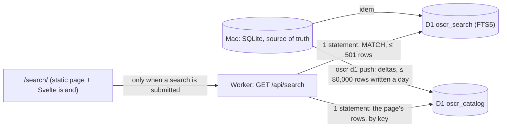

# The search (Phase 3)

Status: **merged (2026-09-28). The remote setup is `tools/setup_cloudflare.sh`, run by the
owner (§7).** The rules are the owner's decision D3 (`CLAUDE.md`):
SQLite FTS5 in D1; a search runs only when the form is submitted, never as one types; when the
daily quota is spent, a clear message says so; plan B is a static index on Hugging Face.



| piece | where |
|---|---|
| D1 schemas, versioned | `migrations/d1/catalog/0001_catalog.sql`, `migrations/d1/search/0001_search.sql` |
| the projector (Mac) | `oscr/d1.py`, `oscr d1 build|push|status [--local|--remote]` |
| the Worker | `website/worker/` (`index.ts` the routes, `env.ts` the bindings, `api.ts` HTTP and errors, `search.ts` the search) |
| the query language, the facets | `website/src/lib/query.ts`, `website/src/lib/facets.ts` (shared by the Worker and the page) |
| the page | `website/src/pages/search.astro`, `website/src/components/Search.svelte` |
| tests | `tests/test_d1.py` (pytest), `website/tests/*.test.ts` (`npm test`, node:test + node:sqlite) |

## 1. The two databases

Two databases because a D1 database that holds an FTS5 table cannot be exported.

**`oscr_catalog`** (binding `CATALOG`): what a result row shows.
- `papers`: one row per paper that has a page (D2) and is not off-topic (D7). The key `pid` is
  `YYYYMMDD × 100,000 + n` from the publication date (a partial date counts as its day 00:
  "2026-09" → 20260900): newest first is the key's order, and a date range a key range. The
  filter columns (status, published, year, type, journal_id, oa, license, cited_by_count,
  has_alignment, languages, hosts) and `doc`, the JSON of the result row: slug, DOI, title,
  journal, date, status, the authors' code (name, URL, license), counts. **Never an abstract.**
- **One secondary index**, `papers_cited (cited_by_count DESC, pid DESC)`: "most cited" without
  a query reads 20 index entries instead of the whole table. Every other filter or sort runs
  in the index (below), so no other index is worth its row written per row.
- `facet_counts (facet, rank, value, papers)`: the counts of the unfiltered view, the most
  frequent values of each facet (40 years, 12 values for the others).
- `meta`: `papers` (the number of rows of `papers`), `updated_at`.

**`oscr_search`** (binding `SEARCH`): `paper_fts`, FTS5, one row per paper under the same key.
- Columns: `title, keywords, mesh, authors, journal, repos, tools, ids, abstract` (the text),
  `facets` (the filters, as tokens), `fx UNINDEXED` (the facet values, JSON).
- `content=''` (contentless): the text is indexed, not stored. **Abstracts are indexed only when
  the paper's license is CC BY, CC0, CC BY-SA or CC BY-NC** (`catalog.statement_is_publishable`,
  decision D1's rule), and never returned: an answer has no abstract, no snippet.
- `contentless_delete=1`: a row is replaced or deleted by its key alone; `contentless_unindexed=1`:
  `fx` is stored and read back.
- Ranking: bm25 with column weights (title 10, identifiers 8, keywords 5, MeSH 4, authors,
  repositories and tools 3, journal 2, abstract 1, filters 0), configured in the table so that
  `ORDER BY rank` uses them.
- **The filters are tokens**, not a table: each facet value of a paper is the token `zz` + a
  2-letter code + the first 12 hexadecimal characters of the SHA-1 of the normalized value
  (NFKC, spaces collapsed, lower case), plus `zzall` in every row. A filter is a clause of the
  MATCH (`{facets} : ("zzmo…" OR "zzmo…")`): values of one facet are OR-ed, facets AND-ed.

| parameter | code | values |
|---|---|---|
| `status` | st | code_verified, code_found, code_empty, code_dead, on_request, data_only |
| `year` | yr | 2026… |
| `modality`, `organism`, `population`, `subfield` | mo, or, po, sf | the categories shown on Browse (owner's labels, then a model's, then the rules at ≥ 0.6, not ambiguous) |
| `tool` | to | the tools found in the authors' code (names: MNE-Python, EEGLAB…) |
| `language` | la | the code's languages |
| `journal` | jo | journal titles |
| `data` | ds | the repositories of the datasets cited (OpenNeuro, DANDI, Zenodo…) |
| `host` | ho | where the code is (github.com, zenodo.org, osf.io…) |
| `code_license` | cl | the family of the code's license: MIT, GPL, BSD, Apache, CC BY…, other, none |
| `type` | ty | research-article, review-article… |
| `license` | li | the family of the paper's license: CC BY, CC BY-NC, CC BY-NC-ND… |
| `matches` | al | yes: Code ↔ Paper matches were computed |
| `oa` | oa | yes, no |

Why tokens rather than the `paper_facet(paper_id, facet, value)` table first planned, measured
on a local D1: such a table writes ~8 rows per paper (31,000 rows for 3,700 papers), and counting
the facets of 1,000 results through it reads 20,000–32,000 rows; as tokens, a filter costs no
row written, D1 reads only the matching rows, and the counts come from `fx` in the rows the index
returns anyway.

## 2. The projector: `oscr/d1.py`

- **Scope**: `entities.PAGES_SQL`, the papers with a page (D2) that are not off-topic (D7). A
  paper that becomes off-topic or loses its page is deleted from both databases, first.
- **Deltas only**: a state file of its own, `data/d1/state.db` (not the harvester's database,
  which the public export copies), keeps the keys (`d1_pid`) and, per target (`local`,
  `remote`), a hash of every row pushed (`d1_sync`). A push sends the rows that changed and
  deletes those that left; each file is recorded once the target accepted it.
- **Budget**: at most 80,000 rows written a day (`--budget`, `OSCR_D1_BUDGET`), counted per UTC
  day as D1 counts (`d1_budget`). The push stops cleanly between two papers: deletions first,
  then the new papers (the most recent first), then the changed ones; the rest goes next time.
  The counts of the unfiltered view come last, computed from what the databases hold after the
  push. A remote push counts the rows D1 reports (`meta.rows_written`); a local push the measured
  costs (`WRITE_COST`: 2 per `papers` row, 1 per index row, 1 per count row, 1 per deletion).
- **What never leaves**: no email address nor contact detail (every string goes through
  `entities.strip_contacts`), no closed-license abstract, no sentence of a paper's body. Tested
  on the generated SQL.
- **Output**: SQL files (`INSERT … ON CONFLICT DO UPDATE`; `INSERT OR REPLACE` for the index,
  since an FTS5 table takes no upsert; `DELETE`), in the order the targets take them: deletions
  from the index, the catalogue, then the index's new rows (a paper is found only once its
  result row exists). `build` keeps the files; a local push deletes them once applied (a full
  push at the full stock is ~400 MB of SQL).

```
oscr d1 build [--local|--remote]      the next delta, as SQL files (data/d1/sql/), nothing sent
oscr d1 push --local                  migrations and delta into the local D1 of `wrangler dev --env local`
oscr d1 push --remote                 the same into Cloudflare, through the REST API (awaiting approval)
oscr d1 status                        rows known per table and target, rows written per day, last pushes
oscr d1 push --remote --reset         after the databases were recreated empty: forget what they held, send all
```

**The remote path, and why the REST API.** `apply_remote` posts each chunk (≤ 100 statements,
≤ 800 KB) to `POST /accounts/{account}/d1/database/{database}/query`, statements joined by
semicolons (run as a batch). Recommended over `wrangler d1 execute --remote --file` because:
- each call answers with `meta.rows_written`, so the budget counts what D1 counts; a call is one
  transaction (accepted whole or not at all), and the state records exactly the calls accepted;
- the nightly job stays in Python, without Node nor a wrangler login on the job's path;
- the calls are small (a few hundred a night at most; the API allows 1,200 per 5 minutes).
It needs one API token with D1 edit rights only, in the macOS keychain (below).

## 3. The API: `GET /api/search`

The Worker runs only for `/api/*` (`run_worker_first`); every other request is a static asset.

| parameter | meaning | default |
|---|---|---|
| `q` | the query: words (all of them), `"a phrase"`, `OR`, `NOT` or `-word`, parentheses, `neuro*` (3 letters at least), and a field before a word, a phrase or a group: `title:`, `author:`, `journal:`, `keyword:`, `mesh:`, `tool:`, `repo:`, `id:` (DOI, PMID, PMCID, dataset, RRID), `abstract:`. At most 500 characters, 24 words or phrases, 4 prefixes; everything typed ends up inside FTS5 quotes. | empty |
| a facet (`status`, `year`, `modality`, `tool`…, table above) | repeated for OR; different facets AND-ed; case-insensitive | none |
| `from`, `to` | `2020`, `2020-03` or `2020-03-15`, inclusive | none |
| `sort` | `relevance`, `newest`, `oldest`, `cited` | relevance with words, else newest |
| `page`, `size` | the pages go as far as the first 500 results (25 pages of 20); past them, no result and a notice to narrow the search. `size` 1–50 | 1, 20 |
| `format` | `csv` or `json`: a download of the first 500 results, without facets | none |

**Answer** (200, JSON):

```json
{
  "results": [{"slug": "doi_10.7554_elife.108408", "doi": "10.7554/elife.108408", "title": "…",
               "journal": "eLife", "published": "2026-09-03", "status": "code_verified",
               "code": [{"name": "TommyClausner/laminarfMRIv2", "url": "https://github.com/…", "license": "MIT"}],
               "data": 0, "files": 209, "pairs": 18, "cited": 1}],
  "query": {"q": "eeg", "match": "({title keywords …} : \"eeg\")", "filters": {}, "from": "", "to": "",
            "sort": "relevance", "page": 1, "size": 20},
  "window": 500, "notices": [],
  "total": 60, "complete": true, "pages": 3,
  "facets": {"status": [["code_verified", 29], ["data_only", 15]], "modality": [["eeg", 57], ["meg", 7]]},
  "facets_scope": "results",
  "cost": {"queries": 2, "rows_read": 100}
}
```

- `total` is exact when `complete`; otherwise more than `window` (500) papers match, and
  `total` is 500.
- `facets_scope`: `results` (the counts are over every result), `window` (over the first 500
  results: the query is broad), `catalogue` (the empty query: the precomputed counts).
- `cost`: the D1 statements and rows read of this answer, as D1 reported them; every answer,
  exports included, also carries them in the header `X-Search-Cost`. An answer served by the
  Cache API carries the header `X-Search-Cache: hit` and cost nothing.
- `notices`: what was changed in the query (a quote closed, a prefix too short…).
- CSV columns: `doi, title, journal, published, status, page, code_repositories, code_licenses,
  datasets, cited_by_count` (cells that a spreadsheet would read as formulas are quoted).

**Errors** (JSON `{"error": {"code", "message"}}`, `Cache-Control: no-store`):

| status | code | when | the page says |
|---|---|---|---|
| 400 | `bad_query` | a wrong parameter, or a query FTS5 refused | the message |
| 503 | `quota` | D1's daily limit is reached (`Retry-After`: seconds until 00:00 UTC) | the daily quota is spent, try tomorrow; Browse and the DOI lookup always work |
| 503 | `unavailable` | D1 fails or is overloaded | unavailable, try later; idem |
| 503 | `not_configured` | the databases are not bound yet | not available yet; idem |
| 429 (Cloudflare, HTML) | — | the Workers' 100,000 requests of the day are spent | the daily quota is spent… |
| 404, 405 | `not_found`, `method_not_allowed` | another route, another method | — |

**Caching.** A successful answer carries `Cache-Control: public, max-age=600`: the browser
serves a repeated search (Back, Forward, the same link) without any request. The Worker also
keeps answers with the Cache API, under the search's canonical parameters: an identical search
then reads nothing from D1, though the request still counts. The Cache API works on a custom
domain only (on `workers.dev` its operations do nothing), so it takes effect with the domain
planned before the launch (D8). **Workers Caching (`[cache] enabled = true`) stays off**: with
it, every request served from the cache, static assets included, is billed as a Worker request.

## 4. The page: `/search/`

- A static Astro page with a Svelte 5 island (`@astrojs/svelte`), markup and classes of
  `science.css` only: the results as the catalogue lists papers (`dl.listing`; `h2.day` per day
  when sorted by date; a ranked list otherwise, with the date on a `.line`), the words searched
  in `mark`, the facets with their counts in the `.sidebar` of a `.record` (below the results on
  a phone), statuses in words (`.ok`, `.warning`).
- **A search runs only when asked**: the form submitted, a facet, a page or a link followed, or
  a shared address opened. `/search/` alone searches nothing; typing never does.
- **The address is the state**: `/search/?q=eeg&modality=eeg&sort=newest&page=2`; Back and
  Forward replay the searches.
- **Advanced search**: a form (all words, a phrase, any word, none, title, author, journal,
  tool, keyword or MeSH, repository, identifier, dates, status) that writes a query in the
  language above, shown before it runs.
- **Export**: CSV and JSON links, which call the API with `format`.
- The masthead's search box (every page) submits to `/search/?q=…&field=…`; the page turns the
  field into the query language (`title:(…)`).
- Category values are shown by the names Browse gives them (the page is built with the export's
  categories: facet → value → name), else as they are ("structural mri").
- The inputs are `type="text"`, so the rule the owner approved on 2026-09-27 for a form in a page
  (`main form input[type="text"], main form button`) styles them once the branches meet. The two
  `select` (the sort, the status) keep the browser's font: the proposed addition is
  `main form select { font: inherit; border-radius: 0; }`, awaiting approval.
- Astro adds one line of its own to pages with an island,
  `<style>astro-island,astro-slot,astro-static-slot{display:contents}</style>`, which makes the
  island's wrapper element neutral in the layout; no style of ours.

## 5. Measured

On a local D1 (wrangler 4.141, workerd 2026-09-25), which counts rows as D1 does: the rows a
statement reads, including the rows of an index or of FTS5 it steps through. Two datasets:
- a copy of `data/dev/phase1.db` (schema 4) whose Phase 1 enrichment was run offline from the
  cache with Phase 1's own code (3,685 papers read, 610 with a page on topic; 607 after the
  delta test below);
- a full-stock simulation: those 610 papers 150 times under new keys, 91,500 papers. Every
  search with words or filters then matches more than 500 papers, as a broad search will.

**Rows read per search** (local D1 `meta.rows_read`, summed over the statements of a search;
all the searches of `docs/SEARCH.md` §3 were run, the table shows a selection):

| search | 607 papers: results | rows read | 91,500 papers: rows read |
|---|---|---|---|
| `q=eeg` | 60 | 100 | 540 |
| `q=fmri`, then `&modality=fmri` | 46, 37 | 86, 77 | 540, 540 |
| `journal=Imaging Neuroscience` (also in lower case) | 30 | 70 | 540 |
| `tool=MNE-Python`; `q=tool:eeglab` | 15; 18 | 45; 54 | 540 |
| `q=eeg OR meg`; `q=eeg NOT meg`; `q=eeg -epilepsy` | 72; 54; 56 | 112; 94; 96 | 540 |
| `q="working memory"` | 11 | 33 | 540 |
| `q=neuro*` | 424 | 464 | 540 |
| `q=NOT eeg` | more than 500 | 540 | 540 |
| `from=2025&to=2025-12` | 33 | 73 | 540 |
| `q=brain` (sorted by relevance, date or citations) | 368 | 408 | 540 |
| `oa=yes` (a filter that matches everything) | more than 500 | 540 | 540 |
| `oa=yes&page=26` (past the first 500) | 0, with a notice | 500 | 500 |
| the empty query (any sort) | 607 | 154 | 154 |
| `q=doi:10.7554/elife.108408` | 1 | 2 | 190 (the simulation's 150 copies) |
| a query that matches nothing, or is empty after cleaning | 0 | 0 | 0 |
| export, CSV or JSON (500 results) | — | 1,104–1,500 | 1,500 |

- A search reads the index's rows it returns (one per result, 501 at most) and ~2 rows per
  result row shown (the rows by key): at most ~540 rows at 20 results a page, ~600 at 50. An
  export reads the window and 500 result rows: ~1,500. The empty query reads its 20 rows, one
  `meta` row and the counts (133 rows here, ~220 at most).
- 5 million rows a day allow ~9,000 searches that fill the window, ~50,000 narrow ones. Two
  knobs if that ever gets tight: `WINDOW` in `website/worker/search.ts` (at 200, a broad search
  reads ~240 rows: ~20,000 a day), and caching (a custom domain turns the Cache API on).
- Every search is also one of the 100,000 Worker requests a day of the whole site.
- `ORDER BY rank` costs only the rows returned (19 rows read for the top 20 of 48,000 matches);
  `ORDER BY bm25(…)` would read every match, twice.
- A rowid bound is used by FTS5 only as an INTEGER; D1 binds a JavaScript number as a REAL, so
  the Worker casts it (without the cast, a date range read every match: 47,149 rows instead
  of 500).

**CPU per search** (the Workers free plan allows 10 ms). `wrangler dev` does not report a
Worker's CPU time, and a V8 profile taken inside workerd counts the local D1 too (it runs in the
same process) and the tracing of `wrangler dev`: it gave ~6–15 ms per search from run to run,
and ~1.5–2.5 ms for an answer served from the cache without touching D1. So the Worker's own
work was measured in V8 itself (Node 26, the engine of workerd): `handleSearch` run on the D1
answers of the local databases, replayed through `JSON.parse` as the D1 client does, 500–1,000
times after a warm-up; and with the JIT turned off (`--jitless`: the interpreter only), an upper
bound for an isolate that has just started:

| search | 610 papers (D1 answers) | 610, no JIT | 91,500 papers (D1 answers) | 91,500, no JIT |
|---|---|---|---|---|
| narrow (`q=eeg`, a phrase, a word and a facet, `OR`) | 0.09–0.30 ms (9–37 KB) | 0.18–0.52 ms | 1.0–1.1 ms (174–181 KB) | 1.7–1.9 ms |
| broad, the window full (`q=brain`, `neuro*`, `oa=yes`, any sort) | 1.2–1.6 ms (146–191 KB) | 2.1–2.7 ms | 0.7–1.0 ms (126–141 KB) | 1.3–1.7 ms |
| the largest answers (`q=eeg OR meg`, a facet alone) | 0.16–0.30 ms | 0.30–0.52 ms | 1.7–1.8 ms (259–284 KB) | 3.0–3.2 ms |
| the empty query | 0.09 ms (16 KB) | 0.18 ms | 0.10 ms (15 KB) | 0.17 ms |
| export of 500 results, CSV / JSON | 2.6 / 1.9 ms (423 KB) | 4.0 / 2.0 ms | 1.8 / 1.2 ms (327 KB) | 2.9 / 1.3 ms |

The cost is parsing D1's answers, proportional to their size (the window's `fx` values are parsed
in one `JSON.parse`). At most ~3 ms for a search and ~4 ms for an export, without the JIT: a
margin of 2.5 to 3 against the 10 ms limit. To confirm on Cloudflare after the deployment: the
Worker's "CPU time" metric (median and 99th percentile).

**Rows written** (measured through a Worker's D1 binding, equal to the projector's estimate):

| push | rows written |
|---|---|
| full, today's scale (610 papers, enriched copy) | 1,965: 1,220 `papers` (row + index), 610 index rows, 133 counts, 2 meta |
| full, the copy as the harvester left it (756 papers, no classification yet) | ~2,346 (estimated by the projector) |
| a day of changes (20 citation counts, 5 titles, 3 papers off-topic, 2 without a page) | 112 (a deletion counts 1 row) |
| the same through `oscr d1 push --local` and wrangler (3 titles, 2 off-topic, 1 without a page) | ~49: the three papers left both databases, the corrected titles are found, the counts say 607 |
| nothing changed | 0 |
| full, projected at the full stock (50,000–90,000 papers) | ~150,000–270,000: 2 to 4 days of 80,000 |
| a day at the full stock, during the backfill (~7,000 new papers with a page a day at 1,500 papers read an hour) | ~21,000 |
| a day at the full stock, after the backfill (~25–50 new papers with a page) | a few hundred, plus the changes |

A change to a paper's citation count rewrites its `papers` row and its index row (3 rows): a
refresh of every paper's citations at the full stock takes ~270,000 rows, spread over 4 days by
the budget.

**Storage** (free plan: 500 MB per database): at 610 papers, `oscr_catalog` 1.0 MB and
`oscr_search` 1.7 MB; in the full-stock simulation (91,500 papers), 78 MB and 150 MB (~0.85 KB
and ~1.6 KB per paper). Real texts are more varied than 150 copies of the same ones, so the
index's vocabulary will be larger, but the margin is threefold.

## 6. Locally

```bash
cd website && npm ci && npm test                      # the Worker's tests
oscr --db <a copy of the database> d1 push --local    # migrations + delta into website/.wrangler/state
CATALOG_DIR=<a public export> npm run build           # the site, with /search/
npx wrangler dev --env local                          # the site, the Worker, the local D1
npx wrangler dev --env local --var SEARCH_SIMULATE_FAILURE:quota   # what the page says when the quota is spent
oscr d1 push --local --reset                          # after deleting website/.wrangler/state: send everything again
```

`--persist-to <folder>` (for both `wrangler d1 …` and `wrangler dev`) keeps a second set of local
databases, as for the full-stock simulation of §5.

`[env.local]` in `website/wrangler.toml` binds the two local databases; the top-level
configuration, which `npm run deploy` uses, binds none until the owner creates them.

## 7. Remote setup: `tools/setup_cloudflare.sh`

The owner runs it once, in their own Terminal (the permissions refuse Claude the creation of
remote resources); it runs again safely:

```bash
cd /Volumes/Expansion/Scrapper && sh tools/setup_cloudflare.sh
```

1. **The databases**: `oscr_catalog`, `oscr_search` (and `oscr_community`, for the accounts),
   created in Western Europe (`--location weur`) if missing, then bound at the top of
   `website/wrangler.toml` by `tools/bind_d1.py` (ids are identifiers, not secrets).
2. **Their tables**: `npx wrangler d1 migrations apply <database> --remote`.
3. **The site**, rebuilt from the public catalogue and deployed with the bindings:
   `/api/search` answers and `/search/` works. Before the databases exist, the same deployment
   is harmless: `/api/search` answers `not_configured` and the page says the search is not
   available yet.
4. **The first load**: `oscr d1 push --remote`, after `OSCR_D1_PUSH=remote` is written to the
   settings. At today's scale one push is enough (~2,000–2,500 rows); at the full stock it
   takes 2–4 days within the budget.
5. **Every night**: `oscr nightly` pushes the day's changes once `OSCR_D1_PUSH=remote` is in
   the settings, after D1's day starts (00:00 UTC). A push that finds nothing changed writes
   nothing.

**How the push reaches Cloudflare.** Through wrangler's own login (`npx wrangler login`, the
one the deployment uses): `wrangler d1 execute <database> --remote --file`, the rows written
counted from the statements. With a token (Account · D1 · Edit, in the keychain as
`org.oscr.cloudflare-d1`) and `OSCR_D1_ACCOUNT_ID`, `OSCR_D1_CATALOG_ID`, `OSCR_D1_SEARCH_ID`
in the settings, it uses the REST API instead, which reports the rows written exactly.

**Check**: `curl 'https://oscr.yannbellec-b.workers.dev/api/search?q=eeg'` (results, and
`cost.rows_read`); `oscr d1 status`; the D1 dashboard's row metrics after a day.

**Undo**: remove the bindings and deploy (the page then says the search is not available);
D1 Time Travel restores a database to any minute of the last 7 days; `npx wrangler d1 delete`
removes one.

## 8. Limits and next steps

- **Rows read and requests**: each search is one Worker request out of 100,000 a day for the
  whole site. If searches ever crowd out the rest, plan B (D3) costs no request: a static
  inverted index as Parquet blocks on Hugging Face, read by byte ranges like the scripts.
- **Broad queries**: past 500 results, the total says "more than 500", the facet counts are the
  first 500 results', "most cited" sorts those 500, and the pages stop there (the reader is
  told to narrow the query, the filters or the dates).
- **Accounting to confirm on the remote databases**: the local D1 counts neither FTS5's internal
  pages nor the rows of the index's shadow tables, for reads as for writes; D1 in production is
  expected to count the same way (the same SQLite engine and counters in workerd), to be checked
  with `cost.rows_read`, `oscr d1 status` and the D1 dashboard in the first days. A remote push
  counts what D1 reports, so its budget follows D1's own count either way.
- **The Cache API** works only on a custom domain (D8).
- **With `main`** (Phase 1 and 2 merged after this branch started): the `data` facet counts the
  keys of the data links as they are; Phase 1's `enrich.dataset_id` (which drops a database's
  root) should be applied in `d1.project` too, so that the facet matches the Datasets pages.
- **Next**: entity pages rendered on demand from `oscr_catalog` (Phase 4, `STATIC_MAX`); saved
  searches and their feeds (Phase 7–8); a `/search/help/` page.

## 9. The GitHub side's search (night phase 08)

`oscr_search` gains `forge_fts` (`migrations/d1/search/0002_forge.sql`): the repositories the registry
knows, its research issues, the people whose profile is public and the topics, pushed by the Mac from
the night's public static files (`oscr social search`, and `oscr nightly` with `OSCR_D1_PUSH=remote`).
`GET /api/search?type=repositories|issues|people|topics` reads it (`website/worker/forge-search.ts`);
without `type`, or with `type=papers`, this page's search is unchanged. The details, the query's
qualifiers and GitHub's issues and commits searched in the reader's browser: [SOCIAL.md](SOCIAL.md)
"Search". The remote database needs the migration applied (`npx wrangler d1 migrations apply
oscr_search --remote`, or `sh tools/setup_cloudflare.sh`).
